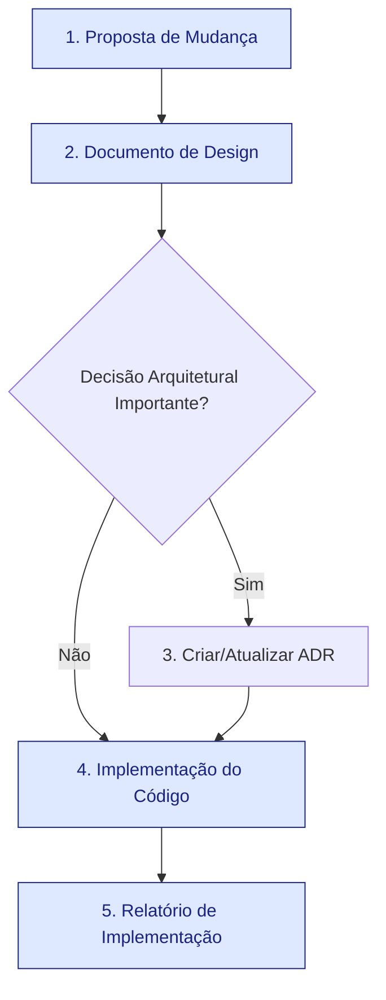

# Guia de Agentes (Codex) — Workflow de Desenvolvimento

## Visão Geral do Projeto
- **CoupaDownloads** automatiza o download de anexos e relatórios no Coupa, validando POs a partir de planilhas e gerando arquivos consolidados.
- Código em **Python 3.12** gerenciado via **Poetry**, combinando Selenium, Playwright, processamento de CSV/Excel (pandas/polars) e pipelines de feedback com Sentence Transformers.
- Entrypoints principais: `src/Core_main.py` (fluxo principal) e `tools/feedback_cli.py` (rotinas de treinamento e feedback).
- A estrutura esperada: dados em `data/`, scripts auxiliares em `tools/`, recursos web em `drivers/` e documentação complementar em `docs/`.

## Setup Rápido
### Pré-requisitos
- Python 3.12 disponível no `PATH` (verifique com `python --version`).
- Poetry >= 1.8 instalado (`pip install poetry`).
- Microsoft Edge atualizado; o instalador baixa o EdgeDriver compatível automaticamente.
- Opcional para testes Playwright: `poetry run playwright install`.

### Provisionamento local
```bash
poetry install                 # instala dependências
poetry shell                   # ativa o ambiente virtual (opcional)
poetry run playwright install  # instala navegadores usados por Playwright, se necessário
```

### Execução rápida
```bash
poetry run python -m src.Core_main         # fluxo principal de download
poetry run python tools/feedback_cli.py wizard  # assistente guiado para ciclo de feedback
poetry run python tools/feedback_cli.py --help   # CLI clássica com automações
```

## Workflow de Desenvolvimento (Proposal -> Design -> Report)

Nosso processo de desenvolvimento é guiado por documentos para garantir clareza, rastreabilidade e alinhamento. Cada mudança, seja uma nova feature, uma correção de bug ou um estudo técnico, segue um ciclo de vida de três artefatos principais, localizados em `PR_PLANS/`.

1.  **Proposta de Mudança (`_template-proposta.md`)**: O ponto de partida. Registra **o que** precisa ser feito e **por quê**.
2.  **Documento de Design (`_template-design-doc.md`)**: O blueprint técnico. Detalha **como** a solução será implementada. É essencial para mudanças complexas, mas pode ser simplificado ou omitido para tarefas triviais.
3.  **Relatório de Implementação (`_template-relatorio-implementacao.md`)**: A prova da entrega. Consolida **o que foi entregue** e serve como o artefato final para revisão.

### Fluxo Visual


### Registros de Decisão de Arquitetura (ADRs)

Para capturar a **memória de longo prazo do projeto**, utilizamos Architecture Decision Records (ADRs).

- **O que são?** Documentos curtos que registram uma única decisão de arquitetura importante, seu contexto, e suas consequências.
- **Onde vivem?** No diretório `docs/adr/`.
- **Quando criar?** Durante a fase de `Documento de Design`, sempre que uma escolha técnica tiver impacto duradouro (ex: adotar uma nova biblioteca, definir um padrão de API). O Design Doc deve então linkar para o ADR.
- **Template**: Use o `docs/adr/_template-adr.md` para criar novos registros.

## Papéis e Responsabilidades

### Autor da Proposta (PO / Analista)
- Inicia o fluxo criando uma **Proposta de Mudança** (`NN-<slug>-proposta.md`) a partir do template.
- Colabora na criação do **Documento de Design** (`NN-<slug>-design-doc.md`) para detalhar a solução técnica.
- Aprova a proposta e o design antes do início do desenvolvimento.

### Pessoa Desenvolvedora
- Implementa a solução conforme o **Documento de Design** aprovado.
- Cria ou atualiza **ADRs** ao tomar decisões de arquitetura relevantes.
- Ao concluir, preenche e entrega o **Relatório de Implementação** (`NN-<slug>-relatorio-implementacao.md`) para revisão.

### QA / Revisão
- Valida a entrega confrontando o **Relatório de Implementação** com os critérios de aceitação da **Proposta de Mudança**.
- Bloqueia merges se houver regressões, testes ausentes ou violações de política.

## Git, Branches e PRs
- Use branches do tipo `feature/<descritor-curto>` ou `fix/<ticket>`.
- Commits devem ser descritivos e curtos (<= 72 caracteres).
- Ao final do trabalho, mova todos os artefatos da demanda (`proposta`, `design-doc`, `relatorio`) para o diretório `PR_PLANS/Implemented/`.
- Solicite revisão explícita quando alterar contratos públicos (interfaces CLI, schemas de dados, endpoints FastAPI).

## Estilo de Código e Qualidade
- Siga **PEP 8**, mantendo importações organizadas e usando type hints sempre que possível.
- Centralize efeitos colaterais em entrypoints (`src/Core_main.py`, CLIs em `tools/`); módulos internos devem ser determinísticos.
- Prefira mensagens e logs em inglês (`structlog`/`rich`) para manter consistência com interfaces geradas automaticamente.
- Comentários só quando agregarem contexto que não é óbvio pelo código.
- Respeite convenções já existentes no módulo editado (nomes, dataclasses, factories, etc.).

## Testes e QA
- Suite principal: `poetry run pytest` (use `-k`, `-m` ou `--maxfail=1` para focar em subconjuntos quando necessário).
- Para testes assíncronos, garanta que `pytest-asyncio` esteja configurado via marcadores; siga padrões existentes.
- Ao alterar pipelines de feedback, valide com `poetry run python tools/feedback_cli.py wizard` e gere relatórios sob `reports/`.
- Se modificar integração Selenium/Playwright, execute um fluxo completo em ambiente controlado e capture evidências.

## Segurança e Dados
- Nunca faça commit de credenciais, tokens ou caminhos absolutos do SO.
- Dados sensíveis devem permanecer fora do repositório; use `storage/` apenas para artefatos locais ignorados pelo Git.
- Downloads de binários externos precisam de um Documento de Design aprovado.
- Logs padrão devem evitar PII; use máscaras ao lidar com fornecedores e números de pedido.

## Políticas Operacionais
### Idioma (UI x código)
- Interfaces e mensagens expostas ao usuário final permanecem em **inglês**.
- Documentação (README, guias, propostas, etc.) deve ser escrita em **português (pt-BR)**.
- Comentários e código podem usar pt-BR quando fizer sentido.
- Logs habilitados por padrão ficam em inglês.

### Execução e Desempenho
- Prefira checks rápidos; evite processos pesados sem alinhamento prévio.
- Respeite variáveis de ambiente, defaults e limites de sandbox.
- Não altere comportamento global ou arquitetura sem um novo Documento de Design aprovado.

## Estrutura Modular e AGENTS.md aninhados
- Em subprojetos autônomos (ex.: novos pacotes dentro de `src/` ou `tools/`), crie um `AGENTS.md` local com instruções específicas.
- O arquivo mais próximo do diretório editado prevalece; mantenha referências entre eles quando houver dependências cruzadas.
- Trate este documento como vivo: ajuste sempre que rotinas, comandos ou políticas mudarem.

## Notas Finais
- Para refatorações grandes, prefira várias entregas pequenas em vez de um PR amplo.
- Se uma proposta depender de outra, mencione claramente (ex.: '''executar após Proposta 26''').
- Ajude a manter este `AGENTS.md` alinhado com a prática diária; atualize-o junto com novas convenções.