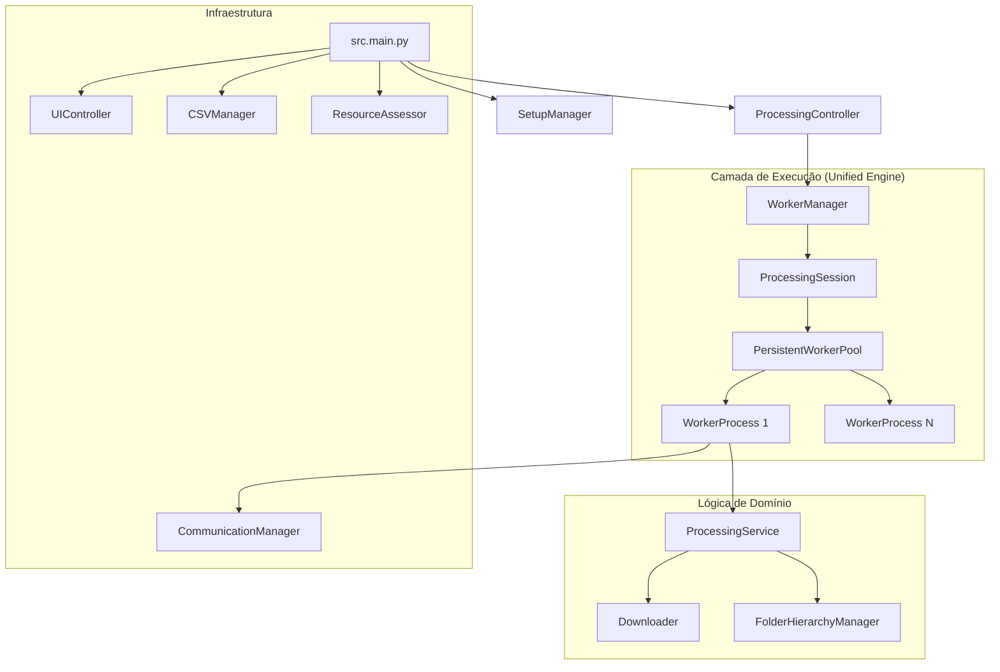

# Arquitetura do Projeto: CoupaDownloads Refactoring

Este documento descreve a estrutura e o funcionamento do sistema após a refatoração para a arquitetura de **Unified Processing Engine**.

## 🏗️ Visão Geral

O projeto segue uma arquitetura modular dividida em camadas de coordenação, gerenciamento e execução. O objetivo principal é a eficiência no download de milhares de anexos através de sessões persistentes de browser.



## 🧩 Componentes Principais

### 1. Entry Point (`src.main`)

O `MainApp` é o orquestrador global. Ele gerencia o ciclo de vida da aplicação, desde a leitura do Excel inicial até o encerramento do sistema.

### 2. Controle de Processamento (`ProcessingController`)

Este componente decide a estratégia de execução.

- Se configurado para paralelo, aciona o **Unified Engine**.
- Se for apenas 1 PO ou configurado como sequencial, utiliza o `ProcessingService` diretamente no processo principal.

### 3. Unified Processing Engine (`src.workers`)

Esta é a maior melhoria da refatoração.

- **PersistentWorkerPool**: Mantém os workers vivos. Diferente da "Legacy", ele não fecha o browser a cada PO.
- **WorkerProcess**: Cada processo gerencia sua própria instância de Edge, aproveitando o cache e evitando o overhead de inicialização repetitiva.
- **ResourceAssessor**: Antes de iniciar, analisa a RAM livre do sistema e ajusta o número de workers para evitar travamentos (OOM).

### 4. Lógica de Download (`src.lib`)

- **Downloader**: Contém a inteligência para navegar no Coupa, encontrar anexos e lidar com fallbacks entre PO e PR.
- **FolderHierarchyManager**: Gerencia a criação do JIT (Just-In-Time) de pastas e a renomeação final com sufixos de status (`_COMPLETED`, `_FAILED`, etc.).

### 5. Comunicação e Estado (`src.core`)

- **CommunicationManager**: Utiliza filas do `multiprocessing` para enviar métricas dos workers de volta para a UI em tempo real.
- **CSVHandler/SQLite**: Garante que o progresso seja salvo incrementalmente, permitindo retomar de onde parou em caso de erro.

## 🚀 Melhorias e Unificação

As melhorias **não foram perdidas**, elas foram consolidadas no diretório `src/workers/`.

> [!IMPORTANT]
> A confusão sobre o "processo legado" geralmente ocorre devido a duas coisas:
>
> 1. **Configuração**: Se `USE_PROCESS_POOL=false` no `.env`, o sistema usa o `ProcessingService` de forma sequencial (mais lenta).
> 2. **Remanescentes**: Nomes de logs ou métodos antigos que ainda não tinham sido renomeados (ex: `process_parallel_legacy`).

## 🛠️ Como Ativar o Engine Moderno

Para garantir que você está usando 100% do novo motor paralelo persistente, verifique seu `.env`:

```env
ENABLE_PARALLEL_PROCESSING=true
USE_PROCESS_POOL=true
MAX_PARALLEL_WORKERS=4  # Ou conforme sua RAM permitir
```
