# Coupa Downloads - E2E Flow Diagram

## Overview

This diagram shows the complete end-to-end flow of the Coupa Downloads automation program, from initialization to completion.

```mermaid
flowchart TD
    %% Start and Initialization
    START([🚀 Start Program]) --> INIT[📋 Initialize MainApp]
    INIT --> CHECK_EXCEL{📊 Check Excel File}

    %% Excel Processing
    CHECK_EXCEL -->|File Found| READ_EXCEL[📖 Read PO_Data Sheet]
    CHECK_EXCEL -->|File Not Found| ERROR_EXCEL[❌ Excel File Error]

    READ_EXCEL --> ANALYZE_HIERARCHY[🔍 Analyze Hierarchy Structure]
    ANALYZE_HIERARCHY --> PROCESS_POS[⚙️ Process PO Numbers]

    %% PO Validation and Filtering
    PROCESS_POS --> VALIDATE_POS{🔍 Validate PO Format}
    VALIDATE_POS -->|Valid| FILTER_COMPLETED{✅ Check Completion Status}
    VALIDATE_POS -->|Invalid| MARK_FAILED[❌ Mark as FAILED]

    FILTER_COMPLETED -->|Not Completed| ADD_TO_QUEUE[📋 Add to Processing Queue]
    FILTER_COMPLETED -->|Completed| SKIP_PO[⏭️ Skip Completed PO]

    MARK_FAILED --> CONTINUE_PROCESSING[🔄 Continue Processing]
    SKIP_PO --> CONTINUE_PROCESSING
    ADD_TO_QUEUE --> CONTINUE_PROCESSING

    %% Random Sampling (Optional)
    CONTINUE_PROCESSING --> CHECK_SAMPLING{🎲 Random Sampling Enabled?}
    CHECK_SAMPLING -->|Yes| SAMPLE_POS[📊 Sample Random POs]
    CHECK_SAMPLING -->|No| INIT_BROWSER[🌐 Initialize Browser]
    SAMPLE_POS --> INIT_BROWSER

    %% Browser Initialization
    INIT_BROWSER --> CHECK_DRIVER{🔧 Check EdgeDriver}
    CHECK_DRIVER -->|Driver Missing| DOWNLOAD_DRIVER[⬇️ Download EdgeDriver]
    CHECK_DRIVER -->|Driver Found| CREATE_BROWSER[🌐 Create Browser Instance]
    DOWNLOAD_DRIVER --> CREATE_BROWSER

    CREATE_BROWSER --> SETUP_PROFILE{👤 Profile Directory Set?}
    SETUP_PROFILE -->|Yes| USE_PROFILE[👤 Use Edge Profile]
    SETUP_PROFILE -->|No| USE_DEFAULT[🔧 Use Default Browser]
    USE_PROFILE --> CONFIGURE_DOWNLOADS[📁 Configure Download Directory]
    USE_DEFAULT --> CONFIGURE_DOWNLOADS

    %% Parallel Processing Setup
    CONFIGURE_DOWNLOADS --> SETUP_PARALLEL[🔄 Setup Parallel Processing]
    SETUP_PARALLEL --> CREATE_THREADPOOL[🧵 Create ThreadPoolExecutor]

    %% Main Processing Loop
    CREATE_THREADPOOL --> PROCESS_PO_LOOP{📋 Process Each PO}

    %% Individual PO Processing
    PROCESS_PO_LOOP --> CREATE_TAB[🆕 Create New Browser Tab]
    CREATE_TAB --> SET_DOWNLOAD_DIR[📁 Set Tab Download Directory]
    SET_DOWNLOAD_DIR --> CREATE_FOLDER[📁 Create Folder Hierarchy]

    %% Folder Hierarchy Creation
    CREATE_FOLDER --> CHECK_HIERARCHY{📊 Has Hierarchy Data?}
    CHECK_HIERARCHY -->|Yes| CREATE_HIERARCHY[📁 Create Hierarchical Structure]
    CHECK_HIERARCHY -->|No| CREATE_FALLBACK[📁 Create Fallback Structure]
    CREATE_HIERARCHY --> NAVIGATE_PO[🌐 Navigate to PO URL]
    CREATE_FALLBACK --> NAVIGATE_PO

    %% PO Page Processing
    NAVIGATE_PO --> CHECK_ERROR_PAGE{❌ Error Page Detected?}
    CHECK_ERROR_PAGE -->|Yes| MARK_PO_ERROR[❌ Mark PO as Error]
    CHECK_ERROR_PAGE -->|No| WAIT_ATTACHMENTS[⏳ Wait for Attachments]

    %% Attachment Processing
    WAIT_ATTACHMENTS --> FIND_ATTACHMENTS[🔍 Find Attachment Elements]
    FIND_ATTACHMENTS --> CHECK_ATTACHMENTS{📎 Attachments Found?}

    CHECK_ATTACHMENTS -->|No| MARK_NO_ATTACHMENTS[📭 Mark as No Attachments]
    CHECK_ATTACHMENTS -->|Yes| PROCESS_ATTACHMENT[📎 Process Each Attachment]

    %% Individual Attachment Download
    PROCESS_ATTACHMENT --> EXTRACT_FILENAME[📄 Extract Filename]
    EXTRACT_FILENAME --> CLICK_ATTACHMENT[⬇️ Click Attachment]

    %% Click Strategies
    CLICK_ATTACHMENT --> CLICK_SUCCESS{✅ Click Successful?}
    CLICK_SUCCESS -->|No| TRY_SCROLL[📜 Scroll Element into View]
    CLICK_SUCCESS -->|Yes| WAIT_DOWNLOAD[⏳ Wait for Download]

    TRY_SCROLL --> SCROLL_SUCCESS{✅ Scroll Click Successful?}
    SCROLL_SUCCESS -->|No| TRY_JAVASCRIPT[💻 JavaScript Click]
    SCROLL_SUCCESS -->|Yes| WAIT_DOWNLOAD

    TRY_JAVASCRIPT --> JS_SUCCESS{✅ JavaScript Click Successful?}
    JS_SUCCESS -->|No| TRY_HIDE_FLOATING[👻 Hide Floating Elements]
    JS_SUCCESS -->|Yes| WAIT_DOWNLOAD

    TRY_HIDE_FLOATING --> HIDE_SUCCESS{✅ Hide Strategy Successful?}
    HIDE_SUCCESS -->|No| TRY_COORDINATES[📍 Coordinate Click]
    HIDE_SUCCESS -->|Yes| WAIT_DOWNLOAD

    TRY_COORDINATES --> COORD_SUCCESS{✅ Coordinate Click Successful?}
    COORD_SUCCESS -->|No| MARK_DOWNLOAD_FAILED[❌ Mark Download Failed]
    COORD_SUCCESS -->|Yes| WAIT_DOWNLOAD

    %% Download Completion
    WAIT_DOWNLOAD --> UPDATE_STATUS[📊 Update PO Status]
    MARK_PO_ERROR --> UPDATE_STATUS
    MARK_NO_ATTACHMENTS --> UPDATE_STATUS
    MARK_DOWNLOAD_FAILED --> UPDATE_STATUS

    %% Status Update and Tab Management
    UPDATE_STATUS --> CLOSE_TAB[🔒 Close Current Tab]
    CLOSE_TAB --> SWITCH_MAIN_TAB[🔄 Switch to Main Tab]
    SWITCH_MAIN_TAB --> CHECK_MORE_POS{📋 More POs to Process?}

    %% Loop Control
    CHECK_MORE_POS -->|Yes| PROCESS_PO_LOOP
    CHECK_MORE_POS -->|No| WAIT_ALL_COMPLETE[⏳ Wait for All Tasks]

    %% Completion
    WAIT_ALL_COMPLETE --> GENERATE_SUMMARY[📊 Generate Summary Report]
    GENERATE_SUMMARY --> CLOSE_BROWSER[🌐 Close Browser]
    CLOSE_BROWSER --> END([🎉 Program Complete])

    %% Error Handling
    ERROR_EXCEL --> END

    %% Styling
    classDef startEnd fill:#e1f5fe,stroke:#01579b,stroke-width:2px
    classDef process fill:#f3e5f5,stroke:#4a148c,stroke-width:2px
    classDef decision fill:#fff3e0,stroke:#e65100,stroke-width:2px
    classDef error fill:#ffebee,stroke:#c62828,stroke-width:2px
    classDef success fill:#e8f5e8,stroke:#2e7d32,stroke-width:2px
    classDef browser fill:#e3f2fd,stroke:#1565c0,stroke-width:2px
    classDef file fill:#f1f8e9,stroke:#33691e,stroke-width:2px

    class START,END startEnd
    class INIT,READ_EXCEL,ANALYZE_HIERARCHY,PROCESS_POS,CREATE_TAB,SET_DOWNLOAD_DIR,CREATE_FOLDER,NAVIGATE_PO,WAIT_ATTACHMENTS,FIND_ATTACHMENTS,EXTRACT_FILENAME,UPDATE_STATUS,CLOSE_TAB,SWITCH_MAIN_TAB,GENERATE_SUMMARY process
    class CHECK_EXCEL,VALIDATE_POS,FILTER_COMPLETED,CHECK_SAMPLING,CHECK_DRIVER,SETUP_PROFILE,CHECK_HIERARCHY,CHECK_ERROR_PAGE,CHECK_ATTACHMENTS,CLICK_SUCCESS,SCROLL_SUCCESS,JS_SUCCESS,HIDE_SUCCESS,COORD_SUCCESS,CHECK_MORE_POS decision
    class ERROR_EXCEL,MARK_FAILED,MARK_PO_ERROR,MARK_DOWNLOAD_FAILED error
    class ADD_TO_QUEUE,CREATE_HIERARCHY,CREATE_FALLBACK,WAIT_DOWNLOAD,CLICK_ATTACHMENT,TRY_SCROLL,TRY_JAVASCRIPT,TRY_HIDE_FLOATING,TRY_COORDINATES success
    class INIT_BROWSER,CREATE_BROWSER,USE_PROFILE,USE_DEFAULT,CONFIGURE_DOWNLOADS,CLOSE_BROWSER browser
    class DOWNLOAD_DRIVER,SET_DOWNLOAD_DIR,CREATE_FOLDER,CREATE_HIERARCHY,CREATE_FALLBACK file
```

## Component Details

### Core Components

- **MainApp**: Orchestrates the entire process
- **ExcelProcessor**: Handles Excel file reading and status updates
- **BrowserManager**: Manages browser lifecycle and tab operations
- **Downloader**: Handles attachment detection and download
- **FolderHierarchyManager**: Creates organized folder structures

### Key Features

- **Parallel Processing**: Uses ThreadPoolExecutor with browser tabs
- **Hierarchical Folders**: Creates organized folder structures based on Excel data
- **Robust Download**: Multiple fallback strategies for clicking attachments
- **Status Tracking**: Real-time updates to Excel file
- **Error Handling**: Comprehensive error detection and recovery

### Flow Highlights

1. **Initialization**: Excel analysis and PO validation
2. **Browser Setup**: EdgeDriver management with profile support
3. **Parallel Processing**: Multiple tabs for concurrent downloads
4. **Folder Organization**: Hierarchical or fallback folder structures
5. **Download Strategies**: Multiple click strategies for reliability
6. **Status Management**: Real-time Excel updates and reporting
