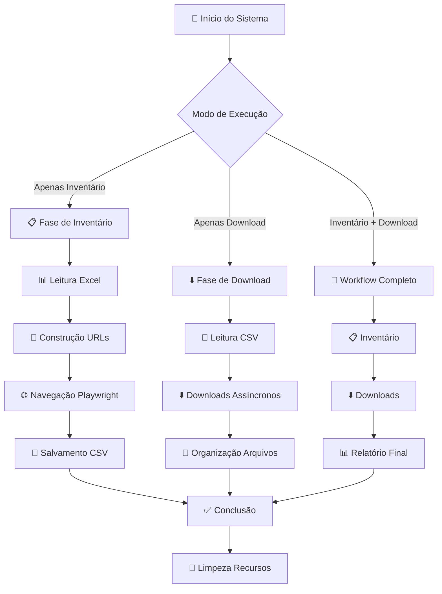
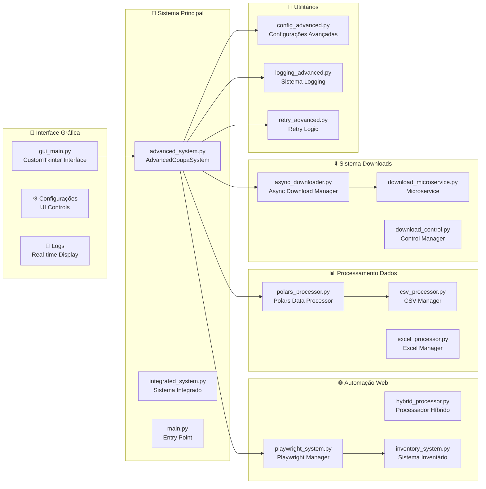
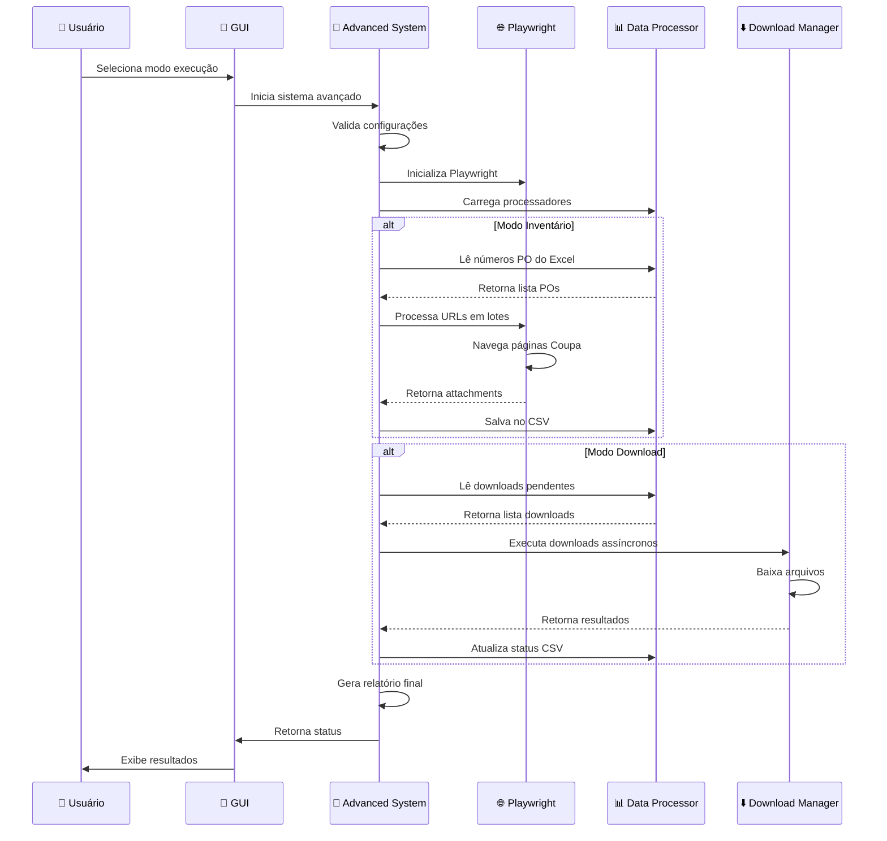
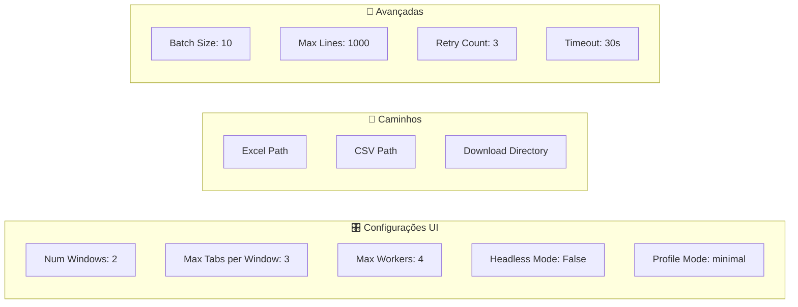
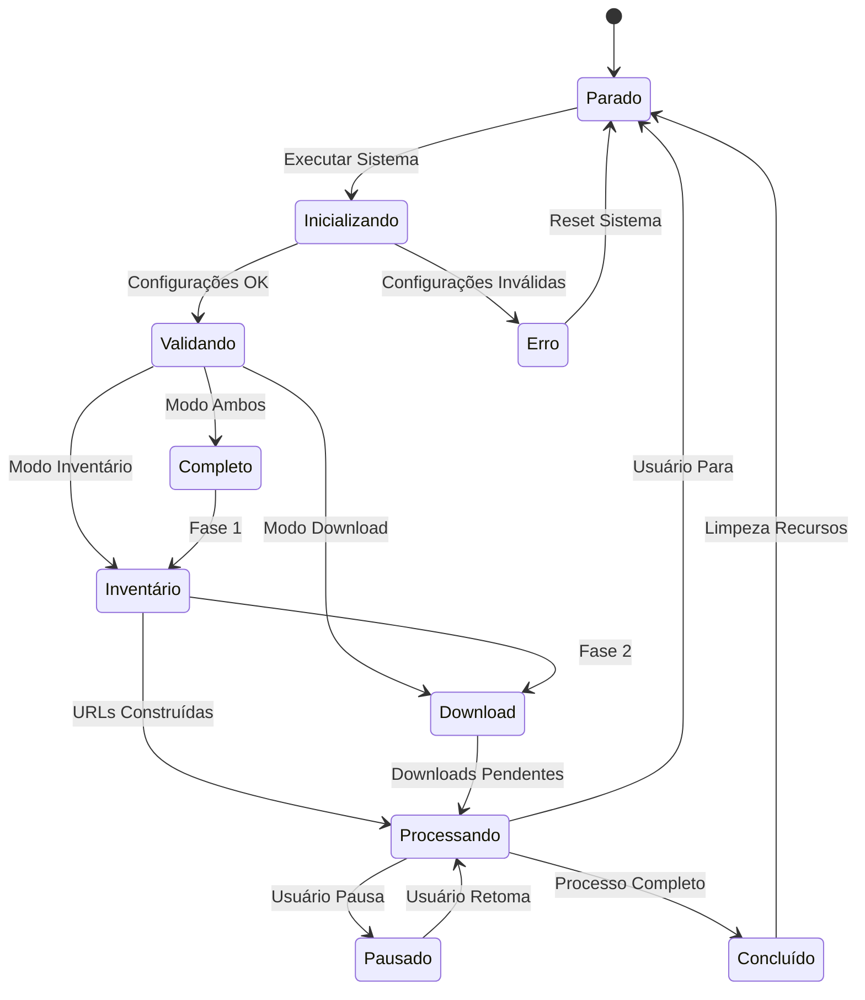

# 🚀 Sistema MyScript - Diagrama de Workflow e Arquitetura

## 📋 Visão Geral do Sistema

O Sistema MyScript é uma solução avançada para automação de downloads de anexos do sistema Coupa, organizado em módulos especializados com interface gráfica moderna.

## 🔄 Diagrama de Fluxo Principal



## 🏗️ Arquitetura por Módulos



## 🔄 Fluxo Detalhado de Execução



## 📁 Estrutura de Dados

```mermaid
graph TD
    subgraph "📊 Entrada"
        EXCEL[input.xlsx<br/>PO_NUMBER Column]
    end

    subgraph "🔄 Processamento"
        URLS[URLs Construídas<br/>base_url/order_headers/{po_number}]
        ATTACH[Attachments Encontrados<br/>filename, url, file_type]
    end

    subgraph "💾 Armazenamento"
        CSV[download_inventory.csv<br/>po_number, filename, url, status]
        FILES[~/Downloads/CoupaDownloads/<br/>Organizados por PO]
    end

    EXCEL --> URLS
    URLS --> ATTACH
    ATTACH --> CSV
    CSV --> FILES
```

## ⚙️ Configurações do Sistema



## 🚦 Estados do Sistema



## 🔍 Módulos Principais Detalhados

### 🎨 Interface Gráfica (gui_main.py)

- **Função**: Interface CustomTkinter moderna
- **Componentes**: Dashboard, Configurações, Logs
- **Controles**: Executar, Pausar, Parar
- **Modos**: Inventário, Download, Ambos

### 🧠 Sistema Avançado (advanced_system.py)

- **Função**: Orquestrador principal
- **Responsabilidades**: Coordenação de módulos, controle de fluxo
- **Integração**: Playwright + Downloads + Processamento

### 🌐 Playwright System (playwright_system.py)

- **Função**: Automação web com Edge
- **Recursos**: Múltiplas janelas, perfil Edge, retry logic
- **Fallback**: Sistema híbrido em caso de falha

### 📊 Processamento de Dados (polars_processor.py)

- **Função**: Manipulação eficiente de dados
- **Recursos**: Polars para performance, Excel/CSV processing
- **Operações**: Leitura, escrita, atualização de status

### ⬇️ Downloads Assíncronos (async_downloader.py)

- **Função**: Downloads paralelos eficientes
- **Recursos**: Async/await, controle de concorrência
- **Organização**: Hierarquia por PO

## 🎯 Fluxo de Dados

1. **Entrada**: Excel com números de PO
2. **Processamento**: Construção de URLs + Navegação web
3. **Inventário**: Coleta de links de anexos
4. **Armazenamento**: CSV com metadados
5. **Download**: Baixar arquivos em paralelo
6. **Organização**: Estrutura hierárquica por PO
7. **Relatório**: Estatísticas e status final

## 🔧 Configurações Avançadas

- **Performance**: Workers paralelos, lotes otimizados
- **Robustez**: Retry automático, fallback híbrido
- **Logging**: Logs especializados por módulo
- **Controle**: Pausar/retomar, parada segura
- **Perfil**: Integração com perfil Edge existente

---

_Este diagrama representa a arquitetura completa do Sistema MyScript, mostrando como os módulos se integram e o fluxo de dados através do sistema._
