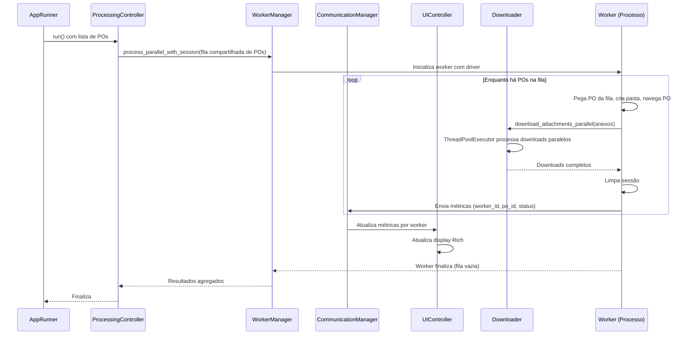

# Proposta de Mudança: Otimização Combinada - Workers Reutilizáveis, Downloads Paralelos e UI Melhorada

## 1. Identificação
- **Número da Proposta**: 05
- **Título**: Otimização Combinada: Workers Reutilizáveis, Downloads Paralelos e UI Melhorada
- **Data de Criação**: 29 de janeiro de 2026
- **Autor**: GitHub Copilot
- **Status**: Em Revisão
- **Dependências**: Após implementação da PR 03 (refatoração main.py em módulos menores).

## 2. Contexto e Problema
Após a refatoração da PR 03, o sistema está modularizado com `AppRunner`, `ProcessingController`, `WorkerManager`, `UIController`, etc. No entanto, o processamento paralelo ainda inicializa um driver por PO (overhead alto), downloads são sequenciais (ineficiente para POs com múltiplos anexos), e a UI não atualiza métricas em tempo real no modo paralelo devido a falta de comunicação inter-processos.

As PRs 01 (um driver por worker reutilizado), 02 (downloads paralelos via threads) e 04 (correção de callbacks na UI) têm sinergia forte: PR 01 estabelece a base para workers eficientes, PR 02 otimiza downloads dentro desses workers, e PR 04 garante que a UI reflita progresso e métricas por worker. Implementá-las separadamente causaria conflitos e retrabalho; uma abordagem combinada reduz riscos e garante integração coesa.

Problemas atuais:
- Overhead de inicialização de drivers por PO (PR 01).
- Downloads sequenciais lentos para POs com >1 anexo (PR 02).
- UI estática no paralelo, sem métricas por worker (PR 04).

### Pré-requisitos e Contexto Adicional
- **Dependência**: PR 03 implementada (módulos como `WorkerManager`, `UIController` existem).
- **Código Atual**: Workers usam processos via `multiprocessing`; downloads via Selenium; UI via Rich.
- **Bibliotecas**: `multiprocessing.Queue` para filas; `concurrent.futures.ThreadPoolExecutor` para threads.
- **Arquivos Chave**: Modificar `src/worker_manager.py`, `src/downloader.py` (assumindo nomes pós-PR 03), etc.

### Snippets de Código Atual (Referências para Validação)
Para reduzir riscos de regressões, aqui estão trechos chave do código legado. O agente deve validar mudanças contra esses padrões.

#### WorkerManager.process_parallel_with_session (src/worker_manager.py ~linhas 982-1050) - Atualizado para Fila Compartilhada
```python
def process_parallel_with_session(
    self,
    po_queue: multiprocessing.Queue,  # Fila compartilhada de POs
    headless_config: HeadlessConfiguration,
    communication_manager: CommunicationManager,  # Novo para métricas
) -> tuple[int, int, dict]:
    # Inicializa workers com fila compartilhada
    workers = []
    for i in range(self.max_workers):
        worker = multiprocessing.Process(
            target=self._worker_process,
            args=(po_queue, headless_config, communication_manager, i)
        )
        workers.append(worker)
        worker.start()
    
    # Aguarda workers finalizarem
    for worker in workers:
        worker.join()
    
    # Coleta resultados agregados
    return self._aggregate_results(communication_manager)
```

#### Downloader.download_attachments_parallel (src/lib/downloader.py - Novo Método)
```python
def download_attachments_parallel(
    self, 
    attachments_list: List[dict], 
    max_concurrent: int = 4
) -> dict:
    """
    Baixa anexos em paralelo usando ThreadPoolExecutor.
    """
    results = []
    with ThreadPoolExecutor(max_workers=max_concurrent) as executor:
        futures = [
            executor.submit(self._download_single_attachment, attachment)
            for attachment in attachments_list
        ]
        for future in as_completed(futures):
            results.append(future.result())
    
    # Agrega resultados
    downloaded = sum(1 for r in results if r['success'])
    return {
        'success': downloaded == len(attachments_list),
        'attachments_downloaded': downloaded,
        'attachments_found': len(attachments_list),
        'errors': [r for r in results if not r['success']]
    }
```

#### CommunicationManager (Novo - src/communication_manager.py)
```python
class CommunicationManager:
    """
    Gerencia comunicação inter-processos para métricas.
    """
    def __init__(self):
        self.metric_queue = multiprocessing.Queue()
    
    def send_metric(self, metric_dict: dict):
        """Envia métrica para UI."""
        self.metric_queue.put(metric_dict)
    
    def get_metrics(self) -> List[dict]:
        """Consome métricas para UI."""
        metrics = []
        while not self.metric_queue.empty():
            metrics.append(self.metric_queue.get())
        return metrics
```

#### UIController.update_display (src/ui_controller.py - Atualizado)
```python
def update_display(self, metrics: List[dict]):
    """
    Atualiza display Rich com métricas por worker.
    """
    # Exemplo: tabela com colunas por worker
    table = Table(title="Progresso por Worker")
    table.add_column("Worker ID")
    table.add_column("PO Atual")
    table.add_column("Status")
    table.add_column("Tempo")
    
    for metric in metrics:
        table.add_row(
            str(metric['worker_id']),
            metric['po_id'],
            metric['status'],
            f"{metric['tempo']:.2f}s"
        )
    
    self.live.update(table)
```

Esses snippets refletem a implementação proposta, preservando lógica existente (ex.: contagem de downloads, mapeamento de campos).

Esses snippets garantem que mudanças preservem lógica existente (ex.: mapeamento de campos, contagem de anexos).

## 3. Objetivo
Implementar otimizações combinadas para melhorar eficiência geral: reutilizar drivers por worker (redução ~20-30% em tempo), paralelizar downloads (redução ~30-50% para POs com múltiplos anexos), e melhorar comunicação para UI em tempo real com métricas por worker. Manter compatibilidade backward e não-destrutividade, pois o código atual é funcional.

Benefícios:
- Processamento mais rápido e eficiente.
- UI responsiva com feedback granular.
- Preparação para escalabilidade futura.

## 4. Escopo
- **In Scope**:
  - Modificar `WorkerManager` para reutilizar drivers por worker (PR 01).
  - Adicionar pool de threads em `Downloader` para downloads paralelos (PR 02).
  - Melhorar comunicação inter-processos (ex.: filas compartilhadas) para métricas por worker e updates de UI (PR 04).
  - Integrar com arquitetura pós-PR 03.
- **Out of Scope**:
  - Mudanças em bibliotecas externas.
  - Novas features não relacionadas (ex.: autenticação adicional).

## 5. Critérios de Aceitação
- Redução de tempo total >40% para lotes com POs múltiplos anexos.
- UI atualiza métricas (tempo, progresso, eficiência) por worker em tempo real no paralelo.
- Zero regressões: processamento sequencial/paralelo funciona como antes.
- Todos testes existentes passam; novos testes para paralelismo e comunicação.
- Código segue PEP 8, type hints, e isolamento de processos.

## 6. Riscos e Mitigações
- **Risco**: Conflitos entre paralelismo de workers e threads de downloads.
  - **Mitigação**: Limitar threads (máx. 4 por worker); testes isolados.
- **Risco**: Overhead de comunicação inter-processos.
  - **Mitigação**: Usar filas leves; monitorar performance.
- **Risco**: Regressões na UI ou processamento.
  - **Mitigação**: Implementação incremental; rollbacks por fase.

## 7. Arquitetura Revisada
### Visão Geral
A arquitetura mantém a modularidade da PR 03, com melhorias em `WorkerManager`, `Downloader`, e comunicação entre `ProcessingController` e `UIController`. Workers (processos) reutilizam drivers para múltiplas POs, com downloads paralelos via threads. Comunicação usa filas compartilhadas para métricas por worker, atualizando UI em tempo real.

### Componentes e Interfaces
- **AppRunner** (modificado): Orquestra fluxo; injeta `CommunicationManager` para troca de dados.
- **ProcessingController** (modificado): Cria fila compartilhada (multiprocessing.Queue) com todos os POs; coleta métricas agregadas.
- **WorkerManager** (modificado):
  - Método `process_parallel_with_session`: Aceita fila compartilhada de POs; inicializa driver uma vez por worker; loop enquanto há POs, competindo por eles com limpeza de sessão.
  - Integra `Downloader` para downloads paralelos.
  - Envia métricas (ex.: tempo por PO, progresso) via `CommunicationManager`.
- **Downloader** (modificado):
  - Novo método `download_attachments_parallel(attachments_list, max_concurrent=4)`: Usa `ThreadPoolExecutor` para enfileirar e processar downloads simultâneos.
  - Monitora arquivos em pasta do PO; valida integridade.
- **UIController** (modificado):
  - Recebe updates via `CommunicationManager`; atualiza display Rich com métricas por worker (ex.: tabela expandida).
- **CommunicationManager** (novo): Classe para comunicação inter-processos; usa `multiprocessing.Queue` para métricas (ex.: dict com worker_id, po_id, status, tempo).
  - Métodos: `send_metric(metric_dict)`, `get_metrics()` (para UI consumir).
- **BrowserManager** (modificado): Adiciona `clear_session()` para limpeza entre POs.
- **Outros**: `SetupManager`, `CSVManager` sem mudanças.

### Fluxo de Dados
1. `AppRunner` inicializa `CommunicationManager` e injeta em controllers.
2. `ProcessingController` cria uma fila compartilhada (multiprocessing.Queue) com todos os POs.
3. Chama `WorkerManager.process_parallel_with_session()` com a fila compartilhada.
4. Cada worker (processo):
   - Inicializa driver/perfil uma vez.
   - Compete por POs da fila: enquanto há POs, pega um, processa (cria pasta, navega, coleta anexos, chama `Downloader.download_attachments_parallel()`, baixa em paralelo, limpa sessão).
   - Envia métricas (ex.: progresso, tempo) para `CommunicationManager`.
5. `UIController` consome métricas e atualiza display em tempo real.
6. Quando fila esvazia, workers finalizam; resultados retornam para `ProcessingController`; `CSVManager` persiste.

### Sequence Diagram


## 8. Plano de Implementação
Implementação faseada, progressiva, não-destrutiva. Cada milestone com tasks; validação incremental. Total estimado: 10-14 dias.

### Milestone 1: Base de Workers Reutilizáveis (PR 01) - 3-4 dias
- **Objetivo**: Implementar reutilização de drivers por worker com competição por POs.
- **Tasks**:
  1. Modificar `WorkerManager.process_parallel_with_session()` para aceitar fila compartilhada de POs; workers competem por itens (usando Queue.get()). Exemplo: `while not queue.empty(): po = queue.get(); process_po(po)`.
  2. Adicionar `clear_session()` em `BrowserManager`.
  3. Testar isolamento: POs de fornecedores diferentes não interferem.
- **Validação**: Benchmarks com 2-3 POs por worker; redução de tempo >20%; workers mais rápidos processam mais.

### Milestone 2: Downloads Paralelos (PR 02) - 3-4 dias
- **Objetivo**: Paralelizar downloads dentro de workers.
- **Tasks**:
  1. Adicionar `download_attachments_parallel()` em `Downloader` com `ThreadPoolExecutor`.
  2. Integrar em funções worker de `WorkerManager`.
  3. Configurar max_concurrent (ex.: 4 threads).
- **Validação**: Testar com PO de 5-10 anexos; redução de tempo >30%; zero conflitos de arquivos.

### Milestone 3: Comunicação e UI Melhorada (PR 04 + Extensões) - 4-6 dias
- **Objetivo**: Melhorar comunicação para métricas por worker e UI em tempo real.
- **Tasks**:
  1. Criar `CommunicationManager` com filas para métricas.
  2. Modificar `WorkerManager` e `ProcessingController` para enviar métricas.
  3. Atualizar `UIController` para consumir e exibir métricas por worker (ex.: tabela com colunas por worker).
  4. Corrigir callbacks para updates em tempo real.
- **Validação**: UI atualiza no paralelo; métricas granulares (tempo por PO/worker).

### Milestone 4: Integração e Otimização Final - 2-3 dias
- **Objetivo**: Integrar tudo; otimizar e testar end-to-end.
- **Tasks**:
  1. Ajustes de compatibilidade; otimizar filas/comunicação.
  2. Testes de regressão completos; benchmarks finais.
  3. Documentação de mudanças.
- **Validação**: Lote grande (50+ POs); redução total >40%; UI responsiva; sem bugs.

Cada milestone inclui commits pequenos, testes unitários/integração, e possibilidade de rollback.

## 9. Próximos Passos
- Aprovar proposta.
- Criar Documento de Design detalhado.
- Implementar por milestones.
- Gerar Relatório de Implementação.