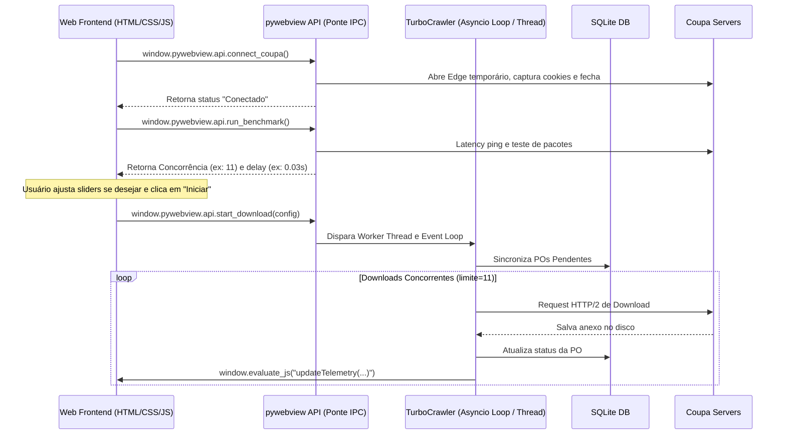

# Documento de Design: Coupa Turbo Downloader (Aplicação Standalone Portátil - Web UI)

## 1. Contexto e Objetivos Arquiteturais
A nova aplicação `CoupaTurboDownloader` será construída de forma 100% isolada e independente. Seu propósito é prover download em lote de anexos do Coupa em altíssima velocidade (meta >30 POs/min, benchmark genético: **69.44 POs/min**) sem a necessidade de drivers de navegador gráficos persistentes no loop principal de downloads.

> [!IMPORTANT]
> **Política de Isolamento Estrito**: O projeto original (`src/` e `tools/` legados) **nunca** será alterado, modificado ou copiado. Ele servirá estritamente como material de referência técnica para compreendermos os requisitos de negócios e o escopo de downloads do Coupa. Todo o código da nova aplicação `CoupaTurboDownloader` será construído totalmente do zero, sem reaproveitamento ou cópia de arquivos legados.

Para atingir a qualidade estética e a sofisticação do **SQLBI Bravo**, substituiremos a interface gráfica antiga (Tkinter) por uma **UI Web-Native** alimentada pelo framework **pywebview**. O aplicativo executará em uma janela nativa estilizada, consumindo pouca memória RAM e renderizando interfaces modernas e interativas via HTML5/CSS3/JS, empacotadas via PyInstaller sem privilégios de administrador.

## 2. Decisões de Tecnologia (Tech Stack)

| Componente | Tecnologia Escolhida | Rationale (Motivação) |
| :--- | :--- | :--- |
| **Gerenciamento de Ambientes** | `uv` | Velocidade absurda de sincronização e facilidade de isolamento. |
| **Interface Gráfica (GUI)** | **pywebview** (Web-Native UI) | Alternativa ao Photino.NET para Python. Abre uma janela desktop nativa utilizando a engine de WebView nativa do SO (Microsoft Edge WebView2 no Windows e WebKit no macOS). Evita embutir o Chromium/Node.js na compilação, mantendo o app pequeno (~18MB) e leve (consome ~35MB RAM). |
| **Frontend UI (Estilo)** | HTML5 / CSS3 (TailwindCSS/Glassmorphic) / JS (Vanilla) | Liberdade absoluta de design (Glassmorphism real com backdrop-blur, gradientes, sombras suaves, tipografia avançada offline, cards responsivos e animações CSS3 ultra-suaves). |
| **Captura de Cookies (Login)** | WebDriver Temporário Minimalista (Selenium) | Abre uma única vez e temporariamente um navegador padrão (Microsoft Edge) para o login do usuário, copia os cookies ativos da sessão autenticada, fecha a janela gráfica e destrói o processo de automação, transferindo a sessão para a Engine HTTP. |
| **Engine de Conexão** | `httpx` (Assíncrono) + `asyncio` | Suporte a HTTP/2 nativo, pooling de conexões e execução paralela assíncrona ultra-rápida. |
| **Parser DOM (HTML)** | `BeautifulSoup4` + `lxml` | Parsing do DOM com suporte a tags tradicionais `<a>` e elementos dinâmicos `<span>` com `data-url`. |
| **Persistência de Estado** | `sqlite3` (Built-in) | Persistência transacional atômica ACID para continuidade resiliente e histórico completo de execuções anteriores. |
| **Bundling (Compilação)**| `PyInstaller` | Gera executáveis standalone de arquivo único (`onefile`) altamente otimizados e portáteis. |

## 3. Arquitetura do Sistema e Estrutura de Pastas
A estrutura da subpasta `/CoupaTurboDownloader` será:

```
CoupaTurboDownloader/
├── .planning/               # Planejamento independente do GSD
│   ├── config.json
│   ├── PROJECT.md
│   ├── REQUIREMENTS.md
│   ├── ROADMAP.md
│   └── STATE.md
├── src/
├── __init__.py
├── main.py              # Ponto de entrada do app (inicializa o pywebview e a Engine)
├── gui/
│   ├── __init__.py
│   ├── api.py           # API Python exposta ao Javascript (Ponte IPC)
│   └── assets/          # Interface do Usuário (UI Web Estática)
│       ├── index.html   # HTML5 com abas de Dashboard, Histórico e Configurações
│       ├── style.css    # TailwindCSS / Glassmorphic Custom Styling
│       └── script.js    # Interação da UI, escuta de métricas, importações e IPC
├── engine/
│   ├── __init__.py
│   ├── crawler.py       # Motor assíncrono httpx + asyncio de downloads
│   ├── parser.py        # BeautifulSoup unificado para href e data-url
│   ├── authenticator.py # Edge WebDriver temporário para extração de cookies
│   ├── benchmarker.py   # Teste rápido de latência e ping para sugerir parâmetros ótimos
│   ├── updater.py       # Verificador de versão no GitHub e download do binário autoupdater
│   └── rate_limiter.py  # Cooldowns inteligentes e adaptativos contra rate limit
└── db/
    ├── __init__.py
    └── session_db.py    # Persistência SQLite multissessão (histórico e resiliência)
├── pyproject.toml           # Dependências isoladas gerenciadas pelo uv
├── uv.lock
└── build_standalone.py      # Script de automação do PyInstaller
```

## 4. Fluxo de Comunicação e IPC (Python <-> JavaScript)
O **pywebview** simplifica drasticamente a comunicação bidirecional entre o motor em Python e a interface gráfica Web:

1. **Chamadas JavaScript -> Python (Ponte JSAPI)**:
   A classe `AppAPI` em `src/gui/api.py` mapeia métodos de produção no Python. O `pywebview` injeta esses métodos no escopo global do JS sob o objeto `window.pywebview.api`.
   *Exemplo na UI (JS):*
   ```javascript
   // Chamar o Benchmarker de Rede no Python
   const recomendacoes = await window.pywebview.api.run_benchmark();
   updateSliders(recomendacoes.concurrency, recomendacoes.delay);
   ```

2. **Notificações Python -> JavaScript (Telemetria Dinâmica)**:
   Para enviar atualizações assíncronas contínuas em tempo real (como progresso do download, taxa de POs/minuto, ETA, e novos consoles de log) sem congelar a janela, a Worker Thread no Python avalia JavaScript na janela de forma thread-safe:
   *Exemplo na Engine (Python):*
   ```python
   # Envia dados de telemetria diretamente para a store da UI
   window.evaluate_js(f"updateTelemetry({json.dumps(metrics)})")
   ```



## 5. Estética da Interface do Usuário (Visual Premium)
Ao usar CSS moderno, podemos criar uma UI espetacular que se assemelha exatamente a uma aplicação desktop de última geração (como o Bravo BI):
- **Efeito Glassmorphism Real**: Uso de `backdrop-filter: blur(12px)` em cards semi-transparentes sobre um fundo escuro degradê elegante (`#0B0F19` a `#070A12`).
- **Cards Dinâmicos de Telemetria**: Bordas neon sutis com cores que mudam de estado (Vibrant Cyan para download, Mint Green para sucesso, Sleek Gold para pendências de rede).
- **Tipografia Offline Estrita**: Uso de fontes profissionais locais (`system-ui`, `-apple-system`, `Segoe UI`, `San Francisco`).
- **Logs Console Interativo**: Uma área preta estilizada que simula uma linha de comando moderna, exibindo com cores (vermelho para erros, verde para downloads efetuados) o andamento detalhado do lote de downloads de anexos.

## 6. Autoupdater Standalone Portátil
- **Detecção**: O script `src/engine/updater.py` consulta as releases do GitHub. Se encontrar uma versão nova, envia `window.evaluate_js("showUpdateBanner(...)")`.
- **Substituição**: Ao aceitar o update na interface, o app baixa o executável apropriado no diretório temporário, gera um script batch/shell nativo que aguarda a janela fechar, copia os novos arquivos substituindo os antigos e reabre a aplicação.

## 7. Compilação Standalone com PyInstaller
Para que a interface gráfica Web funcione de arquivo único portátil, o script `build_standalone.py` orquestra o empacotamento das pastas de assets estáticos da UI:
- **Resolução de Caminhos**: A aplicação usa a verificação dinâmica `sys._MEIPASS` para extrair os arquivos HTML/CSS/JS da pasta temporária local criada pelo executável compilado.
- **Hiding Console**: O PyInstaller compilará em modo `--windowed` (para macOS) e `--noconsole` (para Windows), abrindo diretamente a janela gráfica HTML5 sem terminais pretos no background.

## 8. Fluxo de Importação/Exportação e Histórico de Execuções

Para prover controle total ao usuário e manter conformidade estrita com o sistema legado, o ciclo de vida dos dados será gerenciado de forma transparente e persistente:

### A. Fluxo de Entrada (Importação de POs)
1. **Drag & Drop ou File Dialog**: A Web UI possui um componente estético e interativo de importação. Ao arrastar ou selecionar uma planilha Excel (`.xlsx`) ou arquivo CSV (`.csv`), a ponte IPC envia o caminho do arquivo para o Python.
2. **Leitura e Extração**: Utilizando o parser em Python (com suporte a `pandas`/`openpyxl`), o sistema localiza a coluna de identificação das ordens de compra (`PO_NUMBER`), valida seu conteúdo e cria uma nova sessão de execução.
3. **Criação da Sessão**: O banco de dados registra uma nova linha na tabela `sessions` e popula a tabela `po_downloads` com todas as POs extraídas sob o status inicial `PENDING`.

### B. Persistência de Histórico no SQLite (`session_db.py`)
Diferente da persistência efêmera anterior, o banco de dados unificado manterá o histórico permanente das execuções do usuário através do seguinte modelo relacional:
* **Tabela `sessions`**:
  - `id` (INTEGER, PK): ID auto-incremento da sessão de lote.
  - `started_at` (TEXT): Timestamp de início.
  - `completed_at` (TEXT): Timestamp de conclusão (ou nulo se pausado).
  - `source_file` (TEXT): Caminho da planilha original de entrada.
  - `total_pos` (INTEGER): Total de POs carregadas.
  - `success_rate` (REAL): Porcentagem final de sucesso de downloads.
  - `average_speed` (REAL): Velocidade média atingida (POs/min).
  - `status` (TEXT): Estado da sessão (`RUNNING`, `PAUSED`, `COMPLETED`, `FAILED`).
* **Tabela `po_downloads`**:
  - `po_number` (TEXT, PK combinada com `session_id`): Identificador único da PO.
  - `session_id` (INTEGER, FK): Associação à sessão criada.
  - `status` (TEXT): Status do item (`PENDING`, `DOWNLOADING`, `COMPLETED`, `FAILED`).
  - `attachments_found` (INTEGER): Número de anexos identificados no HTML da PO.
  - `attachments_downloaded` (INTEGER): Número de anexos baixados com sucesso.
  - `error_message` (TEXT): Descrição detalhada da falha, caso ocorra.
  - `processed_at` (TEXT): Timestamp de conclusão do item.

### C. Fluxo de Saída e Geração de Relatórios (Exportação)
1. **Retomada Inteligente**: Como o histórico de cada sessão é gravado de forma ACID, o usuário pode visualizar sessões incompletas na aba de **Histórico de Execuções** da Web UI e retomá-las a qualquer momento com um único clique.
2. **Mesclagem do Relatório XLSX**: Ao final de um lote de download (ou sob demanda na aba Histórico), a engine Python lê a planilha original importada pelo usuário, mescla todas as colunas de resultados atualizados a partir da tabela `po_downloads` (`STATUS`, `SUPPLIER`, `ATTACHMENTS_FOUND`, `ATTACHMENTS_DOWNLOADED`, `LAST_PROCESSED`, `ERROR_MESSAGE`, `DOWNLOAD_FOLDER`) e gera um arquivo consolidado elegante (`CoupaTurbo_Report_YYYYMMDD_HHMMSS.xlsx`) na pasta de saída.
3. **Download dos Arquivos**: Os arquivos de anexos baixados são salvos organizadamente em uma pasta contendo subdiretórios nomeados pelo número das POs, garantindo estruturação impecável e acesso fácil offline.

## 9. Validação Dinâmica e Circuit Breaker de Company Codes

Para evitar desperdício de banda, mitigar riscos de bloqueio (ban) por requisições inválidas repetitivas e prover inteligência operacional, a engine de downloads implementará um disjuntor de segurança dinâmico por Código de Companhia (Company Code):

### A. Mapeamento e Inclusão de Metadados
1. **Mapeamento de Coluna**: O leitor de planilhas identificará a coluna que representa o código de companhia. O sistema **não precisa adivinhar** ou deduzir o código; a informação é fornecida diretamente na tabela de entrada sob a coluna nomeada **`legal entity`** (ou variações diretas mapeadas).
2. **Armazenamento**: O campo `company_code` (TEXT) contendo o valor da coluna `legal entity` será incluído no esquema da tabela `po_downloads` no SQLite para indexação e agrupamento das ordens de compra.

### B. Algoritmo de Circuit Breaker (Disjuntor de Erros)
Para cada Company Code ativo na execução, a engine acompanhará em tempo real a taxa de erros através do seguinte algoritmo:
1. **Verificação de Progresso**: Quando a quantidade de POs processadas (com sucesso ou falha) para uma determinada companhia atingir **$\ge 15\%$ do total previsto** para aquela companhia (com um mínimo amostral de 3 POs para evitar falsos positivos):
   - O sistema calcula a taxa de erro instantânea.
2. **Corte de Fluxo (Trip)**: Se a taxa de erro for de **exatamente 100%** (todas as POs testadas falharam por falta de acesso ou erro de carregamento no Coupa):
   - O **Circuit Breaker** é ativado para essa companhia específica.
   - O processamento de todas as POs restantes pertencentes a essa companhia é **imediatamente suspenso**.
   - As POs suspensas são marcadas no SQLite com o status `SKIPPED_VERIFICATION_REQUIRED`.

### C. Alerta Visual na UI e Reexecução
1. **Notificação Estética**: A Web UI exibirá um banner estilizado em tom de ouro ou vermelho-neon indicando: *"Atenção: Company Code [Código] suspenso após taxa de erro de 100% nos primeiros 15% de processamento. Favor verificar o perfil do usuário no Coupa."*
2. **Ação de Confirmação**: O painel exibirá o botão **"Confirmar e Retentar"** (Confirm & Retry) ao lado do código suspenso.
3. **Loop de Retentativa**: Após o usuário verificar o acesso do usuário no portal do Coupa e clicar em "Confirmar e Retentar" na UI, o Python executa:
   - A alteração do status de todas as POs daquela companhia (tanto as suspensas quanto as falhas anteriores) de volta para `PENDING`.
   - O agendamento imediato dessas POs para um novo ciclo de processamento, sem interferir com os downloads concluídos com sucesso de outras companhias.

### D. Gestão de Limpeza do Disco (Evitando Lixo/Pastas Vazias)
Para assegurar que o diretório final de downloads esteja 100% limpo, sem criar diretórios vazios ("lixo") de POs que falharam ou foram abortadas:
1. **Criação Tardia (Lazy Creation)**: A engine de download **não criará** a pasta da PO no início do download. A pasta física da PO no disco (`download_root/PO_NUMBER/`) só será criada no momento exato em que o primeiro anexo válido da PO for confirmado e estiver pronto para ser gravado em disco.
2. **Rotina de Limpeza (Post-Download Cleanup)**: Caso uma PO inicie o download, crie uma pasta física temporária e sofra uma falha no meio do processo que resulte em zero arquivos baixados com sucesso:
   - A engine disparará uma rotina de deleção segura (`shutil.rmtree` ou `os.rmdir`) para remover a pasta órfã vazia imediatamente, mantendo o diretório final limpo e estruturado.


