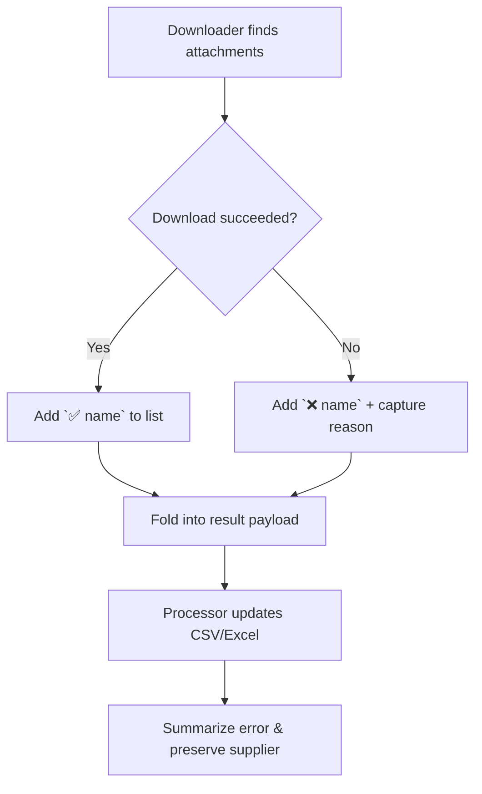

# PR 26 — Attachment Status Markers & Concise Error Summaries
- Status: draft
- Implementação: pending
- Data: 2025-09-23
- Responsáveis: TBD
- Observações: 


## Objective
Deliver cleaner CSV feedback so operators instantly understand outcomes:
- Track every attachment we discover, prefixing the filename with `✅` or `❌` to signal download success.
- Consolidate supplier information into the single column `L1 UU Supplier Name`, keeping values intact if extraction fails.
- Replace noisy status strings with actionable error summaries and leave `ERROR_MESSAGE` blank when nothing went wrong.

- Adjust attachment tracking so discovery and download results feed into a per-file status list that the CSV writer can persist.
- Refactor CSV/Excel processors to treat `L1 UU Supplier Name` as the canonical supplier field (with back-compat read of legacy `SUPPLIER`) and avoid overwriting it with blanks.
- Introduce an error summarizer that maps well-known Coupa/browser issues (PO not found, access denied, timeout, session loss, etc.) to short phrases, otherwise truncating long traces; emit an empty string on fully successful runs.
- Update status derivation to rely on explicit attachment counts instead of parsing log strings so we can simplify returned messages.
- Keep existing delimiter/BOM rules, folder naming, and hierarchy behaviour unchanged.

### Flow Overview


## Affected Files
- Update: `src/core/downloader.py` (collect success/failure lists, expose count metadata, stop emitting "Initiated download" text, surface better failure reasons)
- Update: `src/core/folder_hierarchy.py` (format helper handles pre-prefixed filenames without stripping emojis)
- Update: `src/core/excel_processor.py` (new supplier column logic, error summarizer, blank-on-success writes, status based on counts, column rename to `L1 UU Supplier Name`)
- Update: `src/core/csv_processor.py` (same supplier column adjustments and error write rules)
- Update: `src/Core_main.py` (consume new downloader payload fields when computing status and error message)
- Update Docs: `docs/USER_GUIDE.md` (column description + attachment markers note)

## Pseudodiff (representative)
```diff
--- src/core/downloader.py
@@
-        downloaded_count = 0
-        names_list: List[str] = []
+        downloaded_count = 0
+        names_list: List[str] = []
+        failed_entries: List[Tuple[str, str]] = []
@@
-            names_list.append(filename)
-            if self._download_attachment(attachment, filename):
-                downloaded_count += 1
+            succeeded = self._download_attachment(attachment, filename)
+            if succeeded:
+                downloaded_count += 1
+                names_list.append(f"✅ {filename}")
+            else:
+                failure_reason = "Download click failed"
+                failed_entries.append((filename, failure_reason))
+                names_list.append(f"❌ {filename}")
@@
-        if downloaded_count > 0:
-            msg = (
-                f"Initiated download for {downloaded_count}/{total_attachments} attachments."
-            )
-            print(f"   ✅ {msg}")
-            return {
-                'success': True,
-                'message': msg,
+        if downloaded_count == total_attachments:
+            return {
+                'success': True,
+                'status_hint': 'COMPLETED',
+                'error_message': '',
                 'supplier_name': supplier or '',
                 'attachments_found': total_attachments,
                 'attachments_downloaded': downloaded_count,
-                'coupa_url': url,
-                'attachment_names': names_list,
+                'coupa_url': url,
+                'attachment_names': names_list,
             }
-        else:
-            msg = f"Failed to download any of the {total_attachments} attachments."
-            print(f"   ❌ {msg}")
-            return {
-                'success': False,
-                'message': msg,
+        if downloaded_count == 0:
+            return {
+                'success': False,
+                'status_hint': 'FAILED',
+                'error_message': self._summarize_download_failure(failed_entries),
                 'supplier_name': supplier or '',
                 'attachments_found': total_attachments,
                 'attachments_downloaded': 0,
                 'coupa_url': url,
                 'attachment_names': names_list,
             }
+        return {
+            'success': False,
+            'status_hint': 'PARTIAL',
+            'error_message': self._summarize_download_failure(failed_entries),
+            'supplier_name': supplier or '',
+            'attachments_found': total_attachments,
+            'attachments_downloaded': downloaded_count,
+            'coupa_url': url,
+            'attachment_names': names_list,
+        }
--- src/Core_main.py
@@
-                status_code = _derive_status_label(success, message)
+                status_code = result.get('status_hint') or _derive_status_label(success, result)
@@
-                    error_message=message,
+                    error_message=result.get('error_message', ''),
@@
-            print(f"   ✅ {display_po}: {message}")
+            if result.get('error_message'):
+                print(f"   ⚠️ {display_po}: {result['error_message']}")
+            else:
+                print(f"   ✅ {display_po}: all attachments handled")
--- src/core/csv_processor.py
@@
-                            'supplier': (row.get('SUPPLIER') or '').strip(),
+                            'supplier': (row.get('L1 UU Supplier Name') or row.get('SUPPLIER') or '').strip(),
@@
-            'PO_NUMBER', 'STATUS', 'SUPPLIER',
+            'PO_NUMBER', 'STATUS', 'L1 UU Supplier Name',
@@
-                        'SUPPLIER': entry['supplier'],
+                        'L1 UU Supplier Name': entry['supplier'],
--- src/core/excel_processor.py
@@
-                'SUPPLIER': '',
+                'L1 UU Supplier Name': '',
@@
-                    'supplier': str(row.get('SUPPLIER', '')).strip(),
+                    'supplier': str(row.get('L1 UU Supplier Name', row.get('SUPPLIER', ''))).strip(),
@@
-                df.loc[mask, 'SUPPLIER'] = supplier
+                if supplier.strip():
+                    df.loc[mask, 'L1 UU Supplier Name'] = supplier
@@
-                df.loc[mask, 'ERROR_MESSAGE'] = error_message
+                df.loc[mask, 'ERROR_MESSAGE'] = ExcelProcessor._summarize_error_for_csv(error_message)
@@
-                        worksheet.cell(row=row_num, column=3).value = supplier
+                        if supplier.strip():
+                            worksheet.cell(row=row_num, column=3).value = supplier
+                        worksheet.cell(row=row_num, column=8).value = ExcelProcessor._summarize_error_for_csv(error_message)
+                        worksheet.cell(row=row_num, column=6).value = attachment_names
--- docs/USER_GUIDE.md
@@
-`AttachmentName`: Stores attachment filenames separated by `;` + newline.
+`AttachmentName`: Stores attachment filenames separated by `;` + newline, each prefixed with `✅` or `❌` to indicate the download outcome.
```

## Acceptance Criteria
- CSV/Excel always list every discovered attachment with the correct success/failed emoji prefix.
- `L1 UU Supplier Name` is the only supplier column written; legacy files without it continue to load, and blank extractions do not overwrite existing values.
- `ERROR_MESSAGE` is empty on a clean run, keeps "No attachments found." for that scenario, and otherwise shows <=120-char actionable text (e.g., "PO not found or access denied").
- Status calculation still yields `COMPLETED`, `PARTIAL`, `FAILED`, and `NO_ATTACHMENTS` appropriately even without the old "Initiated download" wording.
- CSV delimiter, BOM, and column order remain unchanged apart from the supplier column rename.

## Minimal Manual Tests
1. **Happy path**: Process a PO with multiple attachments; verify CSV shows `✅` markers, counts match, and `ERROR_MESSAGE` is blank.
2. **Partial failure**: Force one attachment click to fail; confirm both `✅` and `❌` markers appear, status becomes `PARTIAL`, and `ERROR_MESSAGE` summarizes the failure.
3. **PO not found**: Trigger the Coupa error page; ensure status is `FAILED`, `ERROR_MESSAGE` becomes "PO not found or access denied", and supplier column stays unchanged.
4. **Legacy CSV load**: Open an older CSV containing `SUPPLIER` only; confirm we still read it, but writes only produce `L1 UU Supplier Name`.
5. **No attachments**: Run a PO with zero attachments; expect `NO_ATTACHMENTS` status and the message "No attachments found." preserved.

## Suggested Commit Message and Branch
- Plan branch: `plan/26-csv-attachment-markers`
- Impl branch: `fix/26-csv-attachment-markers`
- Plan commit: `docs(pr-plan): PR 26 — attachment markers and error clean-up`

## Plain-language (ELI5) Summary
Think of the tool as a helper who checks each PO for files. After this change the helper writes down every file name and adds a green check or red cross so you instantly know which ones arrived. If the helper bumps into a locked door or times out, it writes a short note about the problem; otherwise it leaves the note blank. The supplier name column you already trust stays in place and is no longer silently cleared.

## Checklist
- [x] Objective and Scope are clear and limited.
- [x] Affected files listed.
- [x] Pseudodiff (small, readable) provided.
- [x] Acceptance criteria and minimal manual tests.
- [x] Suggested commit message and branch name.
```
