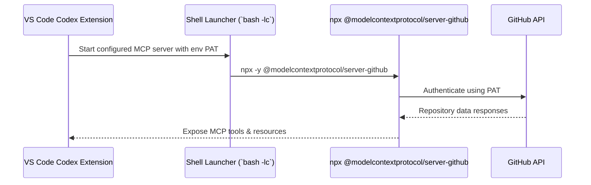

# PR Plan 31 — Enable GitHub MCP in the Codex VS Code Extension
- Status: draft
- Implementação: pending
- Data: 2025-09-23
- Responsáveis: TBD
- Observações: 


## Objective
Document, validate, and socialize the exact Codex VS Code settings needed to launch the GitHub MCP server on demand so contributors can browse and edit repositories through Codex without exposing long-lived secrets.

**Resumo em pt-BR:** Vamos preparar um guia passo a passo mostrando como configurar o Codex no VS Code para iniciar o servidor MCP do GitHub com `npx`, usando um token guardado em variável de ambiente em vez de salvar segredos no repositório.

## Scope
- Author a focused how-to for the VS Code Codex extension that lists prerequisites, configuration, and verification steps for the GitHub MCP server.
- Ship a ready-to-paste `settings.json` block that references an environment variable (e.g., `GITHUB_MCP_PAT`) rather than committing tokens.
- Cross-link the new how-to from maintainer docs (`AGENTS.md`) and the main project entry point (`README.md`).

Out of scope:
- Shipping or bundling the GitHub MCP server binaries, or altering how the extension launches other MCP servers.
- Automating PAT issuance, changing default Codex behaviors, or touching the standalone CLI configuration.

## Affected Files
- `docs/howto/github_mcp_codex_vscode.md` (new walkthrough with prerequisites, config snippet, testing guidance)
- `AGENTS.md` (documentation section points to the new how-to)
- `README.md` (documentation index references the guide for newcomers)

## Approach
1. **Collect prerequisites and references** — Confirm minimum Node.js/npx versions, the GitHub MCP package name, required PAT scopes (`repo`, optional `read:org`), and add citations to GitHub’s official MCP README plus our security policies.
2. **Draft the how-to** — Cover environment prep (exporting `GITHUB_MCP_PAT`, `.env` hygiene), the VS Code `settings.json` snippet under `"codex.experimental.mcpServers"`, an explanation of the shell wrapper that injects the PAT, and troubleshooting notes (missing Node, missing PAT, expired token).
3. **Add visuals and plain-language info** — Include a Mermaid sequence diagram that shows VS Code → Codex → shell launcher → GitHub MCP server → GitHub API, plus a beginner-friendly explanation of what MCP does and why we rely on environment variables.
4. **Update cross-reference docs** — Insert concise bullets in `AGENTS.md` and `README.md` so maintainers and newcomers know where to find the guide; keep wording consistent with existing documentation tone.
5. **Validation checklist** — Document manual verification steps (e.g., `which node`, exporting PAT, running “Codex: List MCP Tools”) inside the how-to and note the expected outcomes for both success and failure paths.



### Plain-language explainer
We are teaching Codex inside VS Code how to talk to a “GitHub helper.” When you open a Codex session that needs GitHub, VS Code will run a small script through `npx`. That script reads your GitHub token from an environment variable, talks to GitHub on your behalf, and passes the answers back to Codex. Because the token comes from your shell instead of a file in this repo, you keep secrets out of source control.

## Pseudodiff (representative)
```diff
+++ docs/howto/github_mcp_codex_vscode.md
++# GitHub MCP for Codex VS Code Extension
++# Prerequisites
++# Exporting the PAT securely
++# VS Code settings snippet
++# Verification & troubleshooting
++
--- AGENTS.md
+++ AGENTS.md
@@
- - Provide a plain-language (explain like I'm new to programming) summary for any deep technical concept introduced, keeping the repo accessible to non-experts.
+ - Provide a plain-language (explain like I'm new to programming) summary for any deep technical concept introduced, keeping the repo accessible to non-experts.
+ - When Codex in VS Code needs GitHub access, follow `docs/howto/github_mcp_codex_vscode.md` so MCP configuration stays consistent.

--- README.md
+++ README.md
@@
- ## 📖 Documentation
+ ## 📖 Documentation
    - Release notes: `docs/RELEASE_NOTES.md`
    ...
+  - GitHub MCP (Codex VS Code): `docs/howto/github_mcp_codex_vscode.md`
```

## Acceptance Criteria
- The new how-to covers prerequisites, environment setup, VS Code configuration, verification steps, troubleshooting, and includes both a Mermaid diagram and a beginner-friendly explanation.
- The provided `settings.json` block launches `npx -y @modelcontextprotocol/server-github` via a shell wrapper that inherits `GITHUB_MCP_PAT` (no secrets committed to the repo).
- `AGENTS.md` and `README.md` reference the guide so maintainers and newcomers discover it quickly.
- Manual verification instructions include checks for missing PAT or Node so contributors can debug setup issues on their own.

## Manual Tests
- `which node && which npx` — verify Node.js tooling is available; document remediation if not.
- `export GITHUB_MCP_PAT=...` followed by adding the settings snippet, then use the VS Code command palette → “Codex: List MCP Tools” and confirm GitHub tools appear.
- Unset or provide an invalid PAT and rerun “Codex: List MCP Tools” to confirm the how-to’s troubleshooting guidance matches the observed error message.

## Suggested commit message and branch
- Branch: `plan/31-github-mcp`
- Commit: `docs(pr-plan): PR 31 — codex vscode github mcp`

## Checklist
- [x] Objective and Scope are clear and limited.
- [x] Affected files listed.
- [x] Pseudodiff (small, readable, representative of the approach).
- [x] Acceptance criteria and minimal manual tests.
- [x] Suggested commit message and branch name.
