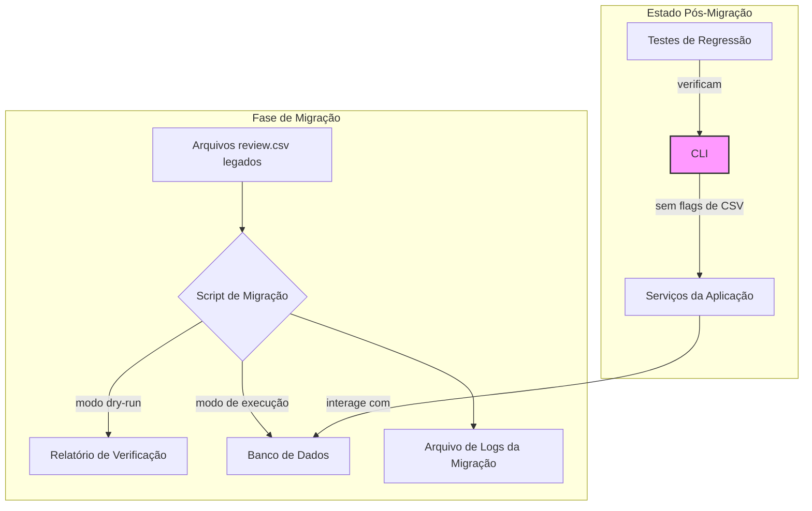

# Arquitetura 42 — Migração e Descontinuação do Fluxo CSV (migration-and-decommission)

- Status: draft
- Data: 2025-09-23
- Responsáveis: Gemini (Developer)
- Observações: Detalhes técnicos para a migração de dados de CSV para o banco de dados e a remoção do fluxo legado.

## Estado da revisão (2025-09-25)

- [ ] Implementado no código-base. O script `scripts/migrate_review_csv.py` permanece como rascunho e a CLI segue aceitando `--review-csv`/`--out-dir`, sem validações que obriguem o uso do banco de dados, então a descontinuação ainda não aconteceu.

## Resumo executivo
Este documento descreve a arquitetura e o plano de implementação para migrar os dados históricos de `review.csv` para o banco de dados da aplicação. Ele também detalha a remoção do código legado relacionado ao fluxo de trabalho baseado em CSV, incluindo comandos da CLI e flags, garantindo que o sistema opere exclusivamente no novo modo orientado ao banco de dados.

## Objetivos e não objetivos
### Objetivos
- Implementar um script de migração (`scripts/migrate_review_csv.py`) para mover os dados de CSV para o banco de dados.
- Limpar a base de código, removendo todos os caminhos de execução que dependem de arquivos CSV.
- Atualizar a documentação para refletir o novo fluxo de trabalho e o processo de migração.
- Garantir que tentativas de usar o fluxo legado resultem em erros claros e informativos.

### Não Objetivos
- Alterar o schema do banco de dados (que já foi definido nos planos anteriores).
- Fornecer uma solução de arquivamento automatizado para os arquivos CSV migrados.

## Estado atual
A aplicação atualmente suporta um fluxo de trabalho duplo: o novo, baseado em banco de dados (Plano 41), e o antigo, baseado em arquivos CSV. A CLI (`tools/feedback_cli.py`) contém comandos e argumentos para ambos os modos, o que aumenta a complexidade e a possibilidade de erros. Dados históricos importantes existem em formato CSV em `reports/feedback/`.

## Visão proposta
A proposta é executar uma migração única dos dados legados e, em seguida, remover completamente o código do fluxo antigo, simplificando a aplicação e consolidando o novo paradigma de banco de dados.

### Componentes e responsabilidades
- **`scripts/migrate_review_csv.py` (novo)**: Um script autônomo que:
    - Encontra os arquivos `review.csv` usando um padrão de glob.
    - Usa utilitários existentes para parsear os CSVs.
    - Converte os registros do CSV para o schema do banco de dados.
    - Insere os registros no banco de dados, associando-os a `documents` e `training_runs`.
    - Oferece um modo `dry-run` e gera um relatório de verificação.
- **`tools/feedback_cli.py` (modificado)**:
    - Remoção de argumentos como `--review-csv`.
    - Os comandos serão atualizados para usar exclusivamente identificadores do banco de dados (ex: `--training-run-id`).
    - Adição de mensagens de erro que guiam o usuário a executar o script de migração se tentarem usar o fluxo antigo.
- **Documentação (modificada)**:
    - O `README.md` e o `USER_GUIDE.md` serão atualizados para remover as instruções do fluxo CSV.
    - Uma nova seção será adicionada para explicar como executar a migração.

### Fluxos (diagramas, mermaid, sequência)



### Pseudocódigo
```python
# scripts/migrate_review_csv.py

def migrate_csv_to_db(csv_path: str, db_session, dry_run: bool = False):
    records = parse_review_csv(csv_path) # Lógica de parse existente
    for record in records:
        # Converte o registro para o modelo do banco de dados
        db_document = convert_to_document_model(record)
        db_annotations = convert_to_annotation_models(record)

        if not dry_run:
            # Insere no banco de dados
            db_session.add(db_document)
            db_session.add_all(db_annotations)
    return len(records)

# tools/feedback_cli.py

def ingest_command(training_run_id: UUID = typer.Option(...)):
    # Lógica que usa o training_run_id para interagir com o banco de dados
    # O argumento --review-csv foi removido
    ...

# Antes da modificação:
# def ingest_command(review_csv: Path = typer.Option(None), ...):
#     if review_csv:
#         # Lógica antiga
#     else:
#         # Lógica nova
```

## Plano de implementação
1.  **Script de Migração**: Desenvolver o `scripts/migrate_review_csv.py` com modo `dry-run` e verificação.
2.  **Testes do Script**: Adicionar testes unitários para o script de migração.
3.  **Limpeza da CLI**: Refatorar `tools/feedback_cli.py` para remover o código do fluxo CSV.
4.  **Testes de Regressão**: Adicionar testes que garantam que a CLI falhe se argumentos legados forem usados.
5.  **Atualização da Documentação**: Atualizar todos os documentos relevantes para refletir a remoção do fluxo CSV e o novo processo de migração.

## Decisões, trade-offs e alternativas consideradas
- **Estratégia de migração**: A migração será "one-off" (executada uma vez) através de um script, em vez de um processo contínuo. Isso é mais simples e adequado para a descontinuação de um fluxo legado.
- **Remoção vs. Deprecation**: Optamos pela remoção completa do código legado em vez de apenas marcá-lo como "deprecated". Isso reduz a complexidade da base de código e evita a manutenção de código morto. Uma ADR será criada para registrar esta decisão.

## Pendências e próximos passos
- [ ] Criar a ADR para a descontinuação do fluxo CSV.
- [ ] Iniciar a implementação do script de migração.
- [ ] Levantar todos os locais na documentação que precisam ser atualizados.
