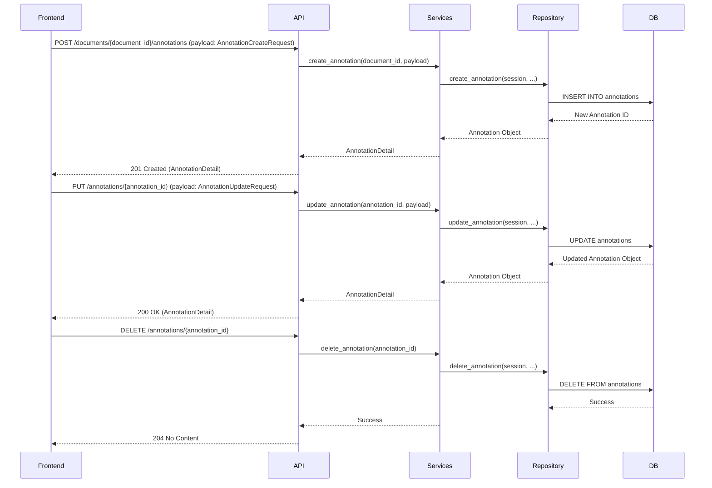

# Arquitetura 48 — Backend - Endpoints de Anotação Interativa (backend-interactive-annotation-endpoints)

- Status: draft
- Data: 2025-09-23
- Responsáveis: Gemini
- Observações: Este documento detalha o design para o PR 48, que implementa endpoints de API para gerenciamento interativo de anotações. Depende do PR 46 e é um pré-requisito para o PR 49.

## Estado da revisão (2025-09-25)

- [ ] Implementado no código-base. Os módulos `api.py` e `services.py` não possuem métodos CRUD para anotações individuais e somente mantêm o fluxo de ingestão em lote, demonstrando que este design permanece sem execução.

## Resumo executivo

Este documento descreve o design para novos endpoints FastAPI que permitirão o gerenciamento granular e interativo de anotações. Esses endpoints suportarão operações CRUD (Create, Read, Update, Delete) para anotações individuais, afastando-se da atual ingestão em lote de exportações de anotações. Este é um passo crítico para o fluxo de trabalho de anotação interativa no frontend.

## Objetivos e não objetivos

### Objetivos
- Fornecer endpoints RESTful para criar, atualizar e excluir anotações individuais.
- Garantir que as alterações nas anotações sejam persistidas no banco de dados.
- Lidar com validação e condições de erro de forma elegante.
- Integrar com o modelo `Annotation` existente em `server.db.models.py`.

### Não objetivos
- Implementar a UI de frontend para anotação interativa (será um PR separado).
- Modificar o endpoint `ingest_annotation_export` (ele permanecerá para importações em lote, mas as alterações interativas usarão os novos endpoints).
- Implementar versionamento complexo ou resolução de conflitos para anotações (foco inicial no CRUD básico).

## Estado atual

- As anotações são principalmente ingeridas via `ingest_annotation_export`, que espera uma exportação JSON semelhante ao Label Studio.
- O modelo `Annotation` em `server.db.models.py` armazena metadados da anotação e um `latest_payload` (que contém o JSON ingerido).
- Não existem endpoints granulares para gerenciamento interativo de anotações.

## Visão proposta

### Componentes e responsabilidades
- **`src/server/pdf_training_app/api.py`:**
    - Novo endpoint `POST /documents/{document_id}/annotations` para criar anotações.
    - Novo endpoint `PUT /annotations/{annotation_id}` para atualizar anotações.
    - Novo endpoint `DELETE /annotations/{annotation_id}` para excluir anotações.
    - Esses endpoints rotearão as requisições para as funções de serviço correspondentes e tratarão `HTTPException`.
- **`src/server/pdf_training_app/services.py`:**
    - Nova função `create_annotation(document_id: str, payload: AnnotationCreateRequest) -> AnnotationDetail`.
    - Nova função `update_annotation(annotation_id: str, payload: AnnotationUpdateRequest) -> AnnotationDetail`.
    - Nova função `delete_annotation(annotation_id: str)`.
    - Essas funções interagirão diretamente com `server.db.repository` para realizar operações de banco de dados.
- **`src/server/db/repository.py`:**
    - Novas funções como `create_annotation`, `get_annotation`, `update_annotation`, `delete_annotation` para abstrair as interações com o banco de dados para o modelo `Annotation`.
- **`src/server/db/models.py`:**
    - O modelo `Annotation` será atualizado para armazenar dados de anotação granulares diretamente (ex: `type`, `value`, `location`) em vez de apenas um blob `latest_payload`, ou o `latest_payload` será estruturado para facilitar isso. Uma decisão sobre a estrutura exata será tomada durante a implementação, potencialmente exigindo um ADR.
- **`src/server/pdf_training_app/models.py`:**
    - Novos modelos Pydantic: `AnnotationCreateRequest`, `AnnotationUpdateRequest`, `AnnotationDetail` (para representar a estrutura de uma anotação para requisições e respostas da API).

### Fluxos (diagramas, mermaid, sequência)

### Dados e contratos

- **`AnnotationCreateRequest`**: `document_id: str`, `type: str`, `value: str`, `location: Dict[str, Any]`, `reviewer: Optional[str]`, `notes: Optional[str]`.
- **`AnnotationUpdateRequest`**: `type: Optional[str]`, `value: Optional[str]`, `location: Optional[Dict[str, Any]]`, `reviewer: Optional[str]`, `notes: Optional[str]`, `status: Optional[AnnotationStatus]`.
- **`AnnotationDetail`**: `id: str`, `document_id: str`, `type: str`, `value: str`, `location: Dict[str, Any]`, `reviewer: Optional[str]`, `notes: Optional[str]`, `status: AnnotationStatus`, `created_at: datetime`, `updated_at: datetime`.

## Plano de implementação

1.  **Definir Modelos Pydantic**: Criar `AnnotationCreateRequest`, `AnnotationUpdateRequest` e atualizar `AnnotationDetail` em `src/server/pdf_training_app/models.py`.
2.  **Atualizar Modelo `Annotation` (se necessário)**: Revisar `src/server/db/models.py` para garantir que o modelo `Annotation` possa armazenar dados granulares de `type`, `value` e `location`. Se `latest_payload` for atualmente um blob JSON genérico, considerar estruturá-lo ou adicionar novas colunas. Isso pode exigir uma migração de banco de dados.
3.  **Implementar Funções do Repositório**: Adicionar `create_annotation`, `get_annotation`, `update_annotation`, `delete_annotation` a `server.db.repository.py`.
4.  **Implementar Funções de Serviço**: Adicionar `create_annotation`, `update_annotation`, `delete_annotation` a `src/server/pdf_training_app/services.py`, utilizando as funções do repositório.
5.  **Adicionar Endpoints da API**: Implementar os endpoints `POST`, `PUT`, `DELETE` em `src/server/pdf_training_app/api.py`, chamando as respectivas funções de serviço e tratando exceções.

## Impactos

- **Performance**: Impacto mínimo para operações CRUD individuais. Operações em lote (como `ingest_annotation_export`) ainda podem ser mais eficientes para grandes importações.
- **Segurança**: Práticas padrão de segurança de API (autenticação, autorização) serão aplicadas a esses novos endpoints.
- **Operações / suporte**: Novos endpoints para monitorar. Potencial migração de banco de dados se o modelo `Annotation` mudar significativamente.

## Testes e evidências

- Testes de unidade para novas funções de repositório e serviço para garantir a interação correta com o banco de dados e a lógica de negócios.
- Testes de integração para todos os novos endpoints da API para verificar o tratamento correto de requisições/respostas, persistência de dados e condições de erro.

## Decisões, trade-offs e alternativas consideradas

- **Estrutura de Dados da Anotação**: Decidiu-se armazenar `type`, `value`, `location` granulares diretamente no modelo `Annotation` ou em um `latest_payload` estruturado para facilitar atualizações interativas. A alternativa era continuar usando um blob JSON genérico, mas isso complicaria as atualizações granulares.
- **Lote vs. Interativo**: Manteve-se `ingest_annotation_export` para cenários em lote, enquanto introduziu endpoints granulares para uso interativo. Isso proporciona flexibilidade.

## Pendências e próximos passos

- PR 49: Frontend - UI de Anotação Interativa.
- PR 50: Backend - Gatilho de Feedback Imediato do Modelo.