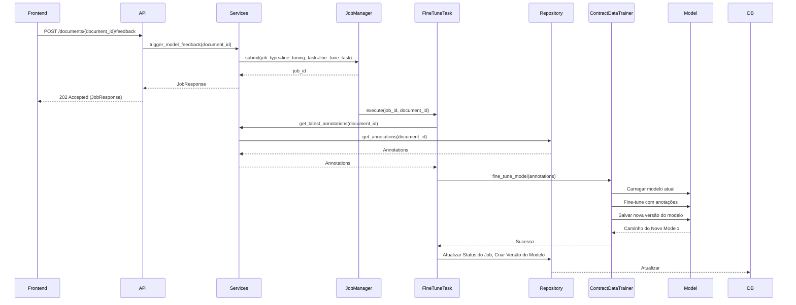

# Arquitetura 50 — Backend - Gatilho de Feedback Imediato do Modelo (backend-immediate-model-feedback-trigger)

- Status: draft
- Data: 2025-09-23
- Responsáveis: Gemini
- Observações: Este documento detalha o design para o PR 50, que implementa o gatilho de feedback imediato do modelo. Depende do PR 48 e é um pré-requisito para o PR 51.

## Estado da revisão (2025-09-25)

- [ ] Implementado no código-base. O serviço de treinamento continua gerando um artefato fictício (`"Placeholder model artifact"`) e nenhum endpoint específico de feedback foi exposto, logo o design não foi aplicado.

## Resumo executivo

Este documento detalha o design para um novo endpoint de backend que permitirá o feedback imediato do modelo. Ao receber anotações corrigidas ou novas, este endpoint acionará um fine-tuning assíncrono ou uma atualização incremental do modelo de extração de entidades. Isso visa melhorar a precisão da predição para documentos subsequentes em tempo quase real, fechando o ciclo de feedback humano-no-loop.

## Objetivos e não objetivos

### Objetivos
- Fornecer um endpoint de API dedicado para receber feedback de anotação para um documento específico.
- Iniciar um job assíncrono para fine-tuning ou atualização incremental do modelo.
- Substituir a lógica de treinamento placeholder em `services.py` por uma implementação funcional.
- Integrar com o módulo `embeddinggemma_feasibility` para atualizações do modelo.
- Garantir que o modelo atualizado seja salvo e disponibilizado para futuras extrações.

### Não objetivos
- Implementar a UI de frontend para acionar este feedback (coberto no PR 51).
- Desenvolver um pipeline MLOps completo para versionamento, implantação e monitoramento de modelos (foco inicial no mecanismo de feedback).
- Alcançar estabilidade e desempenho de modelo de nível de produção na primeira iteração (foco inicial no loop de feedback funcional).

## Estado atual

- A função `create_training_run` em `src/server/pdf_training_app/services.py` contém lógica de treinamento placeholder.
- O módulo `embeddinggemma_feasibility` contém `contract_data_trainer.py`, que provavelmente é destinado ao treinamento de modelos.
- As anotações podem ser armazenadas no banco de dados (após o PR 48).
- Não há mecanismo para acionar atualizações imediatas do modelo com base no feedback do usuário.

## Visão proposta

### Componentes e responsabilidades
- **`src/server/pdf_training_app/api.py`:**
    - Novo endpoint `POST /documents/{document_id}/feedback`. Este endpoint receberá o `document_id` e, potencialmente, as anotações atualizadas (ou uma referência a elas).
    - Ele roteará a requisição para uma nova função de serviço.
- **`src/server/pdf_training_app/services.py`:**
    - Nova função `trigger_model_feedback(document_id: str) -> JobResponse`.
    - Esta função recuperará as anotações mais recentes para o `document_id` fornecido.
    - Ela enviará um job assíncrono (usando `job_manager`) para realizar o fine-tuning.
    - A função `create_training_run` será modificada para chamar a lógica de treinamento real em vez do placeholder.
- **`embeddinggemma_feasibility/contract_data_trainer.py` (modificação):**
    - Este módulo será aprimorado para incluir uma função (ex: `fine_tune_model(annotations: List[AnnotationData])`) que recebe um conjunto de anotações (ground truth) e realiza um fine-tuning leve ou atualização incremental no modelo atual.
    - Ele salvará o modelo atualizado em uma nova versão.
- **`src/server/pdf_training_app/models.py`:**
    - Um novo modelo Pydantic `FeedbackRequest` pode ser necessário se o frontend enviar dados de anotação específicos com a requisição de feedback.

### Fluxos (diagramas, mermaid, sequência)

### Dados e contratos

- **Requisição**: `POST /documents/{document_id}/feedback` (o corpo pode estar vazio ou conter parâmetros de feedback específicos).
- **Resposta**: `JobResponse` (indicando a natureza assíncrona do fine-tuning).

## Plano de implementação

1.  **Definir `FeedbackRequest` (se necessário)**: Adicionar um modelo Pydantic em `src/server/pdf_training_app/models.py` se o endpoint de feedback exigir dados de entrada específicos além do `document_id`.
2.  **Modificar `contract_data_trainer.py`**: Implementar uma função `fine_tune_model` que possa realizar atualizações incrementais. Isso envolverá carregar o modelo existente, preparar um pequeno conjunto de dados a partir das anotações fornecidas e realizar uma etapa de fine-tuning.
3.  **Implementar `trigger_model_feedback`**: Adicionar esta função a `src/server/pdf_training_app/services.py`. Ela orquestrará o job de fine-tuning.
4.  **Atualizar `create_training_run`**: Modificar a lógica placeholder em `src/server/pdf_training_app/services.py` para chamar a lógica de treinamento/fine-tuning real.
5.  **Adicionar Endpoint da API**: Criar o endpoint `POST /documents/{document_id}/feedback` em `src/server/pdf_training_app/api.py`.

## Impactos

- **Performance**: O processo de fine-tuning deve ser projetado para ser leve e rápido para fornecer feedback "imediato". Ele será executado de forma assíncrona, então a resposta da API será rápida.
- **Segurança**: As práticas padrão de segurança da API serão aplicadas. O acesso para acionar atualizações do modelo deve ser controlado.
- **Operações / suporte**: Novo tipo de job assíncrono para monitorar. A estratégia de versionamento e implantação de modelos precisará ser considerada à medida que o sistema amadurece.

## Testes e evidências

- Testes de unidade para a função `fine_tune_model` em `contract_data_trainer.py` (simulando o carregamento e salvamento do modelo).
- Testes de unidade para `trigger_model_feedback` em `services.py` (simulando `job_manager` e chamadas de repositório).
- Testes de integração para o endpoint `POST /documents/{document_id}/feedback` para verificar o início do job e a resposta.

## Decisões, trade-offs e alternativas consideradas

- **Estratégia de Fine-tuning**: A decisão inicial é por um fine-tuning leve e incremental. As alternativas incluem re-treinamento completo (muito lento para feedback imediato) ou o uso de um modelo separado para feedback (adiciona complexidade). O método exato de fine-tuning (ex: LoRA, baseado em adaptador) será decidido durante a implementação em `contract_data_trainer.py`.
- **Granularidade do Feedback**: O endpoint receberá feedback por documento. A agregação de feedback em vários documentos para uma única execução de fine-tuning é uma alternativa para consideração futura.

## Pendências e próximos passos

- PR 51: Frontend - Integrar Feedback do Modelo.