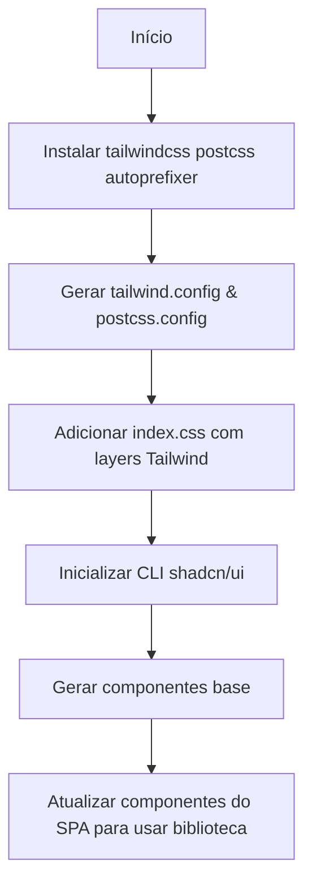

# Arquitetura 52 — Frontend - Padronizar Estilos com Tailwind e shadcn/ui (frontend-shadcn-integration)

- Status: draft
- Data: 2025-01-05
- Responsáveis: Gemini (desenvolvimento)
- Observações: Requer instalar Tailwind CSS e dependências antes de executar o build do SPA. Complementa o PR 45, que entregou o visualizador básico de PDF.

## Resumo executivo

A experiência atual da SPA está praticamente sem estilos utilitários e depende de uma folha de estilo global mínima. O objetivo deste trabalho é adotar Tailwind CSS como fundação utilitária e utilizar os componentes do shadcn/ui para acelerar a entrega de interfaces consistentes. Isso preserva a pilha existente (React 18 + Vite) e habilita uma biblioteca de componentes acessível, pronta para o visual minimalista desejado.

## Objetivos e não objetivos

### Objetivos
- Configurar Tailwind CSS, PostCSS e Autoprefixer no projeto Vite existente.
- Inicializar a CLI do shadcn/ui para gerar componentes reutilizáveis compatíveis com Vite.
- Substituir a folha de estilo global atual pelos layers de Tailwind, mantendo regras customizadas necessárias.
- Documentar guidelines de uso dos componentes e a estratégia de theming mínima.

### Não objetivos
- Redesenhar toda a experiência do usuário; o foco é fornecer a base de estilos.
- Implementar componentes complexos específicos (e.g., dashboards completos) neste PR.
- Migrar para outra ferramenta de bundling ou framework.

## Estado atual

- A SPA está em `src/spa`, construída com Vite e React 18, utilizando React Query.
- Não há bibliotecas de UI instaladas além de uma folha `styles.css` com poucas regras.
- A interface resultante aparece "quebrada" por ausência de estilos, principalmente em tabelas e layouts do wizard.

## Visão proposta

### Componentes e responsabilidades
- **Configuração de build (`tailwind.config.ts`, `postcss.config.js`)**: definir content glob, tema básico, plugins opcionais e variáveis CSS para o tema claro/escuro usado pelo shadcn/ui.
- **Entrada de estilos (`src/spa/src/index.css`)**: importar `@tailwind base;`, `@tailwind components;` e `@tailwind utilities;`, além de classes globais específicas (por exemplo, resets ou layout do shell).
- **CLI shadcn/ui (`components.json`)**: mapear diretório base (`src/spa/src/components/ui`) e opções Vite/React; garantir inclusão de `class-variance-authority`, `clsx` e `tailwind-merge`.
- **Componentes reutilizáveis**: gerar conjuntos iniciais (Button, Input, Table, Dialog) para cobrir telas existentes. Eles manterão estética minimalista por meio das variantes fornecidas.

### Fluxos (diagramas, mermaid, sequência)

### Dados e contratos
- Nenhum contrato de API é alterado. A mudança é puramente de camada de apresentação.
- O theming do shadcn/ui dependerá de CSS custom properties inseridas no `:root` e em `[data-theme]`.

## Plano de implementação

1. **Dependências e configs**
   - `npm install -D tailwindcss postcss autoprefixer`.
   - `npx tailwindcss init -p` gerando arquivos de configuração.
   - Ajustar `tailwind.config.ts` para incluir `./index.html` e `./src/**/*.{ts,tsx}`.
2. **Estrutura de estilos**
   - Atualizar o entry CSS do Vite (provavelmente `src/spa/src/index.css`) com os layers Tailwind e variáveis de tema.
   - Migrar regras relevantes da antiga `styles.css` para classes utilitárias ou `@layer components`.
3. **shadcn/ui CLI**
   - Adicionar `components.json` configurado para Vite.
   - Instalar dependências necessárias: `class-variance-authority`, `clsx`, `tailwind-merge`, `lucide-react`, pacotes Radix UI.
   - Rodar `npx shadcn-ui@latest init` e gerar componentes essenciais (`button`, `input`, `table`, `dialog`, `toast`).
4. **Integração incremental**
   - Atualizar o AppShell e componentes principais para usar os componentes shadcn.
   - Garantir estilos globais para fontes, cores neutras e espaçamento coerente.
5. **Documentação**
   - Adicionar um guia rápido em `docs/` explicando o uso dos componentes, tokens de cores e como estender variantes.

### Feature flags / rollback
- Não haverá feature flag dedicada; rollback consiste em reverter dependências e arquivos gerados. O impacto é isolado ao front-end.

## Impactos

### Performance
- Tailwind gera CSS purgado durante o build, mantendo bundle enxuto. Deve haver impacto mínimo no tempo de build.

### Segurança
- Sem mudanças de segurança, pois trata apenas de assets front-end.

### Operações / suporte
- Pipelines CI precisam instalar novas dependências antes do build da SPA. Scripts existentes (`npm run build`) continuam válidos.

## Testes e evidências

- Validar build local do SPA (`npm run build`) para garantir que Tailwind e shadcn estão corretamente integrados.
- Executar linting do front-end caso exista (`npm run lint`).
- Revisar visual manualmente garantindo que layout mínimo seja preservado.

## Decisões, trade-offs e alternativas consideradas

- **Tailwind + shadcn/ui vs. CSS Modules**: Optamos por Tailwind/shadcn para acelerar a entrega com componentes acessíveis e padronizados, evitando manutenção manual extensa de CSS.
- **Manter estilos globais existentes**: Muitos estilos atuais são redundantes; preferimos consolidá-los nos layers do Tailwind para consistência.

## Pendências e próximos passos

- Mapear telas prioritárias para migração (Dashboard, Wizard, Tabela de Documentos).
- Avaliar se precisaremos de um tema escuro; se sim, configurar variantes usando `next-themes` equivalente para Vite.
- Produzir relatórios de implementação após consolidar telas principais.
