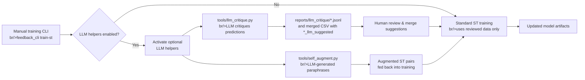

# PR 22 — External LLM Critique + Auto‑training (optional, gated)

## Objective
Leverage an external LLM (e.g., OpenAI API) during the training phase to:
- Produce structured critiques of field predictions and suggest corrections.
- Generate synthetic supervision (few‑shot augmentation) and self‑consistency checks.
- Keep this fully optional, behind a flag and environment variables; no change to runtime defaults.

## Scope
- Add `tools/llm_critique.py`:
  - Inputs: a predictions CSV and/or a reviewed CSV.
  - For each row/field, ask the LLM to critique and propose a corrected value with rationale, returning JSON.
  - Output artifacts: `reports/llm_critique/*.jsonl` and a merged CSV with columns `<Field>_llm_suggested`.
- Add `tools/self_augment.py`:
  - Use LLM to create paraphrases and near‑duplicates for categorical terms (contract types, platforms, currencies) to enrich ST pairs.
- Config and safety:
  - Read `OPENAI_API_KEY` (or provider‑agnostic via pluggable interface) from env; never commit keys.
  - Rate limiting, cost guardrails (max tokens/files per run), redact PII if configured, e registrar decisões do usuário para aprendizado incremental dentro de cada execução manual.
- Docs: `docs/LLM_ASSISTED_TRAINING.md` (risks, costs, privacy, usage examples) incluindo walkthrough do CLI enriquecido e explicações em linguagem simples.
- Enriquecer o CLI: estender `feedback_cli` com uma interface gamificada (Rich/Textual) para aceitar/rejeitar sugestões em tempo real.
- Suporte a auto-treino: integrar helpers de qualidade de dados/active learning (ver avaliação de bibliotecas) sem agendamentos periódicos.
- Estratégia de provedores LLM: priorizar DeepSeek para loops automáticos e permitir fallback para OpenAI em cenários críticos via flag/config.

## Flow Diagram


### Diagram Notes
- `Manual training CLI`: operator runs `feedback_cli train-st`, orchestrating the supervised training workflow (sem schedulers automáticos).
- `LLM helpers enabled?`: feature flag/env guard; defaults to `No` so existing training path remains untouched.
- `Activate optional LLM helpers`: initializes helper settings (rate limits, API clients) when the flag is true.
- `tools/llm_critique.py`: streams predictions/reviews, prompting the external LLM for critiques and candidate corrections.
- `reports/llm_critique/*.jsonl`: structured responses persisted per row; merged CSV exposes `<Field>_llm_suggested` columns for review.
- `Human review & merge suggestions`: analista usa a UI gamificada no terminal para aceitar/rejeitar correções antes de devolver ao treino.
- `tools/self_augment.py`: generates paraphrases/near duplicates for categorical values to expand ST pair coverage.
- `Augmented ST pairs`: deduplicated pairs appended to supervised datasets and passed to the standard pipeline.
- `Standard ST training`: existing training routine consumes reviewed data (plus optional augmentations) to produce updated artifacts.
- `Updated model artifacts`: resulting weights/configs emitted exactly as today; runtime defaults remain unchanged.

### User Walkthrough
| Passo | Ação do usuário/Interface | Efeito no sistema |
| --- | --- | --- |
| 1 | No CLI, executar `feedback_cli train-st` com o flag de helpers habilitado | Carrega config, valida chave `OPENAI_API_KEY` e inicializa clientes LLM com limites definidos |
| 2 | Selecionar o CSV de previsões/revisões quando solicitado | `tools/llm_critique.py` itera o arquivo, envia prompts ao LLM e grava `reports/llm_critique/*.jsonl` e CSV com colunas `_llm_suggested` |
| 3 | Abrir a visualização (ex.: planilha ou viewer interno) das sugestões geradas | Usuário revisa racionales e decide aceitar/rejeitar campo a campo; apenas escolhas aprovadas seguem adiante |
| 4 | Confirmar merge das sugestões aprovadas | Pipeline atualiza dataset supervisionado, mantendo histórico do que foi aceito |
| 5 | Optar por rodar `tools/self_augment.py` com o dataset aprovado | Gera pares adicionais, deduplica e anexa aos dados de treinamento |
| 6 | Prosseguir com o fluxo padrão do CLI até a conclusão | Treinamento ST usa dados revisados+augmentados e emite novos artefatos de modelo, sem alterar defaults em produção |

### ASCII Mockup (CLI Interactions)
```
┌────────────────────────────────────────────────────────────────┐
│ Gamified Feedback CLI                                          │
├────────────────────────────────────────────────────────────────┤
│ Quest   Field                  Model vs LLM Suggestion         │
│ #0123   amount                 10.500 → 10.450 (confidence 0.8)│
│ Badges: ⚡ quick hit   💰 cost 0.02 USD   🧠 tokens 120          │
│ Accept [Y]   Reject [N]   Details [D]                          │
├────────────────────────────────────────────────────────────────┤
│ Progress: ███████░░░ 7/10 suggestions reviewed                 │
│ Score: 540 pts   Streak: 3 accepted consecutively              │
│ Tip: Revise rationale antes de aceitar itens caros.            │
└────────────────────────────────────────────────────────────────┘

+================================================================+
| Workflow Log                                                   |
+----------------------------------------------------------------+
| -> updated file: datasets/supervised_reviewed.csv              |
| [Optional] Run tools/self_augment.py? [y/N]: y                 |
| -> writing augmented pairs to datasets/st_pairs_aug.jsonl      |
|                                                                |
| [Training] Continuing standard ST pipeline...                  |
| [Training] Model artifacts -> reports/models/st_model_v2/      |
+----------------------------------------------------------------+
```

Out of scope:
- Invoking LLMs in the main extraction path.
- Changing default prompts in `advanced_coupa_field_extractor.py`.
- Configurar cron jobs ou agendadores automáticos; execuções continuam manuais via CLI.

## Affected files
- Add: `tools/llm_critique.py`
- Add: `tools/self_augment.py`
- Add: `docs/LLM_ASSISTED_TRAINING.md`
- Update: `docs/HITL_FEEDBACK_WORKFLOW.md` (link optional LLM‑assisted augmentation)
- Update: dependency manifest(s) para incluir `rich`/`textual`, `cleanlab` e integração opcional `modAL`.

## Auto-training Library Evaluation
- `cleanlab`: melhor ajuste para identificar rótulos suspeitos e priorizar revisões na fila gamificada, rodando sob demanda.
- `modAL`: útil para estratégias de active learning; exporemos hooks opcionais para sugerir o próximo item a revisar durante a sessão manual.
- `label-studio` / `argilla`: soluções completas porém pesadas (serviço web); manter fora do escopo para evitar novos componentes por enquanto.
- `river`: orientado a aprendizado online contínuo; fica como referência futura, já que hoje treinamos em batch ao final do workflow.

Adotaremos `cleanlab` como dependência principal, com integração opcional a `modAL`, e documentaremos caminhos para conectar plataformas mais pesadas posteriormente.

## Pseudodiff (representative)
```diff
+ tools/llm_critique.py
+ -------------------------------------------------
+ def critique_csv(pred_csv: str, out_dir: str, model: str = "gpt-4o-mini"): 
+   # stream rows; for each field build a compact JSON-only prompt; write results to JSONL
+
+ tools/self_augment.py
+ -------------------------------------------------
+ def augment_terms(input_jsonl: str, out_pairs: str, model: str = "gpt-4o-mini"): 
+   # generate paraphrases/synonyms for categorical fields → pairs for ST
+
+ docs/LLM_ASSISTED_TRAINING.md
+ -------------------------------------------------
+ # LLM-Assisted Training
+ - Set `OPENAI_API_KEY`.
+ - Run critique on a predictions CSV, produce suggestions.
+ - Merge suggestions cautiously; human remains in the loop.
+ - Cost & privacy caveats.
```

## Acceptance Criteria
- `tools/llm_critique.py` runs with an API key set and produces JSONL suggestions without modifying source files.
- `tools/self_augment.py` generates additional pairs compatible with `feedback_cli.py train-st`.
- Docs clearly mark the feature as optional/experimental, com avisos de custo/privacidade e orientação sobre escolha DeepSeek/OpenAI.

## Minimal Manual Tests
1) Set `OPENAI_API_KEY`.
2) Run `python tools/llm_critique.py --pred-csv reports/advanced_*.csv --out reports/llm_critique/` and verify JSONL outputs.
3) Run `python tools/self_augment.py --input datasets/supervised.jsonl --out datasets/st_pairs_aug.jsonl` and verify file.

## Suggested Commit Message and Branch
- Branch (plan): `plan/22-external-llm-critique-autotraining`
- Commit (plan): `docs(pr-plan): PR 22 — external LLM critique + auto‑training (optional)`
- Branch (impl): `feat/22-external-llm-critique-autotraining`

## Checklist
- [x] Objective and Scope are clear and limited.
- [x] Affected files listed.
- [x] Pseudodiff (small/representative) included.
- [x] Acceptance criteria and minimal manual tests.
- [x] Suggested commit message and branch name.
