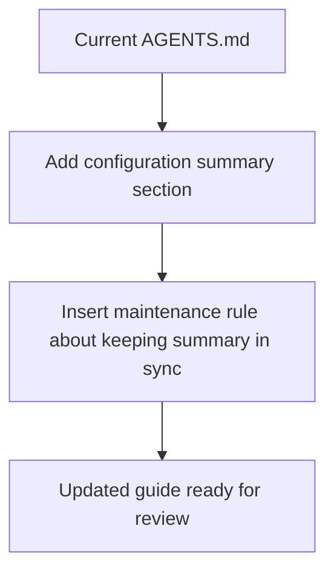

# PR Plan 30 — Add configuration summary and index upkeep rule to AGENTS.md

## Objective
Provide a quick-reference overview of the agent workflow configurations and add a maintenance rule so future updates keep the summary in sync.

## Scope
- Update `AGENTS.md` only.
- Insert a concise summary ("index") of the existing configuration sections at the start of the guide.
- Add a standing rule that any newly introduced rule must also update the summary/index.

## Affected Files
- AGENTS.md

## Approach
1. Add a new "Configuration Summary" block immediately after the document title, listing each current configuration area and its purpose in one line.
2. Introduce an explicit maintenance rule (likely under "Notes") requiring any future rule additions to also update the summary.
3. Keep existing section wording intact outside of the new summary and rule.



### Plain-language explainer
We're just making a short cheat-sheet at the top of the agent guide so it is easier to see what configurations exist, and we're adding a reminder that whenever someone adds a new rule later, they also need to update that cheat-sheet.

## Pseudodiff
```diff
 # Agent Guide (Codex) — Plan → Implement Workflow
 
+## Configuration Summary
+- **Scope and Principles** — High-level rules on when and how to submit plans and implementations.
+- **PR Conventions** — Naming and structure rules for plan and implementation pull requests.
+- **Standard Operating Procedure (SOP)** — Step-by-step workflow for planning and implementing changes.
+- **Technical Rules for the Agent** — Language, testing, security, data handling, and tooling expectations.
+- **Required Checklist in Every Plan** — Mandatory checklist items each plan must satisfy.
+- **Documentation & Communication** — Expectations for diagrams, explanations, and communication style.
+- **GitHub Labels (optional)** — Suggested labels to apply during review.
+- **Notes** — Additional guidance for multi-step or dependent work.
+
 ## Scope and Principles
 ...
 
 ## Notes
 - If a plan depends on another, reference its number (e.g., “after PR 03”).
 - For multi-step refactors, prefer multiple small PRs over a single large PR.
+- When you add a new rule to this guide, update the Configuration Summary so the index stays accurate.
```

## Acceptance Criteria
- `AGENTS.md` begins with a concise summary covering every existing configuration section.
- The document explicitly instructs contributors to update the summary whenever new rules are added.
- No other sections are altered beyond minimal tweaks needed to host the summary and rule.

## Manual Tests
- Open `AGENTS.md` and confirm the summary accurately describes each section and the new rule is present.

## Suggested commit message and branch
- Branch: `plan/30-agents-config-summary`
- Commit: `docs(pr-plan): PR 30 — agents config summary`

## Workflow reuse consideration
This request defines a standing maintenance guardrail for the agent guide, so incorporating it directly into `AGENTS.md` improves future workflow consistency without adding unnecessary complexity.
