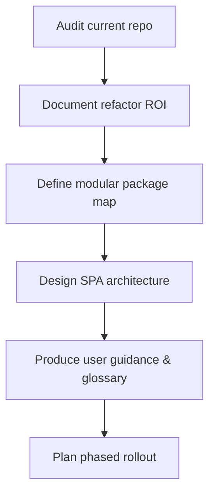

# PR Plan 32 — Refactor Roadmap and SPA Blueprint

## Objective
Create a comprehensive blueprint that (1) quantifies why refactoring the automation suite now delivers the best return, (2) defines a future-proof package layout for the main downloader and the auxiliary subprojects, and (3) specifies a Single Page Application (SPA) concept that exposes every major workflow with clear usage instructions and purpose-driven explanations.

**Resumo em pt-BR:** Vamos produzir um guia que mostra por que vale a pena refatorar agora, como reorganizar o projeto e subprojetos, e como desenhar uma interface web única com instruções acessíveis sobre cada funcionalidade.

## Scope
- Deliver a written analysis that balances the cost/benefit and risks of refactoring in the current release cycle.
- Propose a modular folder/package structure that keeps the downloader core, AI/RAG experiments, and CLI tools cleanly separated while sharing common utilities.
- Describe the SPA architecture, navigation, and API touchpoints so implementers can build it later without guessing.
- Provide beginner-friendly explanations and recommended terminology for each exposed function so users understand both *what* it does and *why* it matters.

Out of scope:
- Moving or editing production code, configuration defaults, or build tooling.
- Building the SPA or wiring real APIs—this plan only produces documentation and diagrams.

## Affected Files
- `docs/refactor/pr32-refactor-spa-blueprint.md` (new reference document with analysis, architecture, and UI guidance)
- `README.md` (link the new blueprint so contributors can find it quickly)
- `docs/USER_GUIDE.md` (call out the SPA blueprint in the onboarding resources)
- `AGENTS.md` (add maintainer note pointing to the blueprint for future coordination)

## Approach
1. **Current-state audit & timing analysis** — Inventory the downloader, tooling, and RAG modules, capture pain points (tight coupling, duplicated utilities, inconsistent configs), and articulate benefits vs. risks of refactoring in the next milestone.
2. **Modular architecture proposal** — Draft a package map that separates `apps/` (downloader, RAG, future SPA backend), `packages/common/` (shared services, config, logging), and `support/` (CLI, scripts). Include migration steps and dependency boundaries.
3. **SPA concept & integration plan** — Define the SPA stack (e.g., React + Vite) with a focus on a lightweight, utility-first interface meant for local usage. Lay out simple navigation (single column of buttons/links) that can trigger existing flows without heavy visual design. Explain how it will communicate with the Python backend (local HTTP API and task queue) while staying easy to run on a developer workstation.
4. **Usage guidance & terminology** — Produce tables that describe each major function, inputs/outputs, technical glossary, and “explain-like-I’m-new” summaries in English (with optional pt-BR notes) to support training and onboarding.
5. **Validation checklist** — Conclude with rollout phases, required testing, and owner matrix so the team can scope follow-up implementation PRs.



### Plain-language explainer
We will write a map that shows how the project looks today, why giving it a tidy structure now will save headaches later, and how a future one-page web app (a simple page with buttons/links that call each function) can guide people through every task with friendly explanations. No code changes happen yet—only clear instructions, diagrams, and vocabulary the whole team can reuse.

## Pseudodiff (representative)
```diff
+++ docs/refactor/pr32-refactor-spa-blueprint.md
+# PR 32 — Refactor Roadmap and SPA Blueprint
+## 1. Why refactor now
+...benefits, risks, timing matrix...
+## 2. Proposed repository layout
+...package map, ownership table, migration notes...
+```mermaid
+flowchart LR
+    Downloader --> SharedServices
+    SharedServices --> SPA
+```
+## 3. SPA concept
+...tech stack, page map, API contracts, UI copy guidelines...
+## 4. Function reference & glossary
+...goal-oriented tables, pt-BR notes...
+## 5. Rollout checklist
+...phased adoption plan...
+
--- README.md
+++ README.md
@@
- ## 📖 Documentation
+ ## 📖 Documentation
   - Release notes: `docs/RELEASE_NOTES.md`
   ...
+  - Refactor & SPA blueprint: `docs/refactor/pr32-refactor-spa-blueprint.md`
+
--- docs/USER_GUIDE.md
+++ docs/USER_GUIDE.md
@@
-### Additional References
+### Additional References
 ...
+- Refactor & SPA blueprint (`docs/refactor/pr32-refactor-spa-blueprint.md`) for architecture context and GUI roadmap.
+
--- AGENTS.md
+++ AGENTS.md
@@
-## Documentation & Communication
+## Documentation & Communication
 ...
+- Consult `docs/refactor/pr32-refactor-spa-blueprint.md` when planning structural changes or SPA features to stay aligned.
```

## Acceptance Criteria
- New blueprint document explains the timing advantages of refactoring, contrasts them with the cost of postponement, and captures current blockers with evidence from the codebase.
- Proposed repository layout covers the main downloader, each subproject, and shared libraries, including ownership notes and migration checkpoints.
- SPA section outlines stack, build tooling, API integration strategy, navigation structure, and guidance copy for every exposed function.
- Document includes at least one Mermaid diagram and plain-language summaries (English with optional pt-BR) for technical concepts.
- README, USER_GUIDE, and AGENTS files reference the blueprint so both users and maintainers know where to start.

## Manual Tests
- `mdformat` (or equivalent) passes on the new/updated Markdown files.
- Markdown preview renders Mermaid diagrams without syntax errors.

## Suggested commit message and branch
- Branch: `plan/32-refactor-spa-blueprint`
- Commit: `docs(pr-plan): PR 32 — refactor roadmap and SPA blueprint`

## Checklist
- [x] Objective and Scope are clear and limited.
- [x] Affected files listed.
- [x] Pseudodiff (small, readable, representative of the approach).
- [x] Acceptance criteria and minimal manual tests.
- [x] Suggested commit message and branch name.
