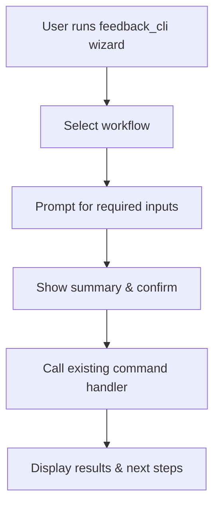

# PR Plan 33 — Guided CLI Wizard for Training Tools

## Objective
Design an interactive wizard that guides users through the existing feedback/training workflows without memorizing every parameter, reducing setup friction for dataset preparation, ingestion, evaluation, fine-tuning, and exports.

**Resumo em pt-BR:** Vamos planejar um assistente interativo no terminal que mostre opções explicadas passo a passo para preparar dados, revisar feedback e treinar o modelo, evitando que a pessoa tenha que lembrar todos os parâmetros manualmente.

## Scope
- Introduce a new guided flow that wraps the current `tools/feedback_cli.py` subcommands with menu-driven prompts, contextual help, and sensible defaults.
- Allow the wizard to preview the underlying command before execution and support optional edits so advanced users can still tweak parameters.
- Update documentation so contributors know how to launch the wizard, what steps it covers, and how it relates to the existing scripted commands.

Out of scope:
- Changing the underlying business logic of `prepare`, `ingest`, `eval`, `train-st`, or `export-labelstudio`.
- Adding new training backends or altering model defaults.
- Building a graphical UI or persisting long-running session state beyond the current invocation.

## Affected Files
- `tools/feedback_cli.py` (register wizard subcommand and delegate to helper)
- `tools/training_wizard.py` (new helper implementing the interactive flow)
- `docs/USER_GUIDE.md` (document how to launch and use the wizard)
- `README.md` (surface the wizard in the quick-start section)
- `docs/cli/training_wizard.md` (new reference page with screenshots/examples)

## Approach
1. **Extract command metadata** — Enumerate existing subcommands, their required/optional arguments, defaults, and short descriptions so the wizard can present them as concise menu items.
2. **Implement wizard helper** — Build a reusable helper (no new heavy dependencies) that prints numbered options, validates input, and gathers parameters via prompts with contextual hints and defaults.
3. **Simulate + execute** — After all inputs are captured, show the equivalent CLI command for confirmation, allow edits, then invoke the existing handler functions directly instead of shelling out.
4. **Documentation & onboarding** — Update docs with step-by-step guidance, add screenshots/gifs placeholder references, and explain how the wizard complements the manual CLI usage.
5. **Regressions check** — Ensure the original argument parsing remains untouched for direct CLI usage, and add smoke tests/manual checklist to verify each wizard path triggers the expected behavior.



### Plain-language explainer
We will add a friendly Q&A flow in the terminal that lists the main jobs (prepare data, ingest reviews, evaluate, train the model, export tasks). The wizard explains what each job does, asks for the few details it needs (like file paths), shows the command it will run, and then runs it for you. You can still tweak values, but you no longer need to remember every flag by heart.

## Pseudodiff (representative)
```diff
+++ tools/training_wizard.py
+"""Interactive helper to guide users through feedback CLI workflows."""
+def run_wizard():
+    # menu definitions, prompts, and call into feedback handlers
+
--- tools/feedback_cli.py
+++ tools/feedback_cli.py
@@
-    p_ls.set_defaults(func=cmd_export_labelstudio)
+    p_ls.set_defaults(func=cmd_export_labelstudio)
+
+    p_wizard = sub.add_parser("wizard", help="Interactive menu that guides common workflows")
+    p_wizard.set_defaults(func=lambda _args: run_wizard())
+
+++ docs/cli/training_wizard.md
+# Guided training wizard
+## When to use it
+...walkthrough, screenshots, explain-like-I'm-new section...
+
--- README.md
+++ README.md
@@
-  - Feedback loop CLI — `python tools/feedback_cli.py --help`
+  - Feedback loop wizard — `python tools/feedback_cli.py wizard`
+  - Feedback loop CLI — `python tools/feedback_cli.py --help`
+
--- docs/USER_GUIDE.md
+++ docs/USER_GUIDE.md
@@
-### Feedback workflows
+### Feedback workflows
+- Guided wizard (`python tools/feedback_cli.py wizard`) for interactive runs
```

## Acceptance Criteria
- Wizard lists all current feedback/training workflows with short descriptions and clearly labels which inputs are required vs optional.
- Each wizard path collects parameters interactively, supplies defaults mirroring the existing CLI flags, and blocks until required values are provided.
- Before execution, the wizard shows the equivalent CLI command and allows the user to confirm or revise inputs.
- Wizard execution calls the same internal functions (`cmd_prepare`, `cmd_ingest`, etc.) so behavior stays consistent with the non-interactive CLI.
- Documentation includes at least one Mermaid diagram and a beginner-friendly explanation of when to use the wizard.
- Running the legacy CLI subcommands directly remains unaffected (no argument regressions).

## Manual Tests
- `python tools/feedback_cli.py wizard` → run through each path with sample inputs, ensuring the underlying action completes and results are printed.
- `python tools/feedback_cli.py prepare --help` (and other subcommands) → verify help text still renders correctly.
- `mdformat docs/cli/training_wizard.md docs/USER_GUIDE.md README.md`

## Suggested commit message and branch
- Branch: `plan/33-cli-training-wizard`
- Commit: `docs(pr-plan): PR 33 — guided CLI wizard for training tools`

## Checklist
- [x] Objective and Scope are clear and limited.
- [x] Affected files listed.
- [x] Pseudodiff (small, readable, representative of the approach).
- [x] Acceptance criteria and minimal manual tests.
- [x] Suggested commit message and branch name.
