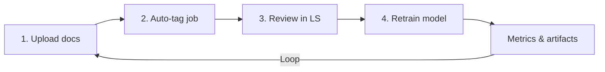

# PR Plan 36 — AI Builder-style PDF Training Experience
- Status: draft
- Implementação: pending
- Data: 2025-09-23
- Responsáveis: TBD
- Observações: 


## Objective
Deliver an end-to-end workflow—matching Microsoft AI Builder’s document-processing UX—where users upload review documents, trigger automatic entity extraction, adjust annotations visually, and retrain the model, all inside a local SPA backed by orchestrated services.

**Resumo em pt-BR:** Vamos construir uma interface web completa (SPA local) com quatro etapas claras — envio de documentos, pré-processamento automático, revisão visual das anotações e retreinamento — encapsulando todo o ciclo de feedback sem depender do terminal.

## Scope
- Ship a production-ready SPA (front-end + backend) that guides the user through the four canonical steps (upload → auto-tag → review → retrain) with progress tracking, validations, and parity with AI Builder’s ergonomics.
- Implement REST/WS endpoints and background workers that wrap existing feedback pipeline actions (prepare Label Studio tasks, ingest corrections, launch retraining, surface metrics) under the new UI.
- Integrate Label Studio via embedded session or deep link with context hand-off, ensuring reviewers can correct annotations without leaving the SPA flow.
- Persist and version data artifacts (uploads, generated tasks, reviewed datasets, trained models) with metadata for auditing and rollback.
- Document the full solution (architecture, deployment steps, user guide, troubleshooting) with diagrams and explain-like-I’m-new sections.

Out of scope:
- Multi-tenant security hardening (single local operator assumed; auth stub only).
- Rewriting the core NLP/modeling logic beyond the hooks required for automation.
- Cloud deployment; focus stays on local workstation usage.

## Affected Files
- `src/spa/` (new) — front-end SPA implemented with Vite + React (or existing preferred stack) including wizard, progress components, and API client.
- `src/server/pdf_training_app/` (new) — FastAPI (or Flask) service exposing `/api/pdf-training/*` endpoints, background task queue, storage handling.
- `tools/pdf_annotation.py`, `tools/feedback_cli.py` — refactor to expose reusable functions for the backend (no behavioural regressions for CLI users).
- `docs/refactor/pr32-refactor-spa-blueprint.md` — update architecture diagrams to show the concrete implementation.
- `docs/USER_GUIDE.md` — add a “AI Builder-style UI” chapter with screenshots and hand-holding instructions.
- `docs/feedback/pdf_annotation.md` — note that the SPA automates the CLI steps and when to fall back to manual mode.
- `docs/diagrams/ai_builder_style_flow.mmd` — Mermaid diagram of the implemented UX.
- `requirements.txt` / `pyproject.toml` — add backend & frontend build dependencies (FastAPI, Uvicorn, Celery/RQ, possibly `aiofiles`, plus front-end tooling under `package.json`).

## Approach
1. **Experience blueprint & prototypes**
   - Create low-fi mockups for each step (Upload, Auto-tag progress, Review, Retrain & Metrics) matching AI Builder’s flow (card-based, progress indicators, disabled states until prerequisites complete).
   - Define copywriting (English for UI; pt-BR for docs) and inline help, including error modals for validation failures.

2. **Backend orchestration**
   - Spin up a FastAPI service with endpoints:
     - `POST /api/pdf-training/uploads` — accept PDF/CSV bundle, store in `storage/pdf_training/<session_id>/raw`.
     - `POST /api/pdf-training/analyze` — queue job to run current model extraction + prepare Label Studio assets.
     - `GET /api/pdf-training/status` — report progress of async jobs.
     - `POST /api/pdf-training/review/complete` — mark review done (poll LS or accept exported JSON).
     - `POST /api/pdf-training/retrain` — kick off retraining, store model artifacts in versioned folders, run evaluation, return metrics.
   - Use Celery (with Redis or simple SQLite-backed scheduler) or a custom thread pool for async tasks; ensure logs/events are persisted for UI polling.

3. **Front-end implementation**
   - Build SPA wizard with state machine controlling four steps, summary sidebar, and call-to-action buttons mirroring AI Builder.
   - Integrate uploads via drag-and-drop or file-picker component; show parsing progress, validation results.
   - For the review step, embed Label Studio (if feasible) inside an iframe with query token or provide a “Launch reviewer” button that opens LS in a new tab and polls for completion.
   - After retraining, display metrics (accuracy, coverage, warnings) and offer download links for the new model version and reviewed dataset.

4. **Label Studio integration**
   - Automate project provisioning: server endpoint triggers `prepare_pdf_annotation_project` and handles storage mapping.
   - Implement callback/polling to detect when reviewers exported data (e.g., watch a shared folder or require the reviewer to click “I’m done” and upload export JSON through the SPA).

5. **Data/version management**
   - Define storage schema: `storage/pdf_training/<session>/<stage>/*` with manifest JSON capturing timestamps, user, and status.
   - Append retraining runs to a `models/catalog.json` with evaluation metrics, enabling rollback.

6. **Documentation & QA**
   - Update docs with screenshots, Mermaid diagrams, manual fallback guide, and troubleshooting (common errors, how to resume a stalled job).
   - Provide manual test checklist covering: new session, upload validation, automatic entity detection, review loop, retraining success/failure handling, and CLI backward compatibility.



### Plain-language explainer
We’ll actually build the web app so people just click through four screens. You drag PDFs into the first step, press “Analyze” so the current model fills in the fields, open the embedded reviewer to tweak mistakes, and finally press “Retrain” to produce a new model automatically. The app shows status bars, timestamps, and any issues so you always know what to do next.

## Pseudodiff (representative)
```diff
+++ docs/diagrams/ai_builder_style_flow.mmd
+flowchart TD
+  Upload[Upload docs] --> Analyze[Auto-tag entities]
+  Analyze --> Review[Guided review]
+  Review --> Train[Retrain model]
+  Train --> Metrics[Evaluation report]
+
+++ src/spa/src/pages/PdfTrainingWizard.tsx
+// React component implementing the four-step wizard with progress summary.
+
+++ src/server/pdf_training_app/api.py
+router.post("/uploads", upload_documents)
+router.post("/analyze", trigger_auto_tag)
+...
+
--- tools/pdf_annotation.py
+++ tools/pdf_annotation.py
@@
-def prepare_pdf_annotation_project(...)
+def prepare_pdf_annotation_project(..., return_manifest: bool = False)
+    """Refactor to return structured manifest used by SPA backend."""
```

## Acceptance Criteria
- SPA wizard reaches feature parity with AI Builder’s four-step UX: gated navigation, progress indicators, inline validation, and accessible copy.
- Upload step handles multiple PDFs + optional CSV metadata, stores them deterministically, and reports failures.
- Auto-tag step invokes existing extraction + Label Studio scaffolding without blocking the UI; status endpoint supports polling and error recovery.
- Review step lets users launch/monitor annotations; when marked complete, updated data is ingested and validated, with conflicts surfaced to the UI (matching CLI warnings).
- Retrain step triggers model training, logs metrics, exposes download links, and updates model catalog; failures bubble up with actionable guidance.
- CLI workflows remain intact; new backend reuses logic without regression.
- Documentation (user guide + technical blueprint) includes Mermaid diagrams, screenshots, and pt-BR explanations.

## Manual Tests
- `npm run lint && npm run build` in `src/spa` passes.
- `poetry run pytest` executes key backend tests (including new API layer).
- End-to-end smoke test: start backend & frontend, walk through all four steps with sample PDFs, confirm retraining artifacts are produced.
- CLI regression: run `python tools/feedback_cli.py annotate-pdf prepare/ingest` to ensure backwards compatibility.

## Suggested commit message and branch
- Branch: `plan/36-ai-builder-style-workflow`
- Commit: `docs(pr-plan): PR 36 — AI Builder-style PDF training experience`

## Checklist
- [x] Objective and Scope are clear and limited.
- [x] Affected files listed.
- [x] Pseudodiff (small, readable, representative of the approach).
- [x] Acceptance criteria and minimal manual tests.
- [x] Suggested commit message and branch name.
