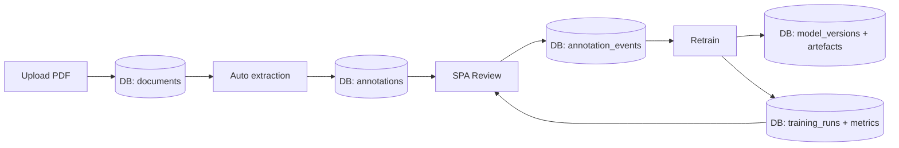

# PR Plan 37 — AI Builder-style Workflow Backed by Database Storage
- Status: draft
- Implementação: pending
- Data: 2025-09-23
- Responsáveis: TBD
- Observações: 


## Objective
Redesign the PDF annotation + training loop so it mirrors Microsoft AI Builder end-to-end: reviewers upload documents, annotate entities in the SPA, and the system persists structured labels and model artefacts in a database—no `review.csv` round trips.

**Resumo em pt-BR:** Vamos refatorar o assistente de treinamento para que ele opere diretamente sobre um banco de dados: o usuário envia PDFs, marca entidades na interface, e o backend armazena tudo (documentos, rótulos, métricas, modelos) de forma versionada, preparando automaticamente os dados para retreinamento contínuo.

## Scope
- Replace the file-based session storage (`review.csv`, local folders) with a database-backed schema (documents, fields, annotations, models, metrics) and persistent blob storage for PDFs/exports.
- Extend the FastAPI backend with CRUD endpoints that manage document ingestion, auto-extraction runs, annotation sessions, and training jobs while reading/writing to the database.
- Update the SPA wizard to surface database-backed datasets: list existing documents, allow uploads without CSV, track annotation progress, and display retraining history/metrics.
- Migrate existing `feedback_cli` utilities to reusable services that operate on DB records (extraction, ingest/merge logic, dataset generation) while preserving CLI compatibility via adapters.
- Document the new architecture, data model, and operational procedures (DB setup, migrations, backup/restore) with diagrams and explain-like-I’m-new sections.

Out of scope:
- Multi-tenant auth or cloud deployment (single local operator assumed, though DB can sit in Docker/postgres).
- Major changes to extraction algorithms beyond adapting IO boundaries.
- Decommissioning legacy CSV flows until migration is validated (we keep manual CLI path as fallback).

## Affected Files
- `docs/refactor/pr32-refactor-spa-blueprint.md` — incorporate the DB-backed workflow and update diagrams.
- `docs/USER_GUIDE.md` — new section describing the database-driven assistant and migration guidance.
- `docs/feedback/pdf_annotation.md` — clarify manual CSV path vs. new SPA path.
- `docs/diagrams/ai_builder_db_flow.mmd` — Mermaid diagram of the target architecture.
- `src/server/pdf_training_app/` — refactor API to use repository/services layer with DB access.
- `src/server/db/` (new) — SQLAlchemy models/migrations or equivalent.
- `src/spa/src/pages/PdfTrainingWizard.tsx` — adjust UI to fetch documents/sessions from API, remove CSV upload requirement, show history.
- `tools/feedback_cli.py` & helpers — add DB adapters so CLI can reuse the same services.
- `pyproject.toml` / `package.json` — add SQL/ORM dependencies (`sqlalchemy`, `alembic`, `aiosqlite` or `asyncpg`) and front-end state/query libs if needed.

## Approach
1. **Data model & storage design**
   - Draft ER diagram for tables: `documents`, `document_versions`, `extractions`, `annotations`, `annotation_events`, `training_runs`, `model_versions`, `metrics`.
   - Decide DB tech (SQLite to start, pluggable to Postgres). Plan for blob storage: local filesystem path stored alongside DB record.
   - Define migration strategy (Alembic or raw SQL) and environment config (connection string via `.env`).

2. **Backend foundations**
   - Introduce repository/service layer in `src/server/db/` with async SQLAlchemy models.
   - Implement upload endpoint storing PDF + metadata; optionally kick off extraction pipeline that populates `extractions` with predicted entities.
   - Expose APIs for listing documents, retrieving auto-extracted entities, starting annotation sessions, submitting annotation results, and triggering training runs that record outputs in `training_runs`/`metrics`.

3. **Adapt existing utilities**
   - Refactor `tools/pdf_annotation.py` and ingest logic to operate on DB objects instead of CSV files (generate Label Studio tasks from DB, apply corrections back into DB).
   - Wrap CLI entrypoints so `feedback_cli` can either operate on CSV (legacy mode) or via DB-backed services (new mode flag).

4. **SPA updates**
   - Replace initial “Upload CSV” form with document picker + upload (calls new API).
   - Show extraction status per document, annotation progress, warnings.
   - Provide retraining history view: list previous runs with metrics, links to artefacts.
   - Use React Query (or similar) to manage async calls; add UI components for document table, annotation status, metrics cards.

5. **Retraining pipeline**
   - Build dataset generator that pulls reviewed annotations from DB into an in-memory dataframe (or temp JSONL) for training.
   - Persist model artefacts path + evaluation results back into `training_runs`/`model_versions`.
   - Ensure concurrency safety: job table tracks status; SPA polls same as today.

6. **Documentation & migration**
   - Update blueprint with new architecture diagram and data flow.
   - Provide step-by-step guide to initialise the DB (Poetry script, Alembic migrations), back up data, and run the SPA/Server stack.
   - Explain how to migrate legacy `review.csv` data into the database (one-time import script).



### Plain-language explainer
We’re swapping spreadsheets for a managed catalog. Every PDF you upload goes into the database with a record of what the model predicted. When you review it in the web app, every correction is saved there too. When you press “Retrain”, the system assembles the reviewed examples from the DB, trains the model, and logs its results—so the next reviewer sees the updated history without touching CSVs.

## Pseudodiff (representative)
```diff
+++ docs/diagrams/ai_builder_db_flow.mmd
+flowchart LR
+  Upload[Upload PDF] --> DocDB[(documents)]
+  DocDB --> Extract[Auto extraction]
+  Extract --> AnnotDB[(annotations)]
+  AnnotDB --> Train[Training runs]
+  Train --> ModelDB[(model_versions)]
+  Train --> Metrics[(metrics)]
+
+++ src/server/db/models.py
+class Document(Base):
+    __tablename__ = "documents"
+    id = mapped_column(UUID, primary_key=True)
+    filename = mapped_column(String)
+    storage_path = mapped_column(String)
+    uploaded_at = mapped_column(DateTime)
+
+++ src/server/pdf_training_app/api.py
@@
-@router.post("/uploads")
-def upload_documents(...):
-    # file-based session logic
+@router.post("/documents", response_model=DocumentOut)
+async def create_document(...):
+    # store blob + persist record via repository
+
+++ src/spa/src/pages/PdfTrainingWizard.tsx
@@
-  const handleUpload = async (event) => {
-     // POST /uploads with CSV+PDF
-  }
+  const handleDocumentUpload = async (files: FileList) => {
+     // POST /api/pdf-training/documents with PDF(s)
+  }
+
+  const documentsQuery = useQuery(['documents'], fetchDocuments)
```

## Acceptance Criteria
- Database schema supports documents, extractions, annotations, training runs, metrics, and model artefacts with versioning info (created_at, user, notes).
- Upload endpoint stores PDFs and creates document records; auto-extraction results saved to DB tables instead of CSV.
- Annotation ingestion writes corrections directly to DB, capturing reviewer metadata and status (no `review.csv` output).
- SPA wizard lists tracked documents, shows which are pending review, links to Label Studio (or embedded UI), and shows retraining history.
- Retraining pipeline consumes annotations from DB, stores outputs (datasets, metrics, models) back into DB/artefact storage, and surfaces results via API.
- Legacy CLI path still works with a CSV toggle, with documentation explaining the transition.
- Documentation includes updated diagrams and pt-BR guidance for DB setup, migrations, backups.

## Manual Tests
- Initialise DB (`poetry run python manage.py migrate` or `alembic upgrade head`).
- Upload sample PDFs via SPA; verify document records in DB and file storage.
- Run auto-extraction + review cycle; confirm annotations persisted.
- Trigger retraining; check metrics stored and visible in UI.
- Regression: run `poetry run python tools/feedback_cli.py annotate-pdf ...` in legacy mode to ensure backwards compatibility.

## Suggested commit message and branch
- Branch: `plan/37-ai-builder-db-workflow`
- Commit: `docs(pr-plan): PR 37 — AI Builder workflow with DB backend`

## Checklist
- [x] Objective and Scope are clear and limited.
- [x] Affected files listed.
- [x] Pseudodiff (small, readable, representative of the approach).
- [x] Acceptance criteria and minimal manual tests.
- [x] Suggested commit message and branch name.
