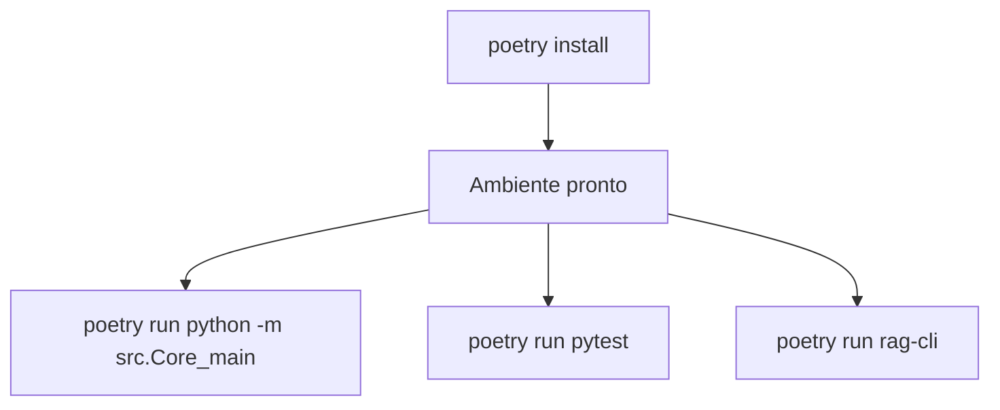

# Plano PR 37 — Dependências unificadas via Poetry

## Objetivo
Consolidar toda a gestão de bibliotecas do repositório sob o `pyproject.toml`, eliminando arquivos `requirements*.txt` e grupos paralelos, de forma que exista uma única fonte de verdade de dependências controlada pelo Poetry.

**Resumo para iniciantes:** Vamos guardar a lista de pacotes em apenas um lugar (o arquivo do Poetry). Assim, qualquer pessoa instala tudo com um único comando e não precisa mais descobrir qual arquivo de requisitos usar.

## Escopo
- Reorganizar o `pyproject.toml` raiz para que todas as dependências fiquem dentro de `[tool.poetry.dependencies]`, sem grupos ou extras paralelos.
- Remover arquivos `requirements.txt` (raiz e subprojetos) e substituir qualquer instrução por um único comando `poetry install`.
- Atualizar `poetry.lock` e garantir que os hashes reflitam a nova estrutura única.
- Ajustar scripts, testes e documentação que ainda referenciam `requirements.txt` ou comandos `pip install -r ...` para usar o fluxo com Poetry.
- Revisar `embeddinggemma_feasibility/pyproject.toml` para depender apenas do manifesto principal e evitar listas duplicadas.

Fora de escopo:
- Alterar a versão das bibliotecas (exceto quando o Poetry exigir pequenas correções de compatibilidade ao refazer o lockfile).
- Refatorar código de features que usam essas dependências.

## Arquivos afetados
- `pyproject.toml`
- `poetry.lock`
- `poetry.toml` (se precisarmos ajustar configurações adicionais do Poetry)
- `requirements.txt`
- `embeddinggemma_feasibility/pyproject.toml`
- `embeddinggemma_feasibility/requirements.txt`
- `embeddinggemma_feasibility/integration_tests.py`
- Documentação: `README.md`, `docs/USER_GUIDE.md`, `docs/howto/README_Offline.md`, guias dentro de `embeddinggemma_feasibility/` e quaisquer outros que instruam a usar `requirements.txt`.

## Abordagem
1. Inventariar todas as dependências utilizadas (core, testes, ML, anotação) e consolidá-las em uma única lista obrigatória.
2. Reescrever a seção `[tool.poetry.dependencies]` para incluir integralmente essa lista, removendo marcas `optional = true`, grupos (`[tool.poetry.group.*]`) e quaisquer seções de extras.
3. Ajustar o subprojeto `embeddinggemma_feasibility` para depender apenas do manifesto principal, eliminando `requirements.txt` próprios.
4. Atualizar/arquivar os arquivos `requirements*.txt`, garantindo que scripts, testes e documentação apontem para `poetry install`.
5. Regenerar `poetry.lock` para refletir a nova configuração e validar com `poetry check`.
6. Revisar documentação e exemplos para enfatizar a instalação única (`poetry install`) e atualizar troubleshooting/comandos auxiliares.



## Pseudodiff (exemplo representativo)
```diff
--- pyproject.toml
+++ pyproject.toml
@@
-[tool.poetry.dependencies]
-pytest = { version = ">=7.4.0", optional = true }
-label-studio-sdk = { version = ">=0.0.30,<0.1", optional = true }
-sentence-transformers = { version = ">=2.2.2", optional = true }
-torch = { version = ">=2.0.0", optional = true }
+[tool.poetry.dependencies]
+pytest = ">=7.4.0"
+label-studio-sdk = ">=0.0.30,<0.1"
+sentence-transformers = ">=2.2.2"
+torch = ">=2.0.0"
```

## Critérios de aceitação
- Todas as dependências necessárias aparecem apenas em `pyproject.toml`; não restam arquivos `requirements*.txt` ativos nem referências a eles em scripts/testes/documentação.
- `poetry install` prepara todo o ambiente (core, testes, ML, anotação) sem precisar de flags adicionais.
- Testes e scripts que verificavam a existência de `requirements.txt` são atualizados para a nova lógica (`poetry install`).
- O lockfile (`poetry.lock`) reflete a nova configuração e o comando `poetry check` passa.
- A documentação orienta explicitamente a instalação única com `poetry install`.

## Testes manuais
- `poetry check`
- `poetry install`
- `poetry run pytest`

## Branch e commit sugeridos
- Branch: `plan/37-dependencias-unificadas`
- Commit: `docs(pr-plan): PR 37 — unificar dependências com Poetry`

## Checklist
- [x] Objetivo e Escopo definidos.
- [x] Arquivos impactados listados.
- [x] Pseudodiff representativo incluído.
- [x] Critérios de aceitação e testes manuais descritos.
- [x] Branch e commit sugeridos.
