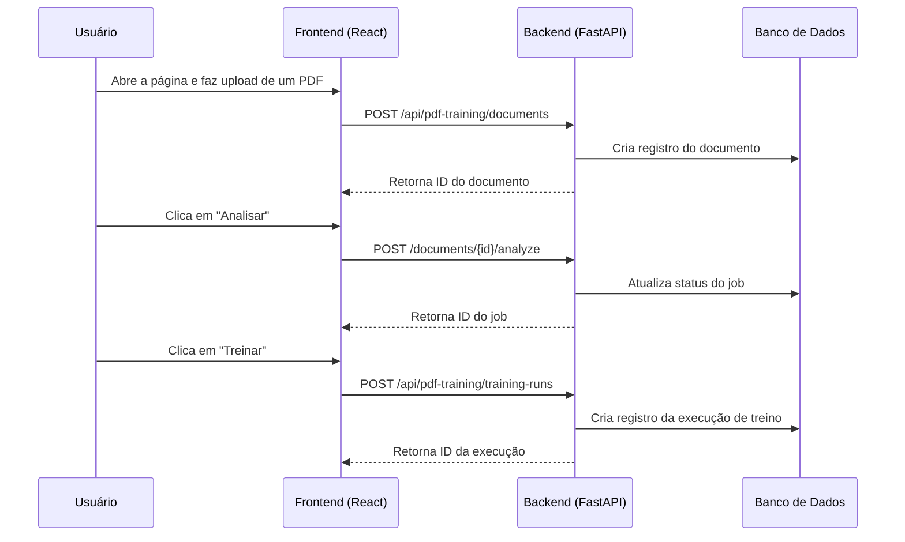

# Arquitetura 40 — Integração de SPA para o Pipeline de Treinamento (spa-integration)

- Status: Concluído
- Data: 2025-09-20 (Data de referência da implementação)
- Responsáveis: Gemini (Developer)
- Observações: Detalhes técnicos da implementação da interface web local (SPA) e seu backend.

## Resumo executivo

Este documento descreve a arquitetura da solução de SPA para o pipeline de treinamento de PDF. A arquitetura consiste em um frontend desacoplado (React) que se comunica com um backend (FastAPI) via uma API RESTful. O backend orquestra a lógica de negócio existente, utilizando um banco de dados (SQLite por padrão) para persistir o estado e um armazenamento de blobs local para artefatos (PDFs, modelos).

## Visão proposta

### Componentes e responsabilidades

- **Frontend (`src/spa`)**: Aplicação React com Vite. Responsável por toda a renderização da UI, gerenciamento de estado local e comunicação com a API.
- **Backend (`src/server/pdf_training_app`)**: Aplicação FastAPI.
    - **API (`api.py`)**: Expõe os endpoints RESTful para o frontend.
    - **Serviços (`services.py`)**: Orquestra a lógica de negócio (upload, análise, treinamento).
    - **Jobs (`jobs.py`)**: Gerencia o estado de tarefas de longa duração.
    - **Banco de Dados (`db/`)**: Camada de acesso a dados com SQLAlchemy (models, repository) para interagir com o banco de dados.
- **Armazenamento (`storage/`)**:
    - **Banco de Dados (`storage/pdf_training/app.db`)**: Arquivo SQLite.
    - **Blobs (`storage/pdf_training/blobs/`)**: Armazena arquivos binários como PDFs e modelos treinados.

### Fluxo da Aplicação

### Endpoints da API (Principais)

- `POST /api/pdf-training/documents`: Upload de novos documentos.
- `GET /api/pdf-training/documents`: Lista todos os documentos.
- `POST /api/pdf-training/documents/{id}/analyze`: Inicia a análise de um documento.
- `POST /api/pdf-training/documents/{id}/annotations/ingest`: Ingesta anotações do Label Studio.
- `POST /api/pdf-training/training-runs`: Dispara uma nova execução de treinamento.
- `GET /api/pdf-training/jobs/{id}`: Consulta o status de um job em andamento.

## Plano de implementação

1.  **Fase 1 (Backend - Concluída no Plano 39)**: Implementar o schema do banco de dados, o repositório e os serviços de negócio.
2.  **Fase 2 (Backend)**: Expor os serviços através de endpoints FastAPI, com validação via Pydantic.
3.  **Fase 3 (Frontend)**: Desenvolver os componentes React para cada etapa do fluxo (Upload, Lista de Documentos, Detalhes, Histórico).
4.  **Fase 4 (Integração)**: Conectar o frontend aos endpoints do backend, implementar o polling de status de jobs e o tratamento de erros.
5.  **Fase 5 (Documentação)**: Atualizar o `USER_GUIDE.md` com o novo fluxo de trabalho via SPA.