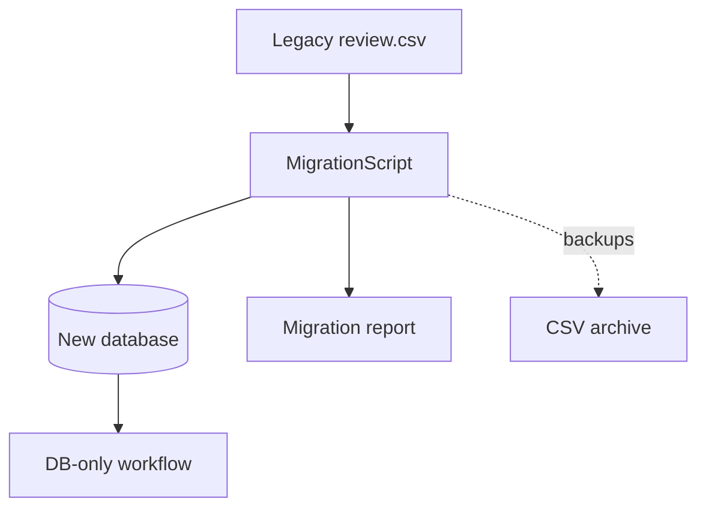

# PR Plan 42 — Migrate Legacy CSV Data & Decommission CSV-based Workflows

## Objective
Migrate existing `review.csv` datasets into the new database, update documentation/processes, and retire the legacy CSV/CLI paths once the database-driven workflow is validated.

**Resumo em pt-BR:** Vamos importar os dados existentes dos CSVs para o novo banco, ajustar toda a documentação e remover o fluxo antigo baseado em CSV/CLI, garantindo que o assistente funcione somente no modo com banco de dados.

## Scope
- Build a migration script that ingests historical `review.csv` files (and related artefacts) into DB tables (`documents`, `annotations`, `training_runs`).
- Provide verification utilities (report counts, diff summaries) to ensure migration completeness.
- Remove legacy CLI commands/flags that operate solely on CSV; update tooling to require DB mode.
- Update docs, READMEs, and warnings to indicate CSV path is deprecated/removed.
- Add guardrails/tests to prevent reintroducing CSV path (e.g., raising errors if CSV flags passed).

Out of scope:
- Core DB or API changes (done in Plans 38–41).
- Long-term archival/backup automation (future work if needed).

## Affected Files
- `scripts/migrate_review_csv.py` (new) — migrates historical data into DB.
- `tools/feedback_cli.py` — remove CSV-only commands/flags, ensure DB mode default.
- `docs/USER_GUIDE.md`, `docs/feedback/pdf_annotation.md`, `docs/refactor/pr32-refactor-spa-blueprint.md`, `README.md` — update instructions, note migration steps.
- `docs/diagrams/ai_builder_db_flow.mmd` — highlight end state (no CSV path).
- `tests/` — add regression tests ensuring CLI rejects CSV mode.

## Approach
1. **Migration script** — Iterate over existing `reports/feedback/*.csv` (configurable), parse with existing utilities, convert to DB records (documents + annotations) with provenance metadata.
2. **Verification** — Generate summary report (counts per document, mismatches). Provide optional dry-run mode.
3. **CLI cleanup** — Remove `review_csv` arguments from commands, replace with DB identifiers. Add helpful error message instructing to run migration script first.
4. **Documentation** — Update manuals, diagrams, and change logs; provide step-by-step for running migration (backup old CSVs, run script, verify, delete old artefacts).
5. **Testing & safeguards** — Add unit tests for migration script; ensure CI fails if CSV code path invoked.



### Plain-language explainer
We’ll move everything out of the spreadsheets into the database, prove the counts match, and then delete the old CSV commands so the system only works in the new mode.

## Pseudodiff (representative)
```diff
+++ scripts/migrate_review_csv.py
+def main(csv_glob: str, dry_run: bool = False):
+    for csv_path in glob(csv_glob):
+        records = parse_review_csv(csv_path)
+        db.import_records(records)
+    print("Migration complete")
+
--- tools/feedback_cli.py
@@
-    p_ing = sub.add_parser("ingest", help="Ingest reviewed CSV ...")
-    p_ing.add_argument("--review-csv", ...)
+    p_ing = sub.add_parser("ingest", help="Ingest reviewed annotations from database")
+    p_ing.add_argument("--training-run-id", required=True)
+    p_ing.set_defaults(func=cmd_ingest_db)
```

## Acceptance Criteria
- Migration script imports legacy CSV data into DB with validation report.
- All CLI commands operate exclusively with DB identifiers; CSV flags removed.
- Docs clearly state the CSV workflow is deprecated and describe the migration steps.
- Automated tests confirm CSV path is unavailable (raising helpful error if attempted).
- Old CSV artefact directories marked archived (or removed) after migration.

## Manual Tests
- `poetry run python scripts/migrate_review_csv.py --glob reports/feedback/*.csv --dry-run`
- Run without dry-run, inspect DB counts.
- Exercise CLI commands to confirm DB-only mode works; verify CSV flags cause errors.
- Review docs for consistency.

## Suggested commit message and branch
- Branch: `impl/42-migrate-and-decommission-csv`
- Commit: `refactor: migrate CSV history to DB and remove legacy workflow`

## Checklist
- [ ] Objective and Scope are clear and limited.
- [ ] Affected files listed.
- [ ] Pseudodiff (small, readable, representative of the approach).
- [ ] Acceptance criteria and minimal manual tests.
- [ ] Suggested commit message and branch name.
