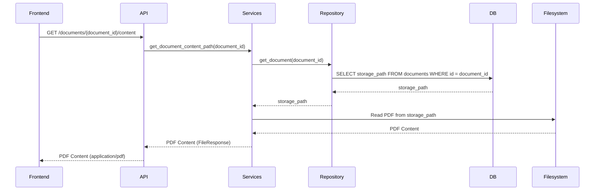

# Arquitetura 01 — Backend - Servir Conteúdo PDF para Visualização (backend-serve-pdf-content)

- Status: draft
- Data: 2025-09-23
- Responsáveis: Gemini
- Observações: Este documento detalha o design para o primeiro PR da feature de visualização e anotação interativa de PDFs.

## Resumo executivo

Este documento detalha o design para um novo endpoint FastAPI que servirá o conteúdo bruto de arquivos PDF armazenados. Este endpoint é um passo fundamental para habilitar a visualização interativa de PDFs no frontend, permitindo que os usuários visualizem e anotem documentos diretamente dentro da aplicação.

## Objetivos e não objetivos

### Objetivos
- Fornecer uma maneira confiável e eficiente para o frontend recuperar arquivos PDF.
- Garantir o tratamento adequado de erros para documentos não existentes.
- Manter a segurança servindo apenas documentos autorizados.

### Não objetivos
- Implementar a lógica de renderização de PDF no frontend (será um PR separado).
- Implementar autenticação/autorização para o endpoint (assumido ser tratado por mecanismos FastAPI existentes ou aprimoramentos futuros).

## Estado atual

- PDFs são carregados e armazenados em um blob storage designado (`document_blob_path`).
- Metadados do documento são armazenados no banco de dados.
- Não existe um endpoint de API direto para recuperar o conteúdo bruto do arquivo PDF.

## Visão proposta

### Componentes e responsabilidades
- **`src/server/pdf_training_app/api.py`**: Exporá um novo endpoint GET `/documents/{document_id}/content`. Este endpoint será responsável por rotear a requisição e tratar exceções.
- **`src/server/pdf_training_app/services.py`**: Conterá a lógica de negócio `get_document_content_path(document_id: str)` para recuperar o caminho absoluto do arquivo PDF do armazenamento com base no `document_id`. Também tratará casos em que o documento ou arquivo não existe.
- **`server.db.repository`**: Será utilizado por `services.py` para consultar o banco de dados para informações do documento, especificamente o `storage_path`.

### Fluxos (diagramas, mermaid, sequência)

### Dados e contratos

- **Requisição**: `GET /documents/{document_id}/content`
    - `document_id`: string (parâmetro de caminho)
- **Resposta (Sucesso)**: `FileResponse` com `media_type="application/pdf"`. O corpo será os bytes brutos do arquivo PDF.
- **Resposta (Erro)**: `HTTPException` com `status_code=404` e `detail="Document not found"` ou `detail="PDF file not found"`.

## Plano de implementação

1.  Adicionar a função `get_document_content_path` a `src/server/pdf_training_app/services.py`. Esta função irá:
    - Aceitar `document_id` como entrada.
    - Consultar o banco de dados usando `repository.get_document` para recuperar o `storage_path` do documento.
    - Validar se o `storage_path` existe e aponta para um arquivo válido.
    - Retornar o caminho absoluto para o arquivo PDF.
2.  Adicionar o `get_document_content_endpoint` a `src/server/pdf_training_app/api.py`. Este endpoint irá:
    - Chamar `get_document_content_path` de `services.py`.
    - Retornar um `FileResponse` com o caminho do arquivo recuperado e `media_type="application/pdf"`.
    - Tratar `ValueError` de `services.py` levantando `HTTPException(status_code=404)`.

## Impactos

- **Performance**: Impacto mínimo. O `FileResponse` do FastAPI é eficiente para servir arquivos estáticos.
- **Segurança**: O endpoint servirá apenas arquivos explicitamente vinculados a um `document_id` no banco de dados, mitigando o acesso arbitrário a arquivos. Mecanismos de autenticação/autorização existentes serão aplicados.
- **Operações / suporte**: Novo endpoint para monitorar.

## Testes e evidências

- Testes de unidade para a função `get_document_content_path` em `services.py` para cobrir a existência do documento, a existência do arquivo e casos de erro.
- Testes de integração para o endpoint `/documents/{document_id}/content` em `api.py` para verificar a recuperação bem-sucedida do arquivo e respostas 404.

## Decisões, trade-offs e alternativas consideradas

- **Alternativa**: Codificar o conteúdo do PDF em Base64 e retorná-lo como JSON. **Decisão**: Rejeitada. `FileResponse` é mais eficiente para dados binários e diretamente suportado pelo FastAPI, reduzindo a sobrecarga e o uso de memória tanto no servidor quanto no cliente.
- **Alternativa**: Servir diretamente de um servidor de arquivos estáticos. **Decisão**: Rejeitada. A integração com a aplicação FastAPI existente oferece melhor controle sobre o acesso e aproveita a lógica de gerenciamento de documentos existente.

## Pendências e próximos passos

- Implementação do visualizador de PDF no frontend (próximo PR).
- Implementação de autenticação/autorização, se ainda não estiver presente ou se surgirem requisitos específicos.