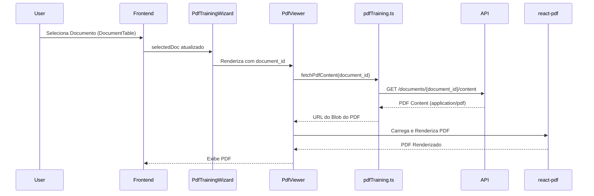

# Arquitetura 45 — Frontend - Visualizador Básico de PDF (frontend-basic-pdf-viewer)

- Status: draft
- Data: 2025-09-23
- Responsáveis: Gemini
- Observações: Este documento detalha o design para o PR 45, que implementa a visualização básica de PDFs no frontend. Depende do PR 44.

## Resumo executivo

Este documento descreve o design para a implementação de um componente React que renderizará documentos PDF na interface do usuário. Ele consumirá o endpoint de backend `/documents/{document_id}/content` (implementado no PR 44) para obter o conteúdo do PDF e exibirá o documento usando uma biblioteca de terceiros. Este é um passo fundamental para permitir a interação do usuário com o conteúdo do PDF.

## Objetivos e não objetivos

### Objetivos
- Criar um componente React reutilizável para exibir PDFs.
- Integrar o componente ao fluxo de seleção de documentos existente no `PdfTrainingWizard`.
- Carregar PDFs de forma assíncrona a partir do backend.
- Exibir mensagens de carregamento e erro de forma adequada.

### Não objetivos
- Implementar funcionalidades de anotação interativa (será abordado em PRs futuros).
- Otimização avançada de performance para PDFs muito grandes (foco inicial na funcionalidade básica).
- Suporte a todas as funcionalidades avançadas de um visualizador de PDF (ex: zoom, busca, navegação por miniaturas).

## Estado atual

- O frontend (`src/spa`) lista documentos e permite o upload, mas não possui um visualizador de PDF.
- O backend (`src/server/pdf_training_app`) agora oferece um endpoint para servir o conteúdo bruto do PDF (`/documents/{document_id}/content`).

## Visão proposta

### Componentes e responsabilidades
- **`src/spa/src/components/PdfViewer.tsx` (novo componente):**
    - Receberá o `document_id` como prop.
    - Usará `react-query` para chamar a nova função de API (`fetchPdfContent`) para obter o URL do PDF (ou o próprio conteúdo, dependendo da biblioteca).
    - Utilizará a biblioteca `react-pdf` (ou similar) para renderizar o PDF.
    - Exibirá um estado de carregamento (`isLoading`) e mensagens de erro (`isError`).
- **`src/spa/src/pages/PdfTrainingWizard.tsx`:**
    - Passará o `document_id` do documento selecionado para o `PdfViewer`.
    - Gerenciará o layout para incluir o `PdfViewer` ao lado da `DocumentTable` e outros componentes.
- **`src/spa/src/api/pdfTraining.ts`:**
    - Adicionar uma nova função `fetchPdfContent(documentId: string)` que fará uma requisição GET para `/documents/{document_id}/content` e retornará o URL do blob do PDF ou o próprio blob.

### Fluxos (diagramas, mermaid, sequência)

### Dados e contratos

- **Frontend -> Backend:** `GET /documents/{document_id}/content` (conforme PR 44).
- **`PdfViewer` Props:** `documentId: string | null`.
- **`fetchPdfContent` Retorno:** `string` (URL para o PDF) ou `Blob`.

## Plano de implementação

1.  **Instalar `react-pdf`:** Adicionar `react-pdf` e suas dependências ao `package.json` do `src/spa`.
2.  **Criar `fetchPdfContent`:** Implementar a função em `src/spa/src/api/pdfTraining.ts` para chamar o novo endpoint de backend.
3.  **Criar `PdfViewer.tsx`:** Desenvolver o componente React que utiliza `react-pdf` para exibir o documento. Incluir estados de carregamento e erro.
4.  **Integrar no `PdfTrainingWizard.tsx`:** Adicionar o `PdfViewer` ao layout do `PdfTrainingWizard`, passando o `document_id` do documento selecionado.

## Impactos

- **Performance**: A renderização de PDFs no cliente pode consumir recursos. Otimizações futuras podem ser necessárias.
- **Segurança**: O acesso ao PDF é controlado pelo endpoint de backend. A biblioteca `react-pdf` é amplamente utilizada e considerada segura.
- **Operações / suporte**: Nenhuma mudança significativa nas operações de backend. O frontend terá um novo componente para depuração.

## Testes e evidências

- **Testes de unidade/componente**: Testar o `PdfViewer` isoladamente para garantir que ele carrega e exibe PDFs corretamente, e que os estados de carregamento/erro são tratados.
- **Testes manuais**: Conforme descrito na Proposta de Mudança.

## Decisões, trade-offs e alternativas consideradas

- **Biblioteca de PDF**: `react-pdf` foi escolhida por ser popular, bem mantida e oferecer boa flexibilidade para futuras sobreposições de UI. Alternativas como `PDF.js` puro ou outras wrappers foram consideradas, mas `react-pdf` oferece um bom equilíbrio entre facilidade de uso e controle.
- **Carregamento do PDF**: O PDF será carregado via URL diretamente do endpoint de backend. Isso evita a necessidade de codificação Base64 no backend e no transporte, otimizando a performance.

## Pendências e próximos passos

- PR 46: Backend - Servir Entidades Pré-processadas.
- PR 47: Frontend - Exibir Entidades Pré-processadas no PDF.