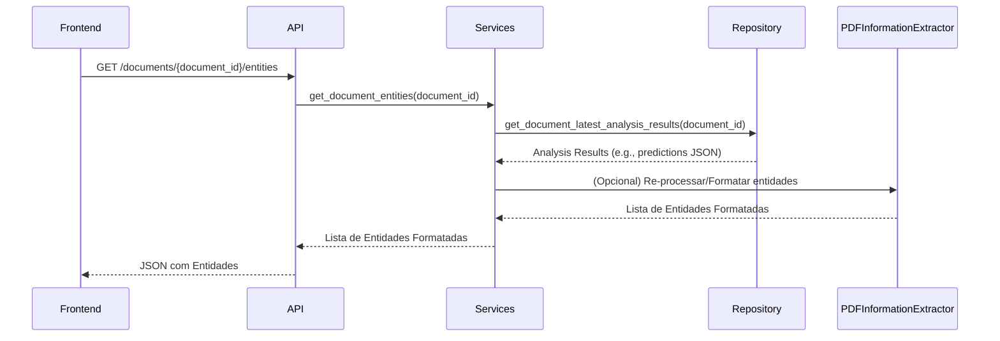

# Arquitetura 46 — Backend - Servir Entidades Pré-processadas para Visualização (backend-serve-preprocessed-entities)

- Status: draft
- Data: 2025-09-23
- Responsáveis: Gemini
- Observações: Este documento detalha o design para o PR 46, que implementa o endpoint para servir entidades pré-processadas. Depende do PR 44 e é um pré-requisito para o PR 47.

## Resumo executivo

Este documento descreve o design para um novo endpoint FastAPI que fornecerá as entidades extraídas de um documento PDF. O endpoint consumirá os resultados da análise de PDF (gerados pelo `start_analysis` e `PDFInformationExtractor`) e os formatará para que o frontend possa sobrepor essas entidades no visualizador de PDF. O foco é fornecer o tipo da entidade, o valor e, idealmente, informações de localização para uma renderização precisa.

## Objetivos e não objetivos

### Objetivos
- Expor um endpoint RESTful para recuperar entidades pré-processadas de um documento específico.
- Formatar as entidades de forma consistente, incluindo tipo, valor e localização.
- Reutilizar a lógica de extração de entidades existente no `embeddinggemma_feasibility/pdf_information_extractor.py`.
- Tratar casos de documentos não encontrados ou análises pendentes.

### Não objetivos
- Realizar a extração de entidades em tempo real a cada requisição (as entidades devem ser pré-processadas).
- Implementar a lógica de renderização das entidades no frontend (será um PR separado).
- Implementar a lógica de anotação interativa (será um PR separado).

## Estado atual

- O `embeddinggemma_feasibility/pdf_information_extractor.py` já extrai entidades (datas, valores, números de PO, etc.) usando regex e palavras-chave, e gera embeddings.
- O `start_analysis` em `services.py` prepara um `review_csv` com colunas `_pred` e `_gold`, indicando que predições são geradas.
- Não há um endpoint de API para recuperar essas entidades de forma estruturada para o frontend.

## Visão proposta

### Componentes e responsabilidades
- **`src/server/pdf_training_app/api.py`:**
    - Exporá um novo endpoint GET `/documents/{document_id}/entities`.
    - Será responsável por rotear a requisição e tratar exceções.
- **`src/server/pdf_training_app/services.py`:**
    - Adicionar uma nova função `get_document_entities(document_id: str)`.
    - Esta função consultará o banco de dados para obter os resultados da última análise do documento (que contém as predições).
    - Irá extrair as entidades relevantes desses resultados e formatá-las em uma lista de objetos `Entity` (novo modelo).
    - Se a análise não tiver sido executada, pode acioná-la ou retornar um status apropriado.
- **`embeddinggemma_feasibility/pdf_information_extractor.py`:**
    - Pode ser necessário adaptar a função `extract_key_information` para que, ao invés de apenas retornar `entities: Dict[str, List[str]]`, retorne uma estrutura mais rica que inclua informações de localização (ex: `(value, start_offset, end_offset)` ou `(value, bounding_box)`). Isso dependerá da capacidade do `pdfplumber` ou de outras bibliotecas de extração de texto.
- **`src/server/pdf_training_app/models.py`:**
    - Definir um novo modelo Pydantic `Entity` para representar uma entidade extraída, incluindo `type: str`, `value: str`, e opcionalmente `location: Dict[str, Any]` (ex: `page_num`, `bbox`).

### Fluxos (diagramas, mermaid, sequência)



### Dados e contratos

- **Requisição**: `GET /documents/{document_id}/entities`
    - `document_id`: string (parâmetro de caminho)
- **Resposta (Sucesso)**: `List[Entity]` (JSON)
    ```json
    [
      {
        "type": "PO Number",
        "value": "PO12345",
        "location": {"page_num": 1, "bbox": [100, 200, 150, 220]}
      },
      {
        "type": "Amount",
        "value": "$1,234.56",
        "location": {"page_num": 1, "bbox": [300, 400, 350, 420]}
      }
    ]
    ```
- **Resposta (Erro)**: `HTTPException` com `status_code=404` (documento não encontrado) ou `status_code=500` (erro de processamento).

## Plano de implementação

1.  **Definir modelo `Entity`:** Criar o modelo Pydantic `Entity` em `src/server/pdf_training_app/models.py`.
2.  **Adaptar `PDFInformationExtractor` (se necessário):** Avaliar e, se possível, modificar `embeddinggemma_feasibility/pdf_information_extractor.py` para que a extração de entidades inclua informações de localização (offsets ou bounding boxes). Isso pode exigir pesquisa sobre as capacidades do `pdfplumber` ou integração com outras bibliotecas.
3.  **Implementar `get_document_entities`:** Adicionar a função a `src/server/pdf_training_app/services.py`. Esta função deve:
    - Recuperar o documento e seus resultados de análise mais recentes.
    - Chamar a lógica de extração de entidades (ou reformatar os resultados existentes) para gerar a lista de objetos `Entity`.
    - Tratar casos onde a análise ainda não foi concluída.
4.  **Adicionar endpoint na API:** Criar o endpoint GET `/documents/{document_id}/entities` em `src/server/pdf_training_app/api.py` que chama `get_document_entities` e retorna a lista de entidades.

## Impactos

- **Performance**: A recuperação e formatação das entidades devem ser rápidas, pois dependem de resultados pré-processados. Se a lógica de localização for complexa, pode haver impacto.
- **Segurança**: O endpoint servirá apenas dados de entidades, não o conteúdo bruto do PDF. Mecanismos de autenticação/autorização existentes serão aplicados.
- **Operações / suporte**: Novo endpoint para monitorar. A complexidade da extração de localização pode exigir mais atenção.

## Testes e evidências

- Testes de unidade para `get_document_entities` em `services.py` para cobrir a recuperação de entidades, formatação e tratamento de erros.
- Testes de integração para o endpoint `/documents/{document_id}/entities` em `api.py` para verificar a resposta JSON e o tratamento de erros.

## Decisões, trade-offs e alternativas consideradas

- **Formato da localização da entidade**: Inicialmente, focaremos em offsets de texto ou coordenadas de bounding box se facilmente disponíveis via `pdfplumber`. Uma solução mais robusta para localização precisa pode ser um ADR futuro.
- **Extração em tempo real vs. pré-processada**: Decisão de usar entidades pré-processadas para garantir performance e consistência, evitando re-extração a cada requisição.

## Pendências e próximos passos

- PR 47: Frontend - Exibir Entidades Pré-processadas no PDF.
- PR 48: Backend - Endpoints de Anotação Interativa.