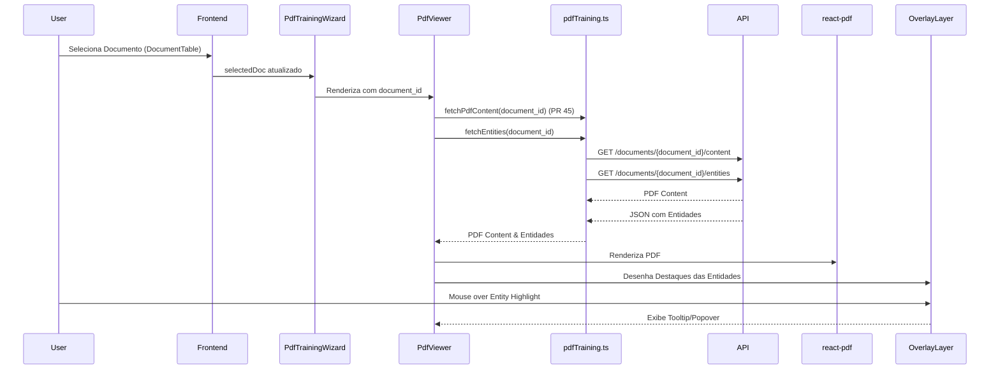

# Arquitetura 47 — Frontend - Exibir Entidades Pré-processadas no PDF (frontend-display-preprocessed-entities)

- Status: implementado
- Data: 2025-09-23
- Responsáveis: Gemini
- Observações: Este documento detalha o design para o PR 47, que implementa a exibição de entidades pré-processadas sobre o PDF. Depende do PR 45 e PR 46.

## Estado da revisão (2025-09-25)

- [x] Implementado no código-base. O `PdfViewer` consulta `/entities` com `react-query`, desenha overlays responsivos e reutiliza `src/spa/src/models.ts` conforme previsto; o cliente HTTP foi expandido em `src/spa/src/api/pdfTraining.ts` para suportar o contrato descrito.

## Resumo executivo

Este documento descreve o design para aprimorar o `PdfViewer` no frontend, permitindo que ele busque e exiba entidades pré-processadas (predições do modelo) diretamente sobre o conteúdo do PDF. A funcionalidade incluirá a renderização visual dos destaques das entidades e a exibição de detalhes da entidade ao interagir com esses destaques. Este é um passo crucial para a experiência de anotação interativa.

## Objetivos e não objetivos

### Objetivos
- Integrar a busca de entidades no `PdfViewer` usando o novo endpoint de backend (`/documents/{document_id}/entities`).
- Desenvolver uma camada de overlay para desenhar destaques visuais sobre o PDF renderizado.
- Exibir informações detalhadas da entidade (tipo, valor) em tooltips ou popovers ao interagir com os destaques.
- Garantir que a exibição de entidades seja responsiva e precisa em relação ao conteúdo do PDF.

### Não objetivos
- Implementar a criação, edição ou exclusão interativa de entidades (será abordado em PRs futuros).
- Otimização avançada para PDFs com um número extremamente alto de entidades (foco inicial na funcionalidade).
- Suporte a diferentes tipos de visualização de entidades (ex: lista lateral, árvore hierárquica) além da sobreposição direta.

## Estado atual

- O `PdfViewer` (PR 45) é capaz de renderizar PDFs básicos.
- O backend (PR 46) fornece um endpoint `/documents/{document_id}/entities` que retorna entidades com tipo, valor e, potencialmente, localização.

## Visão proposta

### Componentes e responsabilidades
- **`src/spa/src/components/PdfViewer.tsx` (modificação):**
    - Adicionar lógica para usar `react-query` para chamar a nova função de API (`fetchEntities`) para obter as entidades do documento selecionado.
    - Implementar a lógica de renderização da camada de overlay. Esta camada precisará mapear as coordenadas das entidades (se fornecidas pelo backend) para as coordenadas de renderização do `react-pdf`.
    - Adicionar manipuladores de eventos (ex: `onMouseEnter`, `onMouseLeave`) para exibir/ocultar tooltips com detalhes da entidade.
- **`src/spa/src/api/pdfTraining.ts` (modificação):**
    - Adicionar uma nova função `fetchEntities(documentId: string)` que fará uma requisição GET para `/documents/{document_id}/entities` e retornará a lista de objetos `Entity`.
- **`src/spa/src/models.ts` (novo arquivo ou modificação):**
    - Definir a interface `Entity` no frontend, espelhando o modelo Pydantic do backend, incluindo `type: string`, `value: string`, e `location: any` (ou uma interface mais específica para localização).

### Fluxos (diagramas, mermaid, sequência)



### Dados e contratos

- **Frontend -> Backend:** `GET /documents/{document_id}/entities` (conforme PR 46).
- **`PdfViewer` Props:** `documentId: string | null`, `entities: Entity[]`.
- **`fetchEntities` Retorno:** `Entity[]` (lista de objetos `Entity`).
- **Interface `Entity` (frontend):**
    ```typescript
    interface Entity {
      type: string;
      value: string;
      location?: { page_num: number; bbox: [number, number, number, number] }; // Exemplo
    }
    ```

## Plano de implementação

1.  **Definir interface `Entity`:** Criar ou atualizar `src/spa/src/models.ts` com a interface `Entity`.
2.  **Atualizar `fetchEntities`:** Implementar a função em `src/spa/src/api/pdfTraining.ts` para chamar o novo endpoint de backend (`/documents/{document_id}/entities`).
3.  **Modificar `PdfViewer.tsx`:**
    - Adicionar lógica para buscar entidades usando `fetchEntities` e `react-query`.
    - Implementar a camada de overlay para desenhar os destaques das entidades. Isso pode envolver o uso de um `div` posicionado absolutamente sobre o canvas do PDF, ou funcionalidades da própria biblioteca `react-pdf`.
    - Adicionar lógica para exibir tooltips/popovers com detalhes da entidade ao interagir com os destaques.

## Impactos

- **Performance**: A renderização de múltiplos destaques pode impactar a performance, especialmente para PDFs com muitas entidades. Otimizações serão consideradas.
- **Segurança**: Nenhuma mudança significativa na segurança além do que já foi abordado nos PRs de backend.
- **Operações / suporte**: Novo componente e lógica no frontend para depuração.

## Testes e evidências

- **Testes de unidade/componente**: Testar a lógica de overlay e a exibição de tooltips no `PdfViewer`.
- **Testes manuais**: Conforme descrito na Proposta de Mudança.

## Decisões, trade-offs e alternativas consideradas

- **Mapeamento de coordenadas**: A precisão do mapeamento das coordenadas das entidades do backend para a renderização do frontend é um desafio. Inicialmente, usaremos uma abordagem direta, mas pode ser necessário um refinamento ou um ADR se a complexidade aumentar.
- **Biblioteca de overlay**: Utilizar um `div` posicionado sobre o PDF é uma abordagem flexível. Alternativas como desenhar diretamente no canvas do PDF podem ser exploradas se houver requisitos de performance ou precisão muito altos.

## Pendências e próximos passos

- PR 48: Backend - Endpoints de Anotação Interativa.
- PR 49: Frontend - UI de Anotação Interativa.