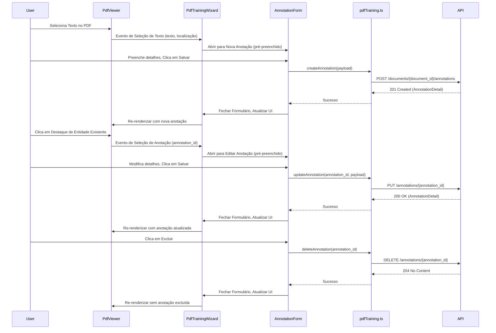

# Arquitetura 49 — Frontend - UI de Anotação Interativa (frontend-interactive-annotation-ui)

- Status: implementado
- Data: 2025-09-23
- Responsáveis: Gemini
- Observações: Este documento detalha o design para o PR 49, que implementa a UI de anotação interativa. Depende do PR 47 e PR 48.

## Estado da revisão (2025-09-25)

- [x] Implementado no código-base. `PdfViewer` captura seleções e dispara fluxos no `PdfTrainingWizard`, o `AnnotationForm` foi construído como modal reutilizável e `AnnotationCard` integra edição e exclusão usando o cliente CRUD conforme planejado.

## Resumo executivo

Este documento descreve o design para a implementação da interface de usuário interativa no frontend, permitindo que os usuários interajam diretamente com o PDF renderizado para criar, editar e excluir anotações. Essas alterações serão enviadas de forma granular para o backend através dos novos endpoints de anotação (PR 48). Este PR é central para a experiência de anotação interativa.

## Objetivos e não objetivos

### Objetivos
- Habilitar a seleção de texto no PDF renderizado para iniciar a criação de novas anotações.
- Fornecer uma interface amigável (formulário/modal) para editar detalhes da anotação (tipo, valor, notas).
- Implementar ações claras para excluir anotações.
- Integrar com os endpoints CRUD de anotação interativa do backend (PR 48).
- Garantir atualizações da UI em tempo real para refletir as alterações nas anotações.

### Não objetivos
- Implementar a lógica de backend para persistência de anotações (coberto no PR 48).
- Implementar o loop de feedback do modelo (coberto no PR 50 e PR 51).
- Funcionalidades avançadas como anotação colaborativa ou funcionalidade complexa de desfazer/refazer (foco inicial na interação principal).

## Estado atual

- O `PdfViewer` (PR 45) renderiza PDFs.
- Entidades pré-processadas são exibidas como overlays (PR 47).
- O backend fornece endpoints CRUD granulares para anotações (PR 48).
- O frontend atualmente carece da UI para criação, edição e exclusão interativa de anotações.

## Visão proposta

### Componentes e responsabilidades
- **`src/spa/src/components/PdfViewer.tsx` (modificação):**
    - Implementar listeners de eventos para interações do mouse (ex: `onMouseUp` para seleção de texto).
    - Ao selecionar texto, capturar o texto selecionado e sua localização (offsets de caracteres ou bounding box em relação à página do PDF).
    - Acionar um modal ou formulário para criação de nova anotação, pré-preenchendo com o texto selecionado.
    - Tornar os destaques de entidades existentes clicáveis para abrir um formulário de edição.
- **`src/spa/src/components/AnnotationForm.tsx` (novo componente):**
    - Um componente React reutilizável (modal ou formulário lateral) para criar e editar anotações.
    - Campos para `type`, `value`, `notes` e, potencialmente, `reviewer`.
    - Botões para "Salvar" (chama o backend para atualizar/criar) e "Excluir" (chama o backend para excluir).
    - Lida com validação de formulário e exibe feedback.
- **`src/spa/src/api/pdfTraining.ts` (modificação):**
    - Adicionar novas funções `createAnnotation`, `updateAnnotation`, `deleteAnnotation` que chamam os respectivos endpoints de backend (PR 48).
    - Utilizar `react-query` para gerenciar chamadas de API, cache e invalidação.
- **`src/spa/src/pages/PdfTrainingWizard.tsx` (modificação):**
    - Gerenciar o estado para a anotação atualmente selecionada ou seleção de texto.
    - Renderizar o componente `AnnotationForm` com base na interação do usuário.
    - Coordenar o fluxo de dados entre `PdfViewer` e `AnnotationForm`.

### Fluxos (diagramas, mermaid, sequência)

### Dados e contratos

- O frontend enviará `AnnotationCreateRequest` e `AnnotationUpdateRequest` (definidos no PR 48) para o backend.
- O frontend receberá `AnnotationDetail` (definido no PR 48) do backend.
- Os dados de `location` (bounding box ou offsets de caracteres) capturados da seleção de texto serão cruciais.

## Plano de implementação

1.  **Aprimorar `PdfViewer.tsx` para Seleção de Texto**: Implementar lógica para detectar e capturar texto selecionado e sua localização correspondente na página do PDF. Isso pode envolver o uso de APIs de seleção do navegador e mapeá-las para coordenadas do PDF.
2.  **Criar `AnnotationForm.tsx`**: Desenvolver o componente React para criar/editar anotações.
3.  **Atualizar `pdfTraining.ts`**: Adicionar funções `createAnnotation`, `updateAnnotation`, `deleteAnnotation` usando `axios` e `react-query`.
4.  **Integrar em `PdfTrainingWizard.tsx`**: Gerenciar o estado para `selectedAnnotation` ou `textSelection` e renderizar condicionalmente `AnnotationForm`.
5.  **Tornar Destaques de Entidade Clicáveis**: Modificar a lógica de overlay de entidade em `PdfViewer.tsx` para tornar os destaques interativos, acionando o `AnnotationForm` para edição.

## Impactos

- **Performance**: O gerenciamento da seleção de texto e das interações de overlay pode ser complexo. Otimizações serão necessárias para garantir uma experiência de usuário suave, especialmente para PDFs grandes.
- **Segurança**: Práticas padrão de segurança de frontend (validação de entrada, sanitização) serão aplicadas.
- **Operações / suporte**: Aumento da complexidade no frontend, exigindo testes rigorosos.

## Testes e evidências

- Testes de unidade/componente para `AnnotationForm` para garantir comportamento e validação corretos.
- Testes de integração para `PdfViewer` para verificar a seleção de texto, interação de destaque e acionamento de formulário.
- Testes manuais conforme descrito na Proposta de Mudança.

## Decisões, trade-offs e alternativas consideradas

- **Mecanismo de Seleção de Texto**: A abordagem inicial usará a seleção de texto padrão do navegador. Se isso se mostrar insuficiente para necessidades específicas de PDF, uma biblioteca mais especializada ou implementação personalizada será considerada (potencial ADR).
- **Exibição do Formulário de Anotação**: Decidiu-se por um modal ou formulário lateral para edição. Um editor inline pode ser uma alternativa, mas pode ser mais complexo de implementar inicialmente.
- **Gerenciamento de Estado**: `react-query` será usado para busca e cache de dados, simplificando o gerenciamento de estado relacionado a anotações.

## Pendências e próximos passos

- PR 50: Backend - Gatilho de Feedback Imediato do Modelo.
- PR 51: Frontend - Integrar Feedback do Modelo.