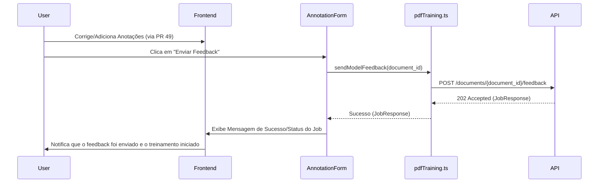

# Arquitetura 51 — Frontend - Integrar Feedback do Modelo (frontend-integrate-model-feedback)

- Status: implementado
- Data: 2025-09-23
- Responsáveis: Gemini
- Observações: Este documento detalha o design para o PR 51, que implementa a integração do feedback do modelo no frontend. Depende do PR 49 e PR 50.

## Estado da revisão (2025-09-25)

- [x] Implementado no código-base. O botão "Send feedback" foi incorporado ao `AnnotationCard`, `pdfTraining.ts` expõe a chamada correspondente e o fluxo apresenta toasts de sucesso/erro conforme descrito.

## Resumo executivo

Este documento descreve o design para integrar a funcionalidade de acionamento do feedback imediato do modelo na interface do usuário do frontend. Após realizar anotações interativas, o usuário poderá enviar essas informações para o backend, que acionará um processo de fine-tuning do modelo. O objetivo é fechar o ciclo de feedback humano-no-loop, permitindo que as correções do usuário melhorem diretamente as predições futuras do modelo.

## Objetivos e não objetivos

### Objetivos
- Adicionar um elemento de UI (botão/ação) para que o usuário possa explicitamente enviar feedback para o modelo.
- Implementar a lógica no frontend para chamar o novo endpoint de feedback do modelo no backend (PR 50).
- Fornecer feedback visual claro ao usuário sobre o status do envio do feedback e o início do processo de fine-tuning.
- Garantir que a UI permaneça responsiva durante o envio do feedback.

### Não objetivos
- Implementar a lógica de fine-tuning do modelo no backend (coberto no PR 50).
- Exibir métricas detalhadas do treinamento do modelo no frontend (foco na ação de feedback).
- Gerenciar o ciclo de vida completo do modelo (versionamento, implantação) no frontend.

## Estado atual

- O frontend permite anotações interativas (PR 49).
- O backend possui um endpoint para acionar o fine-tuning do modelo com base no feedback (PR 50).
- Não há um mecanismo no frontend para o usuário acionar explicitamente esse feedback.

## Visão proposta

### Componentes e responsabilidades
- **`src/spa/src/components/AnnotationForm.tsx` (modificação):**
    - Adicionar um botão "Enviar Feedback" ou "Salvar e Treinar Modelo" ao formulário de anotação.
    - Este botão estará visível após o usuário fazer alterações em uma anotação.
    - Ao clicar, ele chamará a nova função de API para enviar o feedback.
- **`src/spa/src/pages/PdfTrainingWizard.tsx` (modificação):**
    - Pode ser adicionado um botão de feedback em nível de documento, caso o feedback não esteja diretamente ligado a uma anotação específica, mas sim ao conjunto de anotações de um documento.
    - Gerenciar o estado de carregamento e mensagens de feedback para o usuário.
- **`src/spa/src/api/pdfTraining.ts` (modificação):**
    - Adicionar uma nova função `sendModelFeedback(documentId: string)` que fará uma requisição POST para `/documents/{document_id}/feedback` (ou o endpoint definido no PR 50).
    - Utilizar `react-query` para gerenciar a chamada de API e o estado de carregamento.

### Fluxos (diagramas, mermaid, sequência)

### Dados e contratos

- **Frontend -> Backend:** `POST /documents/{document_id}/feedback` (conforme PR 50).
- **Backend -> Frontend:** `JobResponse` (conforme PR 50).

## Plano de implementação

1.  **Atualizar `pdfTraining.ts`:** Implementar a função `sendModelFeedback` para chamar o endpoint de feedback do modelo no backend.
2.  **Modificar `AnnotationForm.tsx`:** Adicionar um botão ou ação para enviar o feedback. Ligar este botão à função `sendModelFeedback`.
3.  **Modificar `PdfTrainingWizard.tsx` (opcional):** Se for decidido que o feedback é em nível de documento, adicionar um botão ou ação correspondente.
4.  **Implementar Feedback Visual:** Adicionar lógica para exibir mensagens de sucesso, erro ou indicadores de carregamento ao usuário após o envio do feedback.

## Impactos

- **Performance**: A chamada de API para o feedback do modelo é assíncrona e não deve bloquear a UI. O impacto na performance do frontend será mínimo.
- **Segurança**: Nenhuma mudança significativa na segurança além do que já foi abordado nos PRs de backend.
- **Operações / suporte**: Novo elemento de UI para monitorar e dar suporte.

## Testes e evidências

- **Testes de unidade/componente**: Testar a funcionalidade do botão de feedback e a exibição das mensagens de status.
- **Testes manuais**: Conforme descrito na Proposta de Mudança.

## Decisões, trade-offs e alternativas consideradas

- **Localização do Botão de Feedback**: Decidiu-se por integrar o botão no `AnnotationForm` ou no `PdfTrainingWizard` para que o usuário possa acioná-lo após as correções. Uma alternativa seria um botão global, mas isso poderia ser menos intuitivo.
- **Feedback Visual**: Foco em mensagens claras e indicadores de carregamento. Evitar sobrecarregar o usuário com detalhes técnicos do processo de fine-tuning.

## Pendências e próximos passos

- Todos os documentos de PRs para a feature de anotação interativa e feedback do modelo foram criados. O próximo passo é aguardar a aprovação para iniciar a implementação do PR 44.