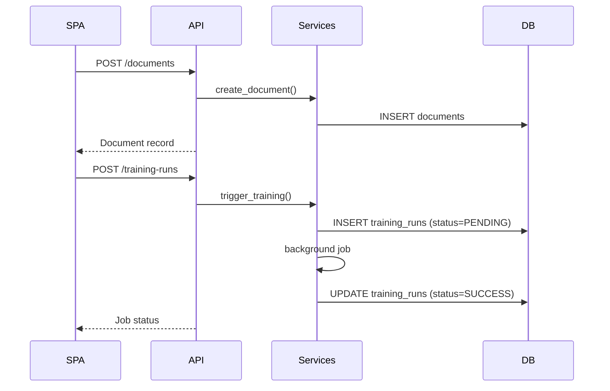

# PR Plan 39 — Backend Services & APIs on Top of the New Database

## Objective
Refactor the FastAPI backend to manage documents, annotations, and training jobs directly through the database layer established in Plan 38.

**Resumo em pt-BR:** Vamos atualizar o backend FastAPI para usar o banco recém-criado, oferecendo endpoints que lidam com upload de documentos, extrações automáticas, sessões de anotação e disparo de treinamentos.

## Scope
- Build repository/service layer functions (async) for documents, extractions, annotations, training runs.
- Replace existing `/api/pdf-training/*` endpoints so they operate on DB records rather than session folders/CSV.
- Implement background jobs (via asyncio tasks or Celery adapter) that run extractions and training, recording progress/status in DB tables.
- Provide health/status endpoints for SPA polling (job detail includes linked document IDs, stage, timestamps).

Out of scope:
- SPA changes (handled in Plan 40).
- Final removal of CSV-based helpers (`feedback_cli`)—adapters added later.
- Migration of legacy data.

## Affected Files
- `src/server/pdf_training_app/api.py` — rewrite endpoints (`/documents`, `/annotations`, `/training-runs`).
- `src/server/pdf_training_app/services.py` (new) — orchestrate business logic using DB repositories.
- `src/server/db/repository.py`, `crud/` — reusable data-access functions.
- `src/server/pdf_training_app/jobs.py` — adapt job manager to persist status in DB.
- `docs/refactor/pr32-refactor-spa-blueprint.md` — update backend architecture description.

## Approach
1. **Repository layer** — CRUD functions for documents, annotations, training runs; helpers to attach blob paths.
2. **Endpoint design** — REST-ish endpoints:
   - `POST /documents` (upload PDF, optional metadata).
   - `POST /documents/{id}/extract` (start auto-extraction job).
   - `POST /annotations/{id}/complete` (ingest label export or direct payload).
   - `POST /training-runs` (trigger retrain for selected docs/labels).
   - `GET /documents`, `/jobs/{id}`, `/training-runs` for status.
3. **Job execution** — background tasks update DB status, handle errors, and store artefact paths produced by Plan 38 storage helpers.
4. **Validation & error handling** — Pydantic models to enforce inputs; 404/409 responses tied to DB state.
5. **Docs** — blueprint snippet showing new service layer; quick reference for endpoint contract.



### Plain-language explainer
Instead of writing folders, the backend will now talk to the database: every upload becomes a row, every job updates its status there. The SPA (next plan) just asks the API for documents and job progress.

## Pseudodiff (representative)
```diff
--- src/server/pdf_training_app/api.py
+++ src/server/pdf_training_app/api.py
@@
-@router.post("/uploads", ...)
-def upload_documents(...):
-    # session folder logic
+@router.post("/documents", response_model=DocumentOut)
+async def create_document(file: UploadFile, ...):
+    doc = await documents_service.create_document(file)
+    return doc
@@
-@router.post("/retrain", ...)
-def retrain(...):
-    # CSV ingest + train
+@router.post("/training-runs", response_model=JobOut)
+async def create_training_run(payload: TrainingRunIn):
+    job = await training_service.enqueue(payload)
+    return job
```

## Acceptance Criteria
- All existing `/api/pdf-training/*` endpoints replaced with DB-backed versions handling documents, jobs, and annotations.
- Background job execution updates DB status; API exposes job listings and latest results.
- Storage paths recorded for artefacts (Label Studio export, models, metrics) via Plan 38 helpers.
- Postman/curl smoke tests demonstrate upload → extract → annotate → retrain without touching CSV.
- Blueprint/doc updates describe the new contract and transition plan.

## Manual Tests
- `poetry run pytest src/server/pdf_training_app` (new unit/integration tests for repositories and API).
- Manual curl sequence: upload document, trigger extract, submit annotation payload, create training run, poll job status.
- Verify DB tables reflect expected state after each step (e.g., `poetry run sqlite-utils tables storage/pdf_training/app.db`).

## Suggested commit message and branch
- Branch: `impl/39-backend-db-services`
- Commit: `feat(api): refactor pdf training endpoints to use database services`

## Checklist
- [ ] Objective and Scope are clear and limited.
- [ ] Affected files listed.
- [ ] Pseudodiff (small, readable, representative of the approach).
- [ ] Acceptance criteria and minimal manual tests.
- [ ] Suggested commit message and branch name.
