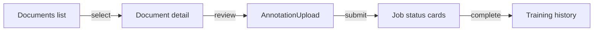

# PR Plan 40 — SPA Wizard Integrated with Database-backed APIs

## Objective
Update the React SPA to consume the new backend endpoints: list documents from the database, manage annotation progress, and visualise training history without CSV uploads.

**Resumo em pt-BR:** Vamos adaptar a SPA para buscar documentos diretamente do backend, permitir upload via API, acompanhar o status das anotações e mostrar o histórico de treinamento registrado no banco.

## Scope
- Replace the current “Upload CSV + PDFs” form with a document manager connected to `/api/pdf-training/documents`.
- Add views for document list (status: new, extracted, reviewing, completed), job status, and training history cards.
- Integrate Label Studio workflow: provide link/button to open project based on DB record, upload annotation export via API, show warnings/status inline.
- Use React Query (or similar) for data fetching, error states, and optimistic updates.

Out of scope:
- Backend changes (Plan 39 handles APIs).
- Training logic adjustments (covered in Plan 41).
- Final CSV decommission messaging (Plan 42).

## Affected Files
- `src/spa/src/pages/PdfTrainingWizard.tsx` — major rewrite of layout and data flows.
- `src/spa/src/api/pdfTraining.ts` (new) — client for backend endpoints.
- `src/spa/src/components/DocumentTable.tsx`, `TrainingHistory.tsx`, `WarningsPanel.tsx` (new).
- `src/spa/src/styles.css` — adjustments for new UI sections.
- `docs/refactor/pr32-refactor-spa-blueprint.md` — update UI description with screenshots/copy.

## Approach
1. **API client setup** — centralise fetch/axios calls; configure base URL/proxy, handle auth token placeholder.
2. **State management** — integrate React Query (or SWR) for `useDocuments`, `useJobs`, `useTrainingRuns` hooks with polling for active jobs.
3. **UI redesign** — create panes for documents, review steps, training summary. Replace upload form with drag-and-drop for PDFs only.
4. **Annotation flow** — when user clicks “Review”, show instructions + link to Label Studio assets (from DB). Upload export JSON through API; display warnings returned.
5. **Training history** — timeline showing past runs (timestamp, metrics, artefact links). Display success/failure badges.
6. **Accessibility & copy** — ensure English UI text is clear; update pt-BR docs for guidance.



### Plain-language explainer
The web app will feel like AI Builder: you see every document waiting for review, click in to upload annotations, and watch training jobs show up in a history feed—all powered by the database from earlier plans.

## Pseudodiff (representative)
```diff
--- src/spa/src/pages/PdfTrainingWizard.tsx
+++ src/spa/src/pages/PdfTrainingWizard.tsx
@@
-  const handleUpload = async (event) => { /* CSV + PDF */ }
-  return (<form>…</form>)
+  const documents = useDocuments();
+  const trainingRuns = useTrainingRuns();
+  return (
+    <Layout>
+      <DocumentTable data={documents} onUpload={handleDocumentUpload} />
+      <DetailsPane>
+        <AnnotationCard doc={selectedDoc} onExportSubmit={submitAnnotation}/>
+        <TrainingHistory runs={trainingRuns} />
+      </DetailsPane>
+    </Layout>
+  );
```

## Acceptance Criteria
- SPA initial screen lists documents (with status) fetched from API; uploading a PDF adds a new row without page reload.
- Annotation step pulls required assets (config/tasks paths) from DB-backed API and submits export JSON; warnings/errors shown inline.
- Training history section displays recent runs with metrics + download links.
- Polling indicators for ongoing jobs (extraction, training) update automatically.
- Build/lint passes (`npm run lint`, `npm run build`).
- Docs updated with new screenshots, instructions, and plain-language explanation.

## Manual Tests
- `npm run lint`
- `npm run build`
- Manual walk-through: upload PDF → run extraction → review (upload export) → trigger training → observe status updates and history.

## Suggested commit message and branch
- Branch: `impl/40-spa-db-integration`
- Commit: `feat(spa): wire PDF training wizard to database-backed APIs`

## Checklist
- [ ] Objective and Scope are clear and limited.
- [ ] Affected files listed.
- [ ] Pseudodiff (small, readable, representative of the approach).
- [ ] Acceptance criteria and minimal manual tests.
- [ ] Suggested commit message and branch name.
