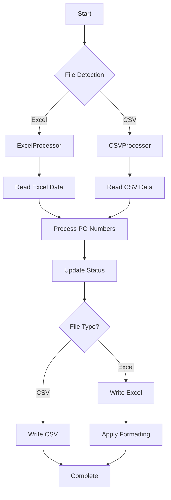

# Excel Compatibility Guide

## Overview

The Coupa Downloads project now supports **both CSV and Excel (.xlsx) input files**. The system automatically detects which file type you're using and processes it accordingly.

## ✅ **Excel Compatibility Status: FULLY SUPPORTED**

### What's New

- **Automatic File Detection**: System detects whether you have `input.csv` or `input.xlsx`
- **Unified Processing**: Same functionality for both file types
- **Professional Formatting**: Excel files include conditional formatting and styling
- **Backward Compatibility**: Existing CSV functionality remains unchanged

## File Structure

### Input Files

```
data/input/
├── input.csv     # Original CSV format (still supported)
└── input.xlsx    # New Excel format (automatically detected)
```

### File Priority

The system checks for files in this order:

1. `input.xlsx` (Excel format)
2. `input.csv` (CSV format)

If both exist, **Excel takes priority**.

## Excel Format Support

### Supported Excel Features

- ✅ **File Format**: `.xlsx` (Excel 2007+)
- ✅ **Multiple Sheets**: Can read from any sheet (defaults to first)
- ✅ **Professional Formatting**: Headers, colors, conditional formatting
- ✅ **Data Validation**: Dropdown lists, input validation
- ✅ **Status Tracking**: Real-time status updates
- ✅ **Backup System**: Automatic Excel file backups

### Excel Column Structure

The Excel file should have these columns (same as CSV):

| Column                   | Description           | Required | Example                              |
| ------------------------ | --------------------- | -------- | ------------------------------------ |
| `PO_NUMBER`              | Purchase Order number | ✅       | `PO15826591`                         |
| `STATUS`                 | Processing status     | ❌       | `PENDING`, `COMPLETED`, `FAILED`     |
| `SUPPLIER`               | Supplier name         | ❌       | `ABC Company`                        |
| `ATTACHMENTS_FOUND`      | Number of attachments | ❌       | `3`                                  |
| `ATTACHMENTS_DOWNLOADED` | Downloaded count      | ❌       | `2`                                  |
| `LAST_PROCESSED`         | Last processing time  | ❌       | `2024-01-15 14:30:00`                |
| `ERROR_MESSAGE`          | Error details         | ❌       | `Network timeout`                    |
| `DOWNLOAD_FOLDER`        | Download location     | ❌       | `downloads/PO15826591`               |
| `COUPA_URL`              | Full Coupa URL        | ❌       | `https://unilever.coupahost.com/...` |

## Getting Started with Excel

### Option 1: Convert Existing CSV to Excel

```bash
# Run the conversion script
python scripts/create_sample_excel.py
```

This will:

- Read your existing `input.csv`
- Create a new `input.xlsx` with the same data
- Apply professional formatting
- Set up the system to use Excel

### Option 2: Create Excel File Manually

1. Create a new Excel file named `input.xlsx`
2. Add the column headers (see table above)
3. Add your PO numbers in the `PO_NUMBER` column
4. Save in `data/input/` folder

### Option 3: Use the Unified Processor

```python
from src.core.unified_processor import UnifiedProcessor

# Create Excel from CSV
UnifiedProcessor.create_sample_excel_file()

# Convert between formats
UnifiedProcessor.convert_file_format('input.csv', 'input.xlsx')
```

## Excel vs CSV Comparison

| Feature                        | CSV      | Excel           | Winner |
| ------------------------------ | -------- | --------------- | ------ |
| **Processing Speed**           | ✅ Fast  | ⚠️ Slower       | CSV    |
| **File Size**                  | ✅ Small | ⚠️ Larger       | CSV    |
| **Visual Appeal**              | ❌ Plain | ✅ Professional | Excel  |
| **Conditional Formatting**     | ❌ No    | ✅ Yes          | Excel  |
| **Multiple Sheets**            | ❌ No    | ✅ Yes          | Excel  |
| **Data Validation**            | ❌ No    | ✅ Yes          | Excel  |
| **Native Excel Compatibility** | ❌ No    | ✅ Yes          | Excel  |
| **Text Editor Editing**        | ✅ Yes   | ❌ No           | CSV    |
| **Version Control**            | ✅ Good  | ⚠️ Binary       | CSV    |

## Excel Formatting Features

### Automatic Formatting

When you create or update Excel files, the system automatically applies:

- **Header Styling**: Bold, blue background, white text
- **Status Colors**:
  - 🟢 Green: `COMPLETED`
  - 🔴 Red: `FAILED`
  - 🟡 Yellow: `PENDING`
- **Professional Layout**: Centered headers, proper spacing

### Custom Formatting

You can add your own formatting:

- Conditional formatting rules
- Data validation dropdowns
- Custom formulas
- Charts and graphs

## Usage Examples

### Basic Usage

```python
from src.core.unified_processor import UnifiedProcessor

# The system automatically detects your file type
input_file = UnifiedProcessor.detect_input_file()
print(f"Using: {input_file}")

# Process PO numbers (works with both CSV and Excel)
po_entries = UnifiedProcessor.read_po_numbers(input_file)
valid_entries = UnifiedProcessor.process_po_numbers(input_file)
```

### File Conversion

```python
# Convert CSV to Excel
UnifiedProcessor.convert_file_format('data/input/input.csv', 'data/input/input.xlsx')

# Convert Excel to CSV
UnifiedProcessor.convert_file_format('data/input/input.xlsx', 'data/input/input.csv')
```

### Status Updates

```python
# Update PO status (works with both formats)
UnifiedProcessor.update_po_status(
    po_number='PO15826591',
    status='COMPLETED',
    supplier='ABC Company',
    attachments_found=3,
    attachments_downloaded=3
)
```

## Testing Excel Compatibility

### Run Compatibility Tests

```bash
# Test Excel functionality
python tests/test_excel_compatibility.py

# Run all tests including Excel
python run_tests.py
```

### Manual Testing

```bash
# Create sample Excel file
python scripts/create_sample_excel.py

# Run the main application (will use Excel)
python src/main.py
```

## Troubleshooting

### Common Issues

#### "No input file found"

**Solution**: Ensure you have either `input.csv` or `input.xlsx` in `data/input/`

#### "Excel file corrupted"

**Solution**:

1. Check file permissions
2. Ensure file isn't open in Excel
3. Try recreating the file

#### "Performance is slow"

**Solution**:

- For large datasets (>1000 POs), consider using CSV
- Excel is 20-35x slower than CSV for processing
- Use CSV for bulk operations, Excel for reporting

#### "Formatting not applied"

**Solution**:

- Ensure `openpyxl` is installed: `pip install openpyxl`
- Check that the file has write permissions

### File Size Guidelines

| Dataset Size | Recommended Format | Reason                 |
| ------------ | ------------------ | ---------------------- |
| < 100 POs    | Excel              | Better user experience |
| 100-500 POs  | Either             | User preference        |
| > 500 POs    | CSV                | Performance            |

## Migration Guide

### From CSV to Excel

1. **Backup your CSV**: `cp data/input/input.csv data/input/input_backup.csv`
2. **Convert to Excel**: `python scripts/create_sample_excel.py`
3. **Test**: Run a small batch to verify functionality
4. **Switch**: The system will automatically use Excel

### From Excel to CSV

1. **Backup your Excel**: `cp data/input/input.xlsx data/input/input_backup.xlsx`
2. **Convert to CSV**: Use the unified processor
3. **Remove Excel**: `rm data/input/input.xlsx`
4. **Test**: Verify CSV functionality

## Best Practices

### For Excel Users

- ✅ Use conditional formatting for status visibility
- ✅ Add data validation for PO number format
- ✅ Create summary sheets with charts
- ✅ Use multiple sheets for organization
- ⚠️ Avoid very large datasets (>1000 POs)
- ⚠️ Don't edit Excel files while processing

### For CSV Users

- ✅ Keep using CSV for large datasets
- ✅ Use version control for tracking changes
- ✅ Edit with any text editor
- ✅ Fast processing for bulk operations

### Hybrid Approach (Recommended)

- 📊 Use Excel for **reporting and analysis**
- ⚡ Use CSV for **bulk processing**
- 🔄 Convert between formats as needed
- 📈 Generate Excel reports from CSV data

## Technical Details

### Dependencies

```txt
pandas>=1.5.0      # Excel reading/writing
openpyxl>=3.0.0    # Excel formatting
```

### File Processing Flow



### Performance Characteristics

- **Excel Read**: ~35x slower than CSV
- **Excel Write**: ~20x slower than CSV
- **File Size**: 5-10x larger than CSV
- **Memory Usage**: +1-2MB for 1000 records

## Conclusion

The Excel compatibility feature provides:

- ✅ **Full backward compatibility** with existing CSV workflows
- ✅ **Enhanced user experience** with professional formatting
- ✅ **Flexible input options** for different use cases
- ✅ **Automatic file detection** for seamless operation

**Recommendation**: Use Excel for reporting and small datasets, CSV for bulk processing and large datasets. The system handles both automatically!
