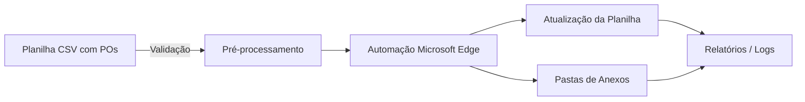
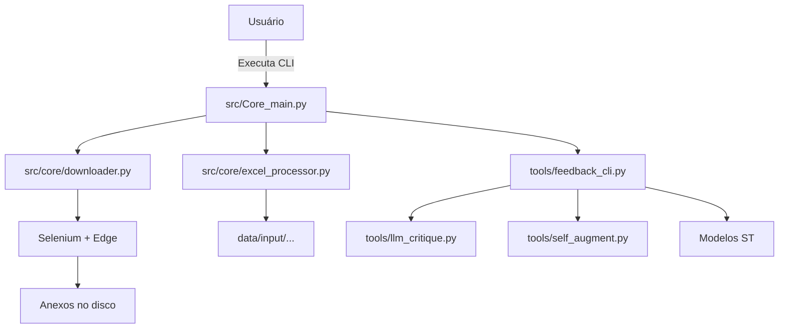
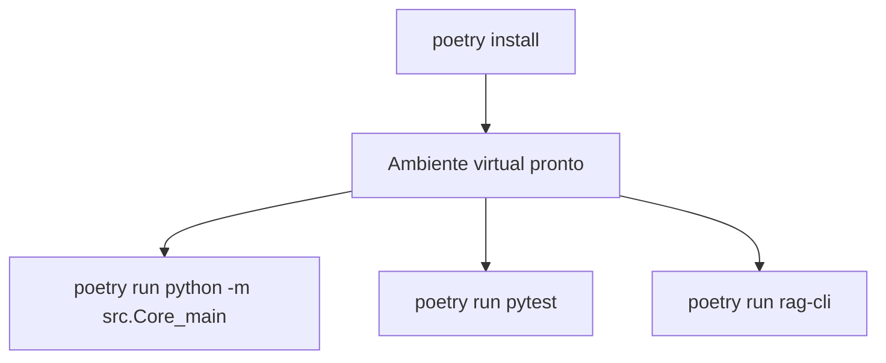
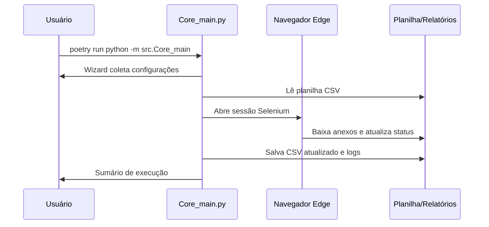
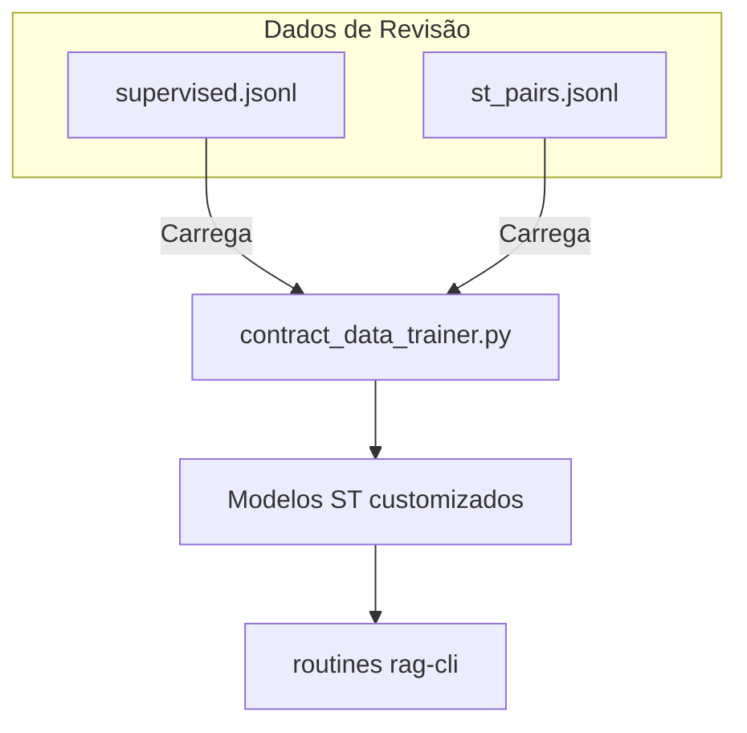
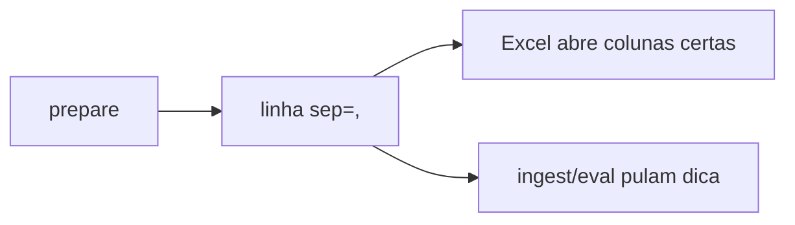

# Manual do Usuário — CoupaDownloads

Bem-vindo ao centro de referência do projeto CoupaDownloads. Este manual foi
escrito em português claro, com explicações de conceitos avançados usando
analogias simples para quem está começando — sem perder precisão para quem já
tem experiência. Ao final você encontra um **handbook/cheatsheet** para consulta
rápida.

## Índice
1. [Visão Geral](#visão-geral)
2. [Componentes do Projeto](#componentes-do-projeto)
3. [Instalação e Configuração Inicial](#instalação-e-configuração-inicial)
4. [Arquitetura de Dados e Fluxo Principal](#arquitetura-de-dados-e-fluxo-principal)
5. [Formatos de Entrada e Saída](#formatos-de-entrada-e-saída)
6. [CLI Principal e Objetivos das Funções](#cli-principal-e-objetivos-das-funções)
7. [Subprojetos e Recursos Avançados](#subprojetos-e-recursos-avançados)
8. [Ciclo de Feedback Humano + LLM](#ciclo-de-feedback-humano--llm)
9. [Monitoramento, Logs e Boas Práticas](#monitoramento-logs-e-boas-práticas)
10. [Resolução de Problemas](#resolução-de-problemas)
11. [Referências Rápidas](#referências-rápidas)
12. [Handbook / Cheatsheet](#handbook--cheatsheet)

---

## Visão Geral

- **O que é**: Automação para baixar anexos de Pedidos de Compra (PO) na
  plataforma Coupa, registrar o status no arquivo de entrada e organizar os
  downloads em pastas estruturadas.
- **Como funciona**: Lê uma planilha CSV, usa Selenium + Microsoft Edge
  para navegar na Coupa, baixa anexos e atualiza a planilha.
- **Público-alvo**: Analistas de compras, operações ou TI que precisam repetir
  o processo com frequência ou desejam auditar o pipeline com feedback humano.



> **Para planejamento da refatoração e da interface web**: consulte
> `docs/refactor/pr32-refactor-spa-blueprint.md`, que traz o roteiro da
> reorganização e a proposta de SPA local com botões simples.

### Conceitos-chave explicados de forma simples
- **Selenium WebDriver**: pense nele como um “robô do teclado e mouse” que abre
  o navegador e clica nos botões por você.
- **Sentence Transformers (ST)**: modelos que convertem frases em vetores
  numéricos. Imagine que eles traduzem texto para coordenadas 3D, permitindo
  medir semelhanças pela distância entre os pontos.
- **RAG (Retrieval-Augmented Generation)**, usado no subprojeto de IA: técnica
  que busca conhecimento em arquivos antes de responder. É como consultar um
  fichário para dar uma resposta informada.

---

## Componentes do Projeto

| Área | Diretório | Função resumida |
| --- | --- | --- |
| Aplicação principal | `src/core/` | Comandos principais, leitura/escrita de planilhas, orquestração do Selenium |
| CLIs auxiliares | `tools/` | Scripts para feedback humano, comparações, relatórios |
| Dados de exemplo | `data/` | Entradas padrão (`data/input/input.csv`) |
| Relatórios | `reports/` | Saída de métricas, logs e resultados |
| Subprojeto de IA | `embeddinggemma_feasibility/` | Pipelines de ST/RAG usados nos feedbacks |
| Manuais | `docs/` | Documentação (este manual, fluxo HITL, etc.) |



### Objetivos das principais camadas
- **Core**: cuidar do trabalho pesado (abrir navegador, baixar arquivos,
  escrever planilhas).
- **Ferramentas (tools)**: adicionar inspeção humana, treinar modelos de apoio,
  comparar configurações.
- **Subprojeto de IA**: experimentar fluxo de feedback com modelos de texto
  dentro do pipeline (geração, crítica, RAG).

---

## Instalação e Configuração Inicial

### Pré-requisitos
- **Sistema**: Windows ou macOS.
- **Python**: 3.12+ instalado e disponível no `PATH`.
- **Navegador**: Microsoft Edge atualizado.
- **Acesso**: permissão para escrever nas pastas do projeto e na pasta de
  downloads configurada.

### Instalação com Poetry (recomendada)
1. Instale o Poetry (`pip install poetry`).
2. No diretório raiz do projeto:
   ```bash
   poetry install
   ```
3. Para ativar o ambiente virtual:
   ```bash
   poetry shell
   ```
4. Ou execute comandos diretamente:
   ```bash
   poetry run python -m src.Core_main
   ```

### Instalação única com Poetry

- Execute `poetry install` para preparar todas as dependências (core, testes, ML, anotação).
- O comando respeita o `poetry.lock`, garantindo ambiente reproduzível em qualquer máquina.



> **Dica rápida**: use `poetry run <comando>` ou entre em `poetry shell` para executar scripts utilizando o ambiente configurado.

### Instalação offline em Windows
- Siga `docs/howto/README_Offline.md` para uso com o pacote que inclui drivers.

### Variáveis de ambiente úteis
- `INPUT_CSV` (ou `EXCEL_FILE_PATH` legado): força um arquivo CSV específico.
- `USE_PROCESS_POOL=true`: liga o modo multiprocessado.
- `EDGE_DRIVER_PATH`: informa o local do EdgeDriver se a auto detecção falhar.
- `DEEPSEEK_API_KEY`, `OPENAI_API_KEY`: usados pelos scripts de LLM.

### Banco de dados para o fluxo AI Builder
1. Instale as dependências (`poetry install`).
2. Rode as migrações iniciais:
   ```bash
   poetry run alembic upgrade head
   ```
   Isso cria o arquivo padrão `storage/pdf_training/app.db` (SQLite). Para Postgres, defina `PDF_TRAINING_DB_URL=postgresql+asyncpg://...` antes de rodar.
3. Verifique as tabelas disponíveis:
   ```bash
   PYTHONPATH=src poetry run python -m server.db.show_tables
   ```
4. Blobs (PDFs, exports, modelos) são gravados em `storage/pdf_training/blobs/` com subpastas determinísticas (`documents/<id>`, `training_runs/<id>`).

> **Dica**: salve as variáveis no seu `~/.zshrc` ou `~/.bashrc` para evitar
> exportá-las a cada sessão.

---

## Arquitetura de Dados e Fluxo Principal

### Estrutura de diretórios (simplificada)
```
CoupaDownloads/
├── data/
│   └── input/
│       ├── input.csv
├── docs/
│   ├── USER_GUIDE.md (este manual)
│   └── ...
├── reports/
│   ├── downloads/...
│   └── llm_critique/...
├── src/
│   └── core/
└── tools/
    ├── feedback_cli.py
    ├── llm_critique.py
    └── self_augment.py
```

### Diagrama do fluxo principal


### Etapas detalhadas
1. Validação da planilha: garante coluna `PO_NUMBER` e normaliza formatos.
2. Preparação das pastas: cria hierarquia `Fornecedor/PO` (customizável).
3. Automação do navegador: login (perfil Edge opcional), busca do PO, download
   dos anexos.
4. Pós-processamento: renomeia pastas com sufixo `_COMPLETED`, `_PARTIAL`, etc.,
   e registra datas/erros.
5. Relatórios: atualiza planilha, gera logs e prepara métricas para feedback.

---

## Formatos de Entrada e Saída

| Tipo | Campo obrigatório | Campos atualizados | Observações |
| --- | --- | --- | --- |
| CSV (`.csv`) | `PO_NUMBER` | `STATUS`, `ATTACHMENTS_FOUND`, `ATTACHMENTS_DOWNLOADED`, `AttachmentName`, `LAST_PROCESSED`, `ERROR_MESSAGE`, `DOWNLOAD_FOLDER`, `COUPA_URL` | Delimitador autodetectado, escrita em UTF-8 BOM |

- **Planilha de exemplo**: `data/input/input.csv`.
- **Saída principal**: planilha atualizada + pastas de anexos dentro de
  `reports/downloads/` (ou destino escolhido).

---

## CLI Principal e Objetivos das Funções

### Entrada padrão
```bash
poetry run python -m src.Core_main
```

### Tabela de comandos (objetivo incluso)

| Comando | Objetivo | Quando usar |
| --- | --- | --- |
| `poetry run python -m src.Core_main` | Executar o fluxo completo de download de anexos, guiado por um wizard interativo. | Operação diária de coleta de anexos. |
| `poetry run python tools/feedback_cli.py wizard` | Abre o assistente guiado que pergunta pelos parâmetros, mostra o comando equivalente e executa o fluxo escolhido. | Quando você prefere uma conversa passo a passo em vez de decorar flags. |
| `poetry run python tools/feedback_cli.py prepare` | Criar CSV de revisão com colunas *_pred/gold/status; prepara o terreno para feedback humano. | Antes de revisar previsões geradas pelo modelo. |
| `poetry run python tools/feedback_cli.py ingest` | Transformar o CSV revisado em datasets (`supervised.jsonl`, `st_pairs.jsonl`). | Depois que o analista preencheu o CSV. |
| `poetry run python tools/feedback_cli.py eval` | Calcular métricas (acurácia/coverage) e gerar relatórios Markdown/JSON. | Para verificar progresso de correções. |
| `poetry run python tools/feedback_cli.py train-st` | Treinar um Sentence Transformer usando os pares produzidos; com `--enable-llm-helpers` abre a interface gamificada. **Com `--use-db`, utiliza o pipeline de treinamento baseado em banco de dados.** | Quando se deseja atualizar o modelo ST. |
| `poetry run python tools/feedback_cli.py export-labelstudio` | Criar JSON simples para importar no Label Studio. | Se quiser revisar no Label Studio ou compartilhar com terceiros. |
| `tools/llm_critique.py` | Enviar a planilha para um LLM (DeepSeek/OpenAI), pedir sugestões e gerar JSONL/CSV com colunas `_llm_suggested`. | Para acelerar revisões humanas com sugestões automáticas. |
| `tools/self_augment.py` | Pedir ao LLM variações de valores categóricos e gerar pares adicionais para treino. | Quando o dataset de treino precisa de diversidade. |
| `tools/ab_compare_cli.py` | Comparar resultados de dois CSVs (A/B) já gerados. | Para avaliar impacto de configurações ou modelos diferentes. |

> **Explicando LLMs para pessoas novas**: imagine que o LLM é um consultor que
> leu muitos contratos. Você pede para ele revisar a planilha e sugerir termos
> melhores. As ferramentas apenas organizam essa conversa de forma segura.

> **Quer visualizar o wizard?** Consulte `docs/cli/training_wizard.md` para um
> tutorial completo, com diagrama Mermaid, perguntas frequentes e um resumo
> “explica como se eu fosse iniciante”.

---

## Subprojetos e Recursos Avançados

### `embeddinggemma_feasibility`
- **Objetivo**: experimentar geração de embeddings, RAG e modelos menores para
  apoiar revisão de campos.
- **Entradas**: datasets gerados pelo HITL (`supervised.jsonl`, `st_pairs.jsonl`).
- **Saídas**: modelos ST customizados, índices para perguntas e respostas.



### Conceitos avançados (explicação leiga)
- **Embedding**: transformar uma frase em números que representam significado.
  É como dar coordenadas no mapa para cada frase, permitindo medir o quão perto
  duas frases estão.
- **Auto-treino**: usar dados anotados automaticamente (com supervisão humana
  final) para melhorar o modelo, sem sempre depender de anotações manuais.
- **Active Learning**: o sistema sugere quais exemplos revisar primeiro — pensa
  num professor indicando exercícios com maior impacto (integração atual usa
  heurísticas próprias + sinalização do `cleanlab`).

### Biblioteca auxiliares recém-adicionadas
- `rich` e `textual`: componentes visuais no terminal.
- `cleanlab`: destaca exemplos ruidosos (dados suspeitos).
- Hooks de active learning: heurísticas internas + `cleanlab` para priorizar
  exemplos ruidosos.

---

## Ciclo de Feedback Humano + LLM

```mermaid
flowchart LR
    Prep[1. feedback_cli prepare] --> ReviewCSV[Planilha de revisão]
    ReviewCSV --> Manual[2. Analista revisa manualmente]
    Manual --> Critique[3. LLM Critique (opcional)]
    Critique --> Gamified[4. Gamificado aceita/rejeita]
    Gamified --> Ingest[5. feedback_cli ingest]
    Ingest --> Metrics[6. feedback_cli eval]
    Metrics --> Train[7. feedback_cli train-st]
    Train --> Deploy[Modelos/ST atualizados]
```

### Passo a passo em linguagem simples
1. **Prepare**: gere uma planilha com colunas “predito, ouro, status”.
2. **Revise**: abra no Excel/Sheets e ajuste os valores errados.
3. **LLM (opcional)**: peça ao LLM para sugerir correções. Ele anota colunas
   `_llm_suggested` para facilitar.
4. **Interface gamificada**: aceite ou rejeite sugestões pressionando `Y/N`.
5. **Ingest**: converte suas decisões em arquivos `jsonl`.
6. **Avalie**: veja acurácia, cobertura e campos problemáticos.
7. **Treine**: atualize o modelo ST com o dataset final.

### Guided wizard (English UI)
- Execute `poetry run python tools/feedback_cli.py wizard` para abrir um menu em inglês
  que cobre as etapas acima (prepare, ingest, eval, train-st e export-labelstudio).
- Cada menu mostra um resumo da tarefa, pede apenas os campos obrigatórios e
  sugere valores padrão para o restante.
- Antes de rodar, o wizard imprime o comando equivalente para você copiar em
  automações ou revisar com o time.
- Documentação detalhada, incluindo diagrama Mermaid e tutorial “explain like
  I'm new”: `docs/cli/training_wizard.md`.

### Revisão visual com PDFs
- `poetry run python tools/feedback_cli.py annotate-pdf prepare --review-csv reports/feedback/review.csv --out-dir reports/feedback/pdf_annotation --pdf-root <pasta_dos_pdfs>`
- Abra o Label Studio, importe `config.xml` e `tasks.json` e conecte o storage local à pasta `pdfs/` gerada.
- Ajuste os campos diretamente na interface visual (predições aparecem como ponto de partida).
- Exporte em JSON e rode `poetry run python tools/feedback_cli.py annotate-pdf ingest --export-json <export.json> --review-csv reports/feedback/review.csv --out reports/feedback/review_annotated.csv`.
- Detalhes completos em `docs/feedback/pdf_annotation.md`.

### Assistente visual estilo AI Builder (SPA local)
- Frontend em `src/spa` (React + Vite) com quatro etapas: **Upload**, **Auto-tag**, **Review**, **Retrain** (acesse `npm run dev`).
- Backend FastAPI (execute `PYTHONPATH=src poetry run python -m server.pdf_training_app.main`) expõe `/api/pdf-training/*` e orquestra os comandos existentes do `feedback_cli`.
- Cada sessão salva artefatos em `storage/pdf_training/<session>` (CSV, PDFs, tarefas, export, métricas, modelo).
- A etapa *Review* aponta diretamente para os arquivos `config.xml`/`tasks.json` prontos para o Label Studio e captura o JSON exportado.
- Ao concluir, a etapa *Retrain* reingesta o CSV revisado, gera datasets, roda `eval` e treina um modelo ST mínimo (1 época) — o painel mostra onde encontrar métricas e pesos.
- A experiência completa (UX, endpoints, diagramas) está descrita em `docs/refactor/pr32-refactor-spa-blueprint.md` e `docs/diagrams/ai_builder_style_flow.mmd`.
- **Como executar:**
  A forma mais fácil é usar os scripts de inicialização na raiz do projeto. Eles cuidam de iniciar os servidores e abrir o navegador para você, aguardando um tempo para que tudo esteja pronto.

  - **No Windows:**
    ```bash
    start_spa.bat
    ```
  - **No macOS ou Linux (aguarda 15 segundos para inicialização):**
    ```bash
    ./start_spa.sh
    ```
    (Pode ser necessário dar permissão de execução primeiro com `chmod +x ./start_spa.sh`)

  **Execução Manual (para depuração):**
  Se preferir iniciar os serviços separadamente:
  1.  **Terminal 1 (Backend)**: `PYTHONPATH=src poetry run python -m server.pdf_training_app.main`
  2.  **Terminal 2 (Frontend)**: `cd src/spa && npm run dev`
  3.  **Navegador**: Abra a URL `http://localhost:5173`.

  5. Quando o wizard solicitar revisão, importe `analysis/config.xml` e `analysis/tasks.json` no Label Studio (instruções no próprio painel).

---

## Monitoramento, Logs e Boas Práticas

- **Logs de execução**: verifique a pasta `logs/` ou a saída do terminal para
  mensagens de status e erros.
- **Pastas de download**: pastas com sufixos `_COMPLETED`, `_PARTIAL`, etc.,
  servem de indicador rápido.
- **Controle de custo LLM**: use `--max-rows` e revise o `summary.json` criado
  pelo `llm_critique.py` para acompanhar gastos estimados.
- **Versionamento de modelos**: salve a pasta `embeddinggemma_feasibility/models`.
- **Backup de planilhas**: crie cópias antes de grandes execuções.

---

## Resolução de Problemas

| Sintoma | Possível causa | Solução rápida |
| --- | --- | --- |
| “Python não encontrado” | Python 3.12+ ausente no PATH | Instale e adicione ao PATH |
| “EdgeDriver incompatível” | Versão do driver diferente do Edge | Atualize o EdgeDriver ou defina `EDGE_DRIVER_PATH` |
| “Live extraction A/B not enabled” | `ab_compare_cli.py` precisa de CSVs de entrada | Gere dois arquivos via extrator e passe `--pred-a` e `--pred-b` |
| Erro de chave LLM | Variável de ambiente não definida | Exporte `DEEPSEEK_API_KEY` ou use `--api-key` |
| Sessão Edge bloqueada | Perfil do Edge aberto em outra janela | Feche todas as janelas ou desabilite perfil no wizard |
| JSON inválido no critique | Resposta do LLM com texto extra | Reexecute; o JSON bruto fica gravado no `.jsonl` para inspeção |

---

## Referências Rápidas

- **Manual HITL detalhado**: `docs/HITL_FEEDBACK_WORKFLOW.md`
- **Treinamento assistido por LLM**: `docs/LLM_ASSISTED_TRAINING.md`
- **Gestão de modelos**: `docs/MODEL_MANAGEMENT.md`
- **Anotação visual em PDF**: `docs/feedback/pdf_annotation.md`
- **Notas de versão**: `docs/RELEASE_NOTES.md`
- **Plano de releases**: `docs/RELEASE_STRATEGY.md`

---

## Handbook / Cheatsheet

### Comandos Essenciais
```
# Fluxo principal
poetry run python -m src.Core_main

# Preparar revisão
poetry run python tools/feedback_cli.py prepare --pred-csv reports/advanced_*.csv --out reports/feedback/review.csv

# Ingestar revisão
poetry run python tools/feedback_cli.py ingest --review-csv reports/feedback/review.csv --out-dir datasets/

# Avaliar resultados
poetry run python tools/feedback_cli.py eval --review-csv reports/feedback/review.csv --report-dir reports/feedback/

# Treinar ST (com interface gamificada se houver LLM)
poetry run python tools/feedback_cli.py train-st --dataset datasets/st_pairs.jsonl --output models/st_custom
poetry run python tools/feedback_cli.py train-st --enable-llm-helpers --llm-jsonl reports/llm_critique/llm_critique_*.jsonl --review-csv reports/feedback/review.csv --output models/st_llm

# Criticar com LLM
poetry run python tools/llm_critique.py --pred-csv reports/advanced_*.csv --review-csv reports/feedback/review.csv --out-dir reports/llm_critique/

# Auto-augmentação
poetry run python tools/self_augment.py --input datasets/supervised.jsonl --out datasets/st_pairs_aug.jsonl

# Anotação visual em PDF
poetry run python tools/feedback_cli.py annotate-pdf prepare --review-csv reports/feedback/review.csv --out-dir reports/feedback/pdf_annotation --pdf-root <pasta_dos_pdfs>
poetry run python tools/feedback_cli.py annotate-pdf ingest --export-json export.json --review-csv reports/feedback/review.csv --out reports/feedback/review_annotated.csv

# Comparar execuções (A/B)
poetry run python tools/ab_compare_cli.py --pred-a reports/runA.csv --pred-b reports/runB.csv --out-dir reports/ab_compare/
```

### Review CSV vs. Excel
- `prepare` agora escreve uma primeira linha `sep=,` (mantendo o BOM) para avisar o Excel que o separador é vírgula.
- Ingestão, avaliação e exportadores ignoram automaticamente essa dica; nenhum fluxo precisa mudar.
- Abra o arquivo com duplo clique e o Excel alinhará as colunas sem prompts extras.



> Explicando como se fosse sua primeira revisão: colocamos um bilhete no topo do CSV dizendo “use vírgula como separador”. O Excel lê esse bilhete e já separa tudo em colunas. As outras partes do sistema simplesmente ignoram o bilhete e continuam lendo o arquivo normalmente.

### Checklist Diário
1. Atualize `data/input/input.csv`.
2. Rode `poetry run python -m src.Core_main`.
3. Conferir `reports/` para anexos e planilha atualizada.
4. Se necessário, iniciar ciclo HITL (`prepare → ingest → eval`).
5. Se usar LLM: exporte `DEEPSEEK_API_KEY`, rode `llm_critique.py`, revise na interface gamificada.
6. Treine ST se houver novos dados significativos.

### Glossário Rápido
- **PO**: Pedido de Compra.
- **ST**: Sentence Transformer (modelo de similaridade textual).
- **LLM**: Large Language Model (modelo de linguagem de grande escala).
- **HITL**: Human-in-the-Loop (humano valida e corrige previsões).
- **RAG**: Retrieval-Augmented Generation (usa base de conhecimento antes de responder).

---

> **Mensagem final**: use o LLM como apoio, mas mantenha a validação humana. O
> sistema foi desenhado para ser auditável, com cada etapa separada e logs
> claros, permitindo que você integre melhorias gradualmente e com segurança.
