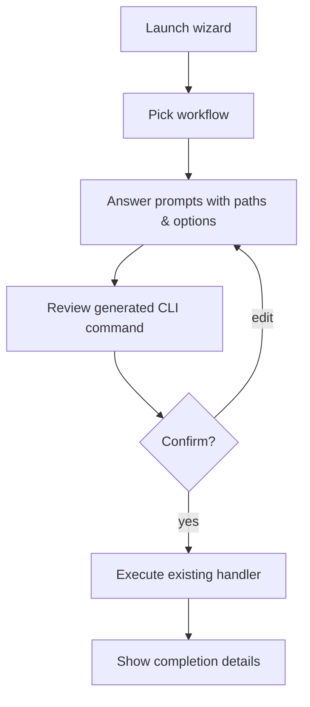

# Guided Training Wizard

Run the wizard with `poetry run python tools/feedback_cli.py wizard` to open a menu-driven walkthrough for the feedback loop and training helpers. The wizard keeps everything inside the terminal, offering the same functionality as the classic subcommands while adding guardrails, context, and confirmation prompts.

## Workflow overview

## Why use it
- Offers short descriptions for each workflow so you can pick the right task quickly.
- Highlights which inputs are required and provides sensible defaults for optional ones.
- Prints the equivalent CLI command before execution to keep the process transparent.
- Calls the same Python handlers already tested in `feedback_cli.py`, avoiding duplicate logic.

## Step-by-step guide
1. Run `poetry run python tools/feedback_cli.py wizard`.
2. Choose one of the available workflows:
   - Prepare review CSV
   - Ingest reviewed CSV
   - Evaluate predictions
   - Train Sentence Transformers (with optional LLM helpers)
   - Export Label Studio tasks
3. Answer the prompts. Press Enter to accept defaults or skip optional values.
4. Review the CLI preview and confirm. You can re-enter answers if something is off.
5. Wait for the handler output and return to the menu to launch another task or exit.

## Plain-language explainer
Think of the wizard as a helpful coworker sitting next to you, asking a few simple questions (like “Where is your CSV?” or “Do you want to review LLM suggestions first?”). After you respond, it shows the exact command it will run, double-checks with you, and then carries out the job. No memorizing dozens of flags—just a short chat to run the right tool.

## Practical tips
- Paths support glob patterns (e.g., `reports/advanced_*.csv`) when preparing review files.
- When training with LLM helpers, the wizard automatically skips the dataset prompt because it will rebuild pairs from the accepted suggestions.
- Use the previewed command as a template for automation scripts if you later want to schedule or version-control these steps.

**Nota em pt-BR:** O assistente funciona todo em inglês (prompts, mensagens, menus), mas ele executa os mesmos comandos Python usados anteriormente. Você pode copiar a linha gerada para scripts ou rodar o fluxo interativo sempre que precisar revisar parâmetros.
