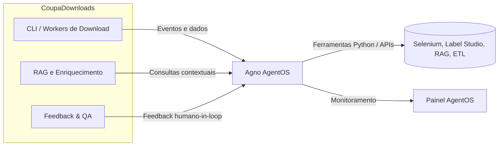

# Future Study — Biblioteca Agno

## 1. Introdução
A biblioteca **Agno** (atualmente na versão 2.0.8) oferece um runtime de alta performance para sistemas multiagente em Python, combinando orquestração de fluxos LLM, gerenciamento de sessões, memória, ferramentas integradas e um pacote chamado AgentOS para operação e monitoramento em produção. Este estudo avalia como esses recursos podem beneficiar o CoupaDownloads, priorizando impactos práticos para automação de downloads, pipelines de feedback e experiências guiadas por agentes.

## 2. Resumo Executivo dos Benefícios
- **Orquestração multiagente performática**: inicialização de agentes em microssegundos e footprint reduzido, permitindo escalonar automações locais sem afetar o tempo de execução.
- **AgentOS pronto para uso**: entrega um servidor FastAPI gerenciado e um control plane web que podem padronizar observabilidade e governança dos fluxos de automação atuais.
- **Integração nativa com ferramentas**: suporte MCP, tool calling e conectores prontos encurtam o esforço para reutilizar serviços existentes (Selenium, Label Studio SDK, pipelines RAG).
- **Memória e histórico por sessão**: facilita consolidar contexto e feedback de forma rastreável, aderindo aos requisitos de auditoria do BMAD.
- **Execução segura no próprio ambiente**: telemetria opcional e deploy self-hosted alinham-se com a estratégia local-first do CoupaDownloads.

## 3. Visão Geral do Agno
- **Arquitetura**: composta por _Agents_, _Tasks_ e _Tools_, executados sobre um runtime otimizado, com suporte a execução síncrona/assíncrona e coordenação multiagente.
- **AgentOS**: aplicação FastAPI pré-configurada que expõe endpoints REST, filas e painel de controle para observabilidade (logs, monitoramento, telemetria). Pode rodar on-premises.
- **Ecossistema**: compatível com provedores populares (OpenAI, Anthropic, Google, Ollama, etc.) e inclui integrações MCP e Cookbook de exemplos (bots de atendimento, pipelines RAG, automações de pesquisa).
- **Licenciamento e comunidade**: repositório público `agno-agi/agno` (Apache 2.0 segundo GitHub; PyPI lista classifiers MPL 2.0), atividade alta (≈33k estrelas, atualizações 2025) e documentação oficial extensa.

## 4. Benefícios Potenciais por Fluxo Atual
### 4.1 Automação de downloads e ETL
- **Coordenação de tarefas**: agentes podem gerir sequência “login → coleta → validação → persistência”, com replanejamento automático ao detectar erros (ex.: captcha, páginas fora do ar).
- **Ferramentas customizadas**: wrappers sobre `src/core` e `tools/*` podem ser expostos como _Tools_ reutilizáveis, reduzindo código repetido em diferentes scripts.
- **Agendamento e monitoramento**: AgentOS oferece hooks REST para acionar execuções e acompanhar status, substituindo scripts ad-hoc ou crons externos.

### 4.2 Feedback loop e anotações
- **Memória estruturada**: Agno persiste histórico de chamadas e mensagens; isso permitiria manter contexto de revisões entre `tools/feedback_cli.py` e novas interações.
- **Human-in-the-loop**: o runtime lida com checkpoints e confirmações humanas, combinando bem com Label Studio e pipelines de QA descritos em `docs/feedback/`.
- **Experimentação guiada**: agentes podem aplicar heurísticas (ex.: selecionar subconjunto de POs problemáticos) antes de chamar o wizard ou Label Studio, elevando a precisão das correções.

### 4.3 Fluxos RAG e pesquisa assistida
- **Orquestração multi-etapa**: agentes podem encadear preparação de dados (`embeddinggemma_feasibility`), execução de consultas e análise de resultados, com fallback automático entre modelos locais/remotos.
- **Ferramentas MCP**: Agno já suporta o padrão MCP, alinhando com planos futuros (PR 31) de integração GitHub MCP no Codex.
- **Padronização de prompts**: centralizar prompts e decisões em _Tasks_ facilita auditoria e versionamento, respondendo a requisitos do BMAD.

## 5. Ajuste Técnico e Compatibilidade
- **Versão Python**: Agno suporta Python 3.7–3.12; o CoupaDownloads roda em 3.12, portanto não há bloqueio.
- **Dependências**: adicionaria pacote `agno` (peso ~1-2 MB) e, opcionalmente, FastAPI extras se AgentOS for habilitado. Deve-se avaliar conflitos com versões já presentes (FastAPI, Uvicorn, httpx).
- **Execução**: runtime pode operar integrado ao `src/server` existente, ou rodar em serviço separado. Requer definir estratégia de autenticação e isolamento de arquivos sensíveis.
- **Observabilidade**: AgentOS registra telemetria opcional; para ambientes restritos, basta definir `AGNO_TELEMETRY=false`.
- **Teste e CI**: agentes são funções Python testáveis; podemos usar `pytest` + `pytest-asyncio` já disponíveis. Seria útil criar _fixtures_ que simulam ferramentas Agno.

## 6. Riscos e Pontos de Atenção
- **Maturidade vs. roadmap**: ritmo acelerado de releases (mudanças semanais) pode exigir atenção à compatibilidade semântica.
- **Licença**: discrepância entre PyPI (MPL 2.0 nos classifiers) e GitHub (Apache 2.0). É crucial validar termos antes de adoção corporativa.
- **Complexidade operacional**: AgentOS introduz mais um serviço em execução; benefício só compensa se houver volume de workflows a monitorar.
- **Treinamento da equipe**: desenvolvedores precisam compreender padrões multiagente para evitar overengineering.
- **Modelo de custo**: embora self-hosted, uso intensivo de LLMs externos mantém custos de inferência; Agno não elimina esse fator.

## 7. Roadmap Sugerido (Experimentos)
1. **Prova de conceito rápida** (1 sprint): envolver automation engineer para encapsular `tools/feedback_cli` em um agente único e medir ganho de reutilização.
2. **Pilotar AgentOS local** (2 sprints): subir runtime FastAPI em paralelo ao `src/server`, instrumentar logs e comparar com orquestração atual.
3. **Fluxo multiagente completo** (3 sprints): automatizar cenário “download → validação → notificação” usando dois agentes (crawler + auditor), registrando métricas de tempo e erros.
4. **Avaliação formal**: consolidar aprendizados em novo plano BMAD, decidindo on/off com base em indicadores (tempo de desenvolvimento, incidência de falhas, satisfação do QA).

## 8. Recomendações de Próximos Passos
- Abrir plano focado na POC mencionada, definindo métricas claras (tempo de manutenção, linhas de código reaproveitadas).
- Mapear ferramentas/serviços críticos a serem expostos como _Tools_ Agno (Selenium wrapper, Label Studio client, manipuladores de CSV/Polars).
- Revisar política de telemetria e dados sensíveis antes de expor ambientes de produção ao AgentOS.
- Alinhar dependências no `pyproject.toml`, garantindo que versões de FastAPI/Uvicorn permaneçam compatíveis.

## 9. Explicação para Iniciantes (Plain Language)
Pense no Agno como um maestro que sabe conversar com inteligências artificiais e com scripts em Python. Você descreve o que precisa (por exemplo, “baixar notas fiscais, conferir dados e avisar se algo deu errado”), e ele monta uma equipe de assistentes automáticos para executar cada etapa, perguntando para você quando algo não estiver claro. Assim, em vez de escrever vários scripts separados, você usa blocos prontos que já cuidam de lembrar do histórico, dividir tarefas e mostrar um painel de controle.

## 10. Referências
- PyPI Agno: https://pypi.org/project/agno/
- Repositório GitHub: https://github.com/agno-agi/agno
- Documentação oficial: https://docs.agno.com
- Execução MCP: https://docs.agno.com/agent-os/mcp

