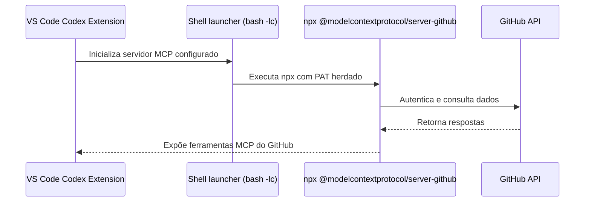

# GitHub MCP para a extensão Codex no VS Code

Este guia explica, em português, como configurar a extensão Codex no VS Code para iniciar o servidor GitHub MCP sob demanda usando `npx`, reutilizando um token pessoal guardado em variável de ambiente. O objetivo é permitir que você navegue por repositórios ou edite arquivos via Codex sem expor segredos no repositório.

## Pré-requisitos
- Extensão **Codex for VS Code** na versão 0.5.12 ou superior (a partir daí o campo `codex.experimental.mcpServers` está disponível).
- **Node.js** (>= 18 LTS) e **npm** acessíveis no `PATH` (`node --version`, `npx --version`).
- **Token pessoal do GitHub (PAT)** com escopos mínimos:
  - `repo` — leitura/escrita em repositórios.
  - `read:org` — apenas se precisar acessar repositórios privados de organizações.
- Opcional: arquivo `.env` carregado pelo shell (`~/.zshrc`, `~/.bashrc`, `direnv`) para persistir o PAT sem anotá-lo em `settings.json`.

```bash
# Confirme se o Node + npx estão disponíveis
which node
which npx
```

## 1. Guardar o PAT com segurança
1. Gere o token em <https://github.com/settings/tokens/new> com os escopos necessários.
2. Exporte o valor na mesma sessão de terminal que inicia o VS Code:
   ```bash
   export GITHUB_MCP_PAT="ghp_sua_chave_aqui"
   ```
3. Se preferir centralizar variáveis em arquivo dedicado:
   ```bash
   echo "GITHUB_MCP_PAT=ghp_sua_chave_aqui" >> ~/.config/coupadownloads/.env
   echo "~/.config/coupadownloads/.env" >> ~/.gitignore
   ```
4. Reinicie o VS Code (ou use `Developer: Reload Window`) para garantir que a extensão herde a variável.

> **Importante:** Não cole o token diretamente no `settings.json`. A configuração abaixo pega o valor já carregado no ambiente, conforme nossas políticas de segurança.

## 2. Configurar o `settings.json`
Inclua o bloco abaixo no `settings.json` (nível Usuário ou Workspace). Ele executa um `bash -lc` que falha explicitamente quando o PAT não está carregado e injeta o valor como `GITHUB_PERSONAL_ACCESS_TOKEN` para o servidor MCP.

```json
"codex.experimental.mcpServers": {
  "github": {
    "command": "bash",
    "args": [
      "-lc",
      "if [ -z \"${GITHUB_MCP_PAT:-}\" ]; then echo 'Set GITHUB_MCP_PAT before starting Codex (GitHub MCP).' >&2; exit 1; fi; GITHUB_PERSONAL_ACCESS_TOKEN=\"$GITHUB_MCP_PAT\" exec npx -y @modelcontextprotocol/server-github"
    ],
    "startupTimeoutMs": 20000
  }
}
```

### Explicação em linguagem simples
Pense no servidor GitHub MCP como uma tradutora: Codex conversa com a tradutora, que por sua vez fala com a API do GitHub usando o seu token. O envoltório em `bash` apenas confere se o “crachá” (PAT) está presente, passa esse crachá para a tradutora e sai de cena. Se o crachá não estiver definido, a mensagem de erro aparece imediatamente em inglês, evitando falhas silenciosas.

## 3. Verificação rápida
1. Recarregue o VS Code para aplicar o `settings.json`.
2. Abra a paleta (`Ctrl+Shift+P`) e execute `Codex: New Session`.
3. Peça algo como “List MCP tools” dentro da sessão ou execute `Codex: List MCP Tools`. As ferramentas iniciadas devem incluir `github.*` (por exemplo, `github.create_or_update_file`).
4. Execute `unset GITHUB_MCP_PAT` e repita a ação: a extensão deve exibir o erro `Set GITHUB_MCP_PAT before starting Codex (GitHub MCP).`, confirmando que a proteção funciona.

## 4. Solução de problemas
- **`command not found: npx`** — Instale Node.js via <https://nodejs.org/> ou `brew install node` (macOS). Após a instalação, reabra o terminal antes de reiniciar o VS Code.
- **`401 Unauthorized from GitHub`** — Gere um novo PAT, atualize a variável de ambiente e abra o VS Code a partir do shell que contém o valor atualizado.
- **Inicialização lenta** — Ajuste `startupTimeoutMs` (valor em milissegundos) para 30000 ou mais caso a rede esteja fria ou proxies atrasem a autenticação.
- **Token expira rápido** — Avalie tokens de curta duração e documente o tempo de expiração no seu `.env`. Considere ferramentas como `gh auth refresh`.

## 5. Checklist de validação manual
- `which node` / `which npx` retorna caminhos válidos.
- `echo $GITHUB_MCP_PAT | head -c 4` confirma que o token está carregado (sem imprimir o valor completo).
- `Codex: List MCP Tools` mostra entradas `github.*` com o PAT válido.
- Após `unset GITHUB_MCP_PAT`, o comando anterior falha com a mensagem em inglês citada acima.

## Visão arquitetural


## Referências
- README oficial do GitHub MCP Server: <https://github.com/github/github-mcp-server>
- Referência de configuração do Codex (secção MCP): <https://github.com/openai/codex/blob/main/docs/config.md#mcp_servers>
- Política local de documentação e segurança: ver `AGENTS.md` (seção "Language policy" e "Security").
