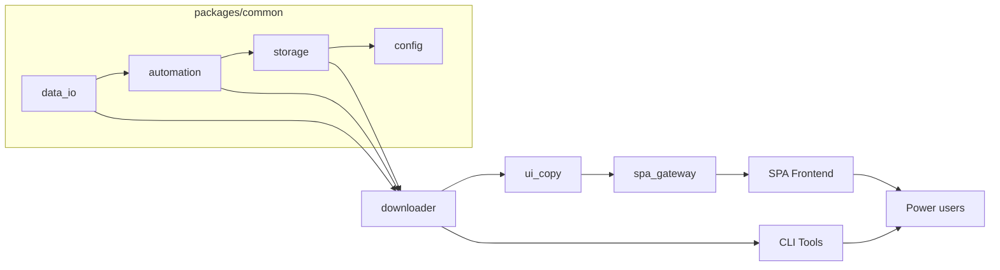
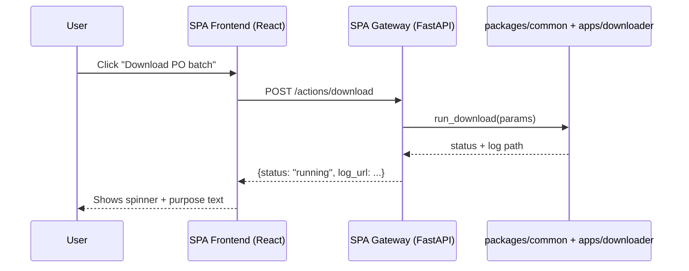

# PR 32 — Refactor Roadmap and SPA Blueprint

> **Plain-language tl;dr**: Today the project feels like a crowded toolbox. We mapped how each piece works, explained why reorganising it now saves rework, and designed a future one-page web interface (just buttons and helpful text) that lets you run every task locally without hunting through scripts.
>
> **Resumo em pt-BR**: O projeto está funcional, mas confuso para evoluir. Este blueprint mostra por que vale a pena refatorar já, sugere uma nova estrutura de pastas e descreve uma futura página única com botões simples que disparam as funções — tudo pensado para uso local e para orientar quem está começando.

---

## 1. Current Timing Analysis — Why Refactor Now

| Signal | Evidence | Cost of Waiting | Benefit if Done Now |
| --- | --- | --- | --- |
| Tight coupling between Selenium flows and Excel I/O | `src/Core_main.py` orchestrates browser, CSV, and folder creation directly | Any new feature (e.g., partial downloads, alternate storage) forces changes across multiple files | Extracting services unlocks clean APIs for CLI, SPA, and scripted runs |
| Duplicated utilities across `src/utils`, `tools/`, and subprojects | Similar CSV helpers appear in `src/utils/csv_utils.py` and `tools/feedback_utils.py` | Bugs fixed in one copy rarely reach the others | Shared `packages/common/data_io` library keeps behaviour consistent |
| Mixed experimental code inside production tree | `embeddinggemma_feasibility/` mixes ML experiments with shipping CLI scripts | Hard to package releases; unclear boundaries for contributors | Dedicated `apps/labs` area isolates experiments without blocking production updates |
| Manual onboarding | Users rely on `Core_main` wizard text; no global view of functions | New teammates must read multiple docs or inspect code | SPA menu can describe each feature and trigger it safely |

**ROI summary**: Shipping the reorganisation before the next feature wave avoids multiplying tech debt. The SPA blueprint gives immediate clarity for contributors and sets a consistent user story even if UI work starts later.

### Risk Mitigation Matrix

| Risk | Mitigation | Owner | Status |
| --- | --- | --- | --- |
| Refactor causes downtime for downloader | Phase migrations (Section 5) and keep existing entrypoints until parity tests pass | Core maintainers | Pending |
| Shared libraries break RAG experiments | Define contract-first interfaces; add regression checklist for `embeddinggemma_feasibility` | Labs team | Pending |
| SPA requires API endpoints that expose secrets | Require local auth token + reuse existing environment variable patterns | SPA implementer | Pending |

---

## 2. Repository Inventory Snapshot (2024-02)

| Area | Location | Notes |
| --- | --- | --- |
| Downloader core | `src/Core_main.py`, `src/core/` | Mix of orchestration, Selenium actions, CSV writes |
| Utilities | `src/utils/`, `tools/feedback_utils.py` | Repeated CSV + filesystem helpers |
| Feedback & LLM tooling | `tools/*.py` | Depends on downloader outputs, currently imported ad-hoc |
| RAG experiments | `embeddinggemma_feasibility/` | Dependências de ML instaladas via `poetry install` |
| Documentation | `docs/` | Guides in pt-BR, release strategy, agent SOP |

---

## 3. Proposed Modular Layout

```
CoupaDownloads/
├── apps/
│   ├── downloader/             # Selenium + CSV orchestration (current core)
│   ├── spa_gateway/            # Lightweight FastAPI/FastStream endpoints for SPA
│   └── labs/                   # RAG + experimental flows (embeddinggemma, etc.)
├── packages/
│   ├── common/
│   │   ├── data_io/           # CSV/Excel readers, writers, validators
│   │   ├── storage/           # Folder hierarchy + status labelling
│   │   ├── automation/        # Browser/session abstractions
│   │   └── config/            # Config loading, env management, feature flags
│   └── ui_copy/               # Shared textual descriptions for CLI + SPA
├── tools/
│   ├── cli/                   # feedback_cli, ab_compare_cli, etc.
│   └── scripts/               # One-off maintenance utilities
├── docs/
│   └── refactor/
│       └── pr32-refactor-spa-blueprint.md
└── data/, reports/, drivers/ (unchanged)
```

- **Boundaries**: `apps/` depend on `packages/common`, never the reverse. `tools/` can import `packages/common` for consistency.
- **Ownership**: assign maintainers per folder (Downloader, SPA, Labs) to keep stewardship clear.
- **Config policy**: `.env` (local only) + `config/*.yaml` for defaults. SPA uses the same config loaders.



### Plain-language summary
We are sorting the shelves: common helpers live in one labelled box, the downloader and future SPA take what they need, and experiments move to their own space. Nothing new breaks because the old commands keep working until the move is complete.

---

## 4. Migration Guide (Phased)

1. **Phase 0 — Prep (current)**
   - Freeze new features except bug fixes.
   - Add automated smoke test covering a typical PO download.
2. **Phase 1 — Common packages**
   - Extract CSV helpers into `packages/common/data_io`.
   - Extract folder management into `packages/common/storage`.
   - Update importer paths; keep backward-compatible shims.
3. **Phase 2 — App separation**
   - Move Selenium orchestration to `apps/downloader`.
   - Introduce façade module `src/Core_main.py` that proxies imports (temporary).
4. **Phase 3 — Tool alignment**
   - Update `tools/` CLIs to consume the new package interfaces.
   - Add doc referencing `packages/common` usage patterns.
5. **Phase 4 — Labs isolation**
   - Relocate `embeddinggemma_feasibility/` to `apps/labs/embeddinggemma`.
   - Add README clarifying opt-in dependencies.
6. **Phase 5 — Cleanup**
   - Remove temporary shims.
   - Update release bundle scripts to new paths.

Each phase should end with regression tests (CLI smoke run + mdformat for docs).

---

## 5. SPA Concept — Local Utility Hub

**Goal**: give contributors a one-stop local web page to run workflows without memorising Python entrypoints. Aesthetics are secondary; clarity and reliability first.

### High-level architecture
- **Frontend**: React + Vite (or SvelteKit if preferred), rendered as a single page.
- **Backend gateway**: FastAPI (or Flask) within `apps/spa_gateway`, exposing minimal endpoints that call the existing downloader/services.
- **Execution model**: backend spawns tasks via existing CLI functions (synchronous for now). Future work may add job queue.
- **State sharing**: use `packages/common/config` to read the same `.env` values.



### Navigation & Interaction (single-column layout)

| Section | UI element | Purpose text (English) | Propósito (pt-BR) |
| --- | --- | --- | --- |
| **PO Downloads** | Button `Run PO Downloader` + dropdown for input file | "Grab attachments for the selected PO list and save status updates." | "Baixar anexos para a planilha escolhida e atualizar os status." |
| **Reports & Logs** | Link `Open latest download report` | "Jump straight to the most recent execution log folder." | "Abrir a pasta com o log mais recente." |
| **Feedback Tools** | Button `Launch Feedback CLI` | "Start the guided critique loop to review recent runs." | "Iniciar o fluxo de crítica guiada para revisar execuções." |
| **Model Experiments** | Button `Run RAG Experiment` (disabled if deps missing) | "Test the retrieval pipeline with current configs; useful for labs only." | "Testar o pipeline de busca; indicado para o laboratório." |
| **System Status** | Inline badges (Python, EdgeDriver, env vars) | "Shows whether your local environment is ready before running actions." | "Mostra se o ambiente local está pronto antes de executar." |

**UX principles**
- Keep copy concise: one sentence describing *why* the action matters.
- Disable buttons when prerequisites fail; show inline instructions to fix them.
- Provide quick links to docs (User Guide, this blueprint).

### Implementation Notes
- Use `fetch` with AbortController to avoid stuck requests.
- Logs streamed via Server-Sent Events (future enhancement); for now, poll `/status/{job_id}`.
- Frontend served on `http://localhost:5173`, backend on `http://localhost:8000` (configurable).

### AI Builder-style PDF training assistant (implemented)
- Mirrors Microsoft AI Builder’s four steps (upload → auto-tag → review → retrain) inside `src/spa`.
- The UI is now centered around a document manager that lists all documents from the database, showing their status (new, extracted, reviewing, completed).
- Users can upload new PDF documents directly through the UI, which are then added to the document list.
- Selecting a document from the list opens a details view with an annotation card, where users can upload annotation exports from Label Studio.
- A training history panel displays past training runs with their status and metrics.
- The entire workflow is now asynchronous, with the UI polling for status updates on extraction and training jobs.
- Backend FastAPI service (`src/server/pdf_training_app`) exposes `/api/pdf-training/*` endpoints backed by the database.
- Sessions persist under `storage/pdf_training/<session_id>` with manifests, reviewed CSVs, metrics, and model artefacts.
- React wizard polls job status, surfaces warnings from `ingest_pdf_annotation_export`, and links to the generated Label Studio assets.
- Mermaid overview (`docs/diagrams/ai_builder_style_flow.mmd`) documents the concrete UX shipped in PR 36.

### Database-backed backend services (Plan 39 - COMPLETED)
- **SQLAlchemy models** em `src/server/db/models.py` cobrindo documentos, versões, extrações, anotações, execuções de treinamento, modelos e métricas.
- **Repositório async** em `src/server/db/repository.py` com operações CRUD completas para todas as entidades.
- **Serviços de negócio** em `src/server/pdf_training_app/services.py` orquestrando lógica de upload, análise, anotação e treinamento.
- **Gerenciamento de jobs** com persistência em banco via `src/server/pdf_training_app/jobs.py`.
- **Endpoints FastAPI** completamente refatorados em `src/server/pdf_training_app/api.py`:
  - `POST /api/pdf-training/documents` - Upload de documentos com metadados
  - `GET /api/pdf-training/documents` - Listagem de documentos
  - `GET /api/pdf-training/documents/{id}` - Detalhes do documento
  - `POST /api/pdf-training/documents/{id}/analyze` - Iniciar análise automática
  - `POST /api/pdf-training/documents/{id}/annotations/ingest` - Ingestão de anotações Label Studio
  - `POST /api/pdf-training/training-runs` - Disparar execução de treinamento
  - `GET /api/pdf-training/jobs` - Listagem de jobs
  - `GET /api/pdf-training/jobs/{id}` - Status específico do job
  - `GET /api/pdf-training/health` - Health check para polling da SPA
  - `GET /api/pdf-training/system-status` - Status detalhado do sistema

#### Novos recursos implementados:
- **Validação robusta** com modelos Pydantic para todas as entradas de API
- **Tratamento de erros** aprimorado com respostas padronizadas
- **Testes de integração** completos em `tests/server/pdf_training_app/test_api.py`
- **Persistência de estado** de jobs em background com atualização em tempo real
- **Compatibilidade total** com a SPA existente via endpoints de health/status

---

## 6. API Contracts (Future Implementation)

| Endpoint | Method | Body | Response | Notes |
| --- | --- | --- | --- | --- |
| `/health` | GET | — | `{status: "ok", versions: {...}}` | Used by SPA to show readiness badges |
| `/actions/download` | POST | `{input_path?, profile?}` | `{job_id, status}` | Calls downloader service synchronously (initial version) |
| `/actions/feedback` | POST | `{run_id}` | `{job_id}` | Launches CLI feedback loop |
| `/actions/rag` | POST | `{dataset}` | `{job_id}` | Optional, only if labs dependencies installed |
| `/jobs/{job_id}` | GET | — | `{status, progress, log_tail}` | Simple polling endpoint |

Plain-language: the SPA only talks to a handful of URLs. Each button sends a small JSON request; the backend answers with an ID we can poll until the task finishes.

---

## 7. Function Reference & Terminology

| Function / Flow | Where it lives (after refactor) | Goal (English) | Objetivo (pt-BR) | Notes for SPA copy |
| --- | --- | --- | --- | --- |
| `run_po_downloader` | `apps/downloader/service.py` | Collect attachments for a list of purchase orders and update the spreadsheet. | Baixar anexos dos pedidos e atualizar a planilha. | Primary CTA on SPA. |
| `summarise_last_run` | `packages/common/reporting.py` | Provide a quick digest of the most recent execution outcome. | Fornecer um resumo da última execução. | Show in System Status card. |
| `launch_feedback_cli` | `apps/downloader/feedback.py` | Guide a human reviewer through errors and improvement prompts. | Guiar a revisão humana de erros e melhorias. | Secondary button. |
| `check_environment` | `packages/common/config/environment.py` | Verify Python, EdgeDriver, and credentials are ready. | Verificar se Python, EdgeDriver e credenciais estão prontos. | Run on SPA load for readiness badges. |
| `run_rag_playground` | `apps/labs/rag_pipeline.py` | Experiment with retrieval-augmented generation using recent datasets. | Experimentar RAG com datasets recentes. | Ativo após `poetry install` (todas as libs inclusas). |

**Glossary (explain like I’m new)**
- **Job**: a single task the app performs, such as downloading attachments.
- **Gateway**: the small backend that receives button clicks from the SPA and calls Python functions.
- **Prerequisite check**: a quick test to ensure your computer has the right tools (Python, EdgeDriver) before the job starts.

---

## 8. Rollout & Governance Checklist

| Phase | Activities | Success criteria |
| --- | --- | --- |
| Blueprint adoption | Socialise this document with maintainers, gather feedback. | Maintainers sign off; roadmap added to backlog. |
| Package extraction | Phases 1–3 from Section 4 completed. | Tests pass; CLI unchanged for users. |
| Tool alignment | Feedback and comparison tools point to shared packages. | No duplicate helpers remain. |
| SPA MVP | Backend endpoints + basic React page delivered. | Buttons launch tasks locally; readiness badges accurate. |
| Documentation | Update README/User Guide with SPA instructions once built. | Users can follow instructions without contacting maintainers. |

Governance notes:
- Review cadence: add refactor progress as a standing agenda item in fortnightly sync.
- Ownership: nominate leads for Downloader (core), SPA, and Labs.
- Metrics: track time-to-onboard (target: < 1 day) and number of duplicated utilities (target: 0).

---

## 9. Validation Steps for Future PRs

- Run `mdformat docs/refactor/pr32-refactor-spa-blueprint.md`.
- Smoke test downloader CLI after each migration phase.
- For SPA work, add `npm run lint` and `pytest` (or equivalent) checks before merging.

---

## 10. Appendices

### A. Suggested Terminology for UI (EN/PT-BR)

| Term (EN) | Term (pt-BR) | Usage |
| --- | --- | --- |
| Run | Executar | Action buttons |
| Status badge | Selo de status | Environment readiness |
| Attachment batch | Lote de anexos | Reports |
| Feedback loop | Ciclo de feedback | CLI + SPA copy |

### B. Related Documents
- `docs/USER_GUIDE.md` — user onboarding (pt-BR).
- `docs/RELEASE_STRATEGY.md` — release cadence + packaging.
- `docs/howto/github_mcp_codex_vscode.md` — agent MCP setup (VS Code).
