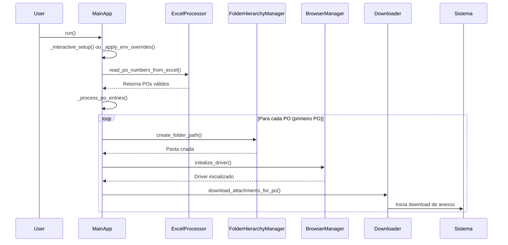

# Processo até o Primeiro Download - Sequence Diagram

```mermaid
sequenceDiagram
    participant User
    participant MainApp
    participant ExcelProcessor
    participant FolderHierarchyManager
    participant BrowserManager
    participant Downloader
    participant Sistema

    User->>MainApp: run()
    MainApp->>MainApp: _interactive_setup() ou _apply_env_overrides()
    MainApp->>ExcelProcessor: read_po_numbers_from_excel()
    ExcelProcessor-->>MainApp: Retorna POs válidos
    MainApp->>MainApp: _process_po_entries()
    loop Para cada PO (primeiro PO)
        MainApp->>FolderHierarchyManager: create_folder_path()
        FolderHierarchyManager-->>MainApp: Pasta criada
        MainApp->>BrowserManager: initialize_driver()
        BrowserManager-->>MainApp: Driver inicializado
        MainApp->>Downloader: download_attachments_for_po()
        Downloader->>Sistema: Inicia download de anexos
    end
```
