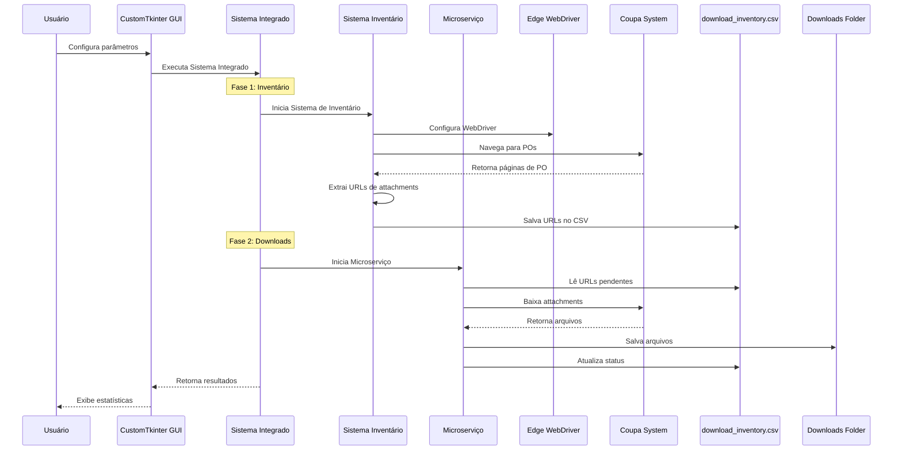
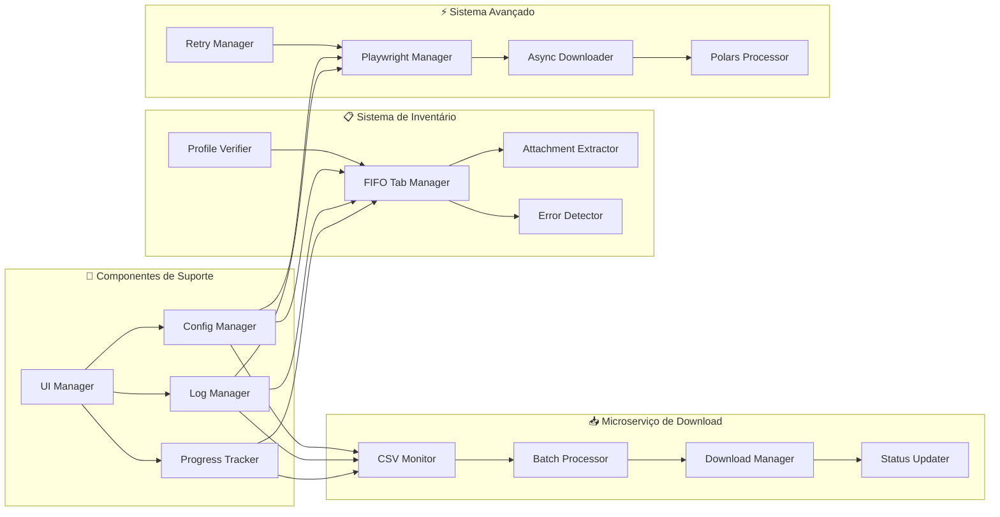
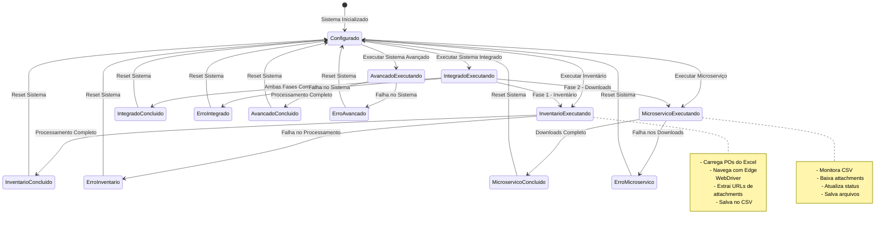
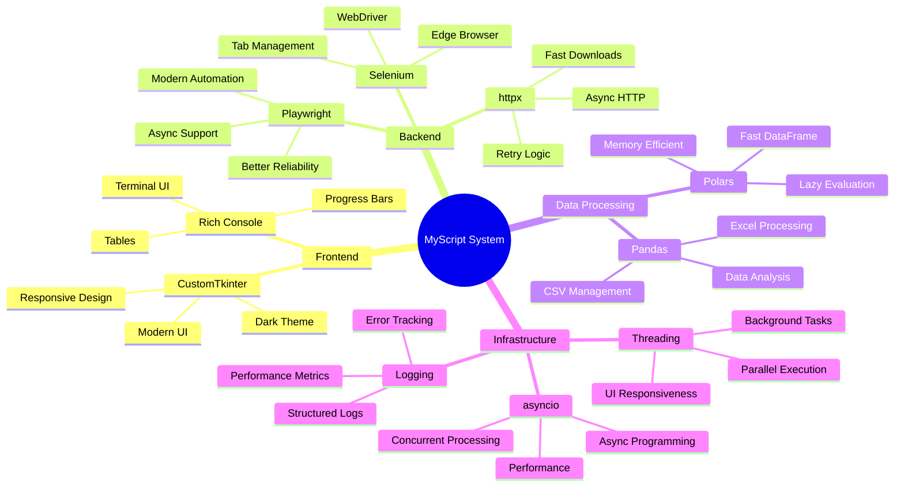
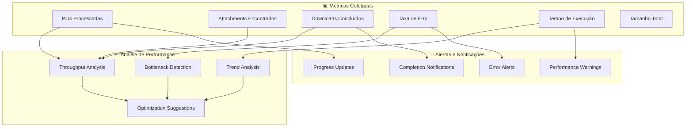

# 🚀 Diagrama do Sistema MyScript - CoupaDownloads

## 📋 Visão Geral da Arquitetura

```mermaid
graph TB
    subgraph "🎯 Interface do Usuário"
        GUI[CustomTkinter GUI]
        CLI[Terminal Interface]
    end

    subgraph "⚙️ Sistemas Principais"
        INTEGRATED[Sistema Integrado]
        INVENTORY[Sistema de Inventário]
        MICROSERVICE[Microserviço de Download]
        ADVANCED[Sistema Avançado]
    end

    subgraph "🔧 Componentes Core"
        CONFIG[Configuração]
        LOGGING[Logging Estruturado]
        RETRY[Sistema de Retry]
        PROGRESS[Progress Tracker]
    end

    subgraph "🌐 Automação de Browser"
        SELENIUM[Selenium WebDriver]
        PLAYWRIGHT[Playwright]
        HYBRID[Sistema Híbrido]
    end

    subgraph "📊 Processamento de Dados"
        POLARS[Polars Processor]
        EXCEL[Excel Processor]
        CSV[CSV Manager]
    end

    subgraph "📥 Sistema de Downloads"
        ASYNC[Async Downloader]
        HTTPX[httpx Client]
        MICRO[Microserviço]
    end

    subgraph "📁 Arquivos de Dados"
        INPUT[input.xlsx]
        INVENTORY_CSV[download_inventory.csv]
        DOWNLOADS[~/Downloads/CoupaDownloads]
    end

    subgraph "🌍 Coupa System"
        COUPA[unilever.coupahost.com]
        PO_PAGES[Páginas de PO]
        ATTACHMENTS[Attachments]
    end

    %% Conexões principais
    GUI --> INTEGRATED
    GUI --> INVENTORY
    GUI --> MICROSERVICE
    GUI --> ADVANCED

    CLI --> INTEGRATED
    CLI --> INVENTORY
    CLI --> MICROSERVICE

    %% Fluxo do Sistema Integrado
    INTEGRATED --> CONFIG
    INTEGRATED --> INVENTORY
    INTEGRATED --> MICROSERVICE

    %% Fluxo do Sistema de Inventário
    INVENTORY --> SELENIUM
    INVENTORY --> CONFIG
    INVENTORY --> LOGGING
    INVENTORY --> CSV

    %% Fluxo do Microserviço
    MICROSERVICE --> CSV
    MICROSERVICE --> ASYNC
    MICROSERVICE --> DOWNLOADS

    %% Fluxo do Sistema Avançado
    ADVANCED --> PLAYWRIGHT
    ADVANCED --> POLARS
    ADVANCED --> ASYNC
    ADVANCED --> RETRY
    ADVANCED --> PROGRESS

    %% Conexões com dados
    INPUT --> EXCEL
    EXCEL --> INVENTORY
    INVENTORY --> INVENTORY_CSV
    INVENTORY_CSV --> MICROSERVICE
    MICROSERVICE --> DOWNLOADS

    %% Conexões com Coupa
    SELENIUM --> COUPA
    PLAYWRIGHT --> COUPA
    HYBRID --> COUPA
    COUPA --> PO_PAGES
    PO_PAGES --> ATTACHMENTS

    %% Estilos
    classDef uiClass fill:#e1f5fe,stroke:#01579b,stroke-width:2px
    classDef systemClass fill:#f3e5f5,stroke:#4a148c,stroke-width:2px
    classDef coreClass fill:#e8f5e8,stroke:#1b5e20,stroke-width:2px
    classDef browserClass fill:#fff3e0,stroke:#e65100,stroke-width:2px
    classDef dataClass fill:#fce4ec,stroke:#880e4f,stroke-width:2px
    classDef downloadClass fill:#e0f2f1,stroke:#004d40,stroke-width:2px
    classDef fileClass fill:#f1f8e9,stroke:#33691e,stroke-width:2px
    classDef coupaClass fill:#fff8e1,stroke:#ff6f00,stroke-width:2px

    class GUI,CLI uiClass
    class INTEGRATED,INVENTORY,MICROSERVICE,ADVANCED systemClass
    class CONFIG,LOGGING,RETRY,PROGRESS coreClass
    class SELENIUM,PLAYWRIGHT,HYBRID browserClass
    class POLARS,EXCEL,CSV dataClass
    class ASYNC,HTTPX,MICRO downloadClass
    class INPUT,INVENTORY_CSV,DOWNLOADS fileClass
    class COUPA,PO_PAGES,ATTACHMENTS coupaClass
```



## 🔄 Fluxo de Execução Detalhado



## 🏗️ Arquitetura dos Componentes



## 📊 Estados e Transições



## 🔧 Tecnologias e Bibliotecas



## 📈 Métricas e Monitoramento



## 🚀 Como Usar o Sistema

### 1. **Interface Gráfica (Recomendado)**

```bash
# Instalar dependências
pip install customtkinter

# Executar GUI
python src/MyScript/gui_main.py
```

### 2. **Sistema Integrado**

```bash
# Executar sistema completo
poetry run python src/MyScript/integrated_system.py
```

### 3. **Sistema Avançado**

```bash
# Executar com tecnologias modernas
poetry run python src/MyScript/advanced_system.py
```

### 4. **Componentes Individuais**

```bash
# Apenas inventário
poetry run python src/MyScript/inventory_system.py

# Apenas microserviço
poetry run python src/MyScript/download_microservice.py
```

## 📋 Funcionalidades Principais

- ✅ **Interface Gráfica Moderna** com CustomTkinter
- ✅ **Sistema de Inventário** para coleta de URLs
- ✅ **Microserviço de Download** em background
- ✅ **Sistema Integrado** combinando ambos
- ✅ **Sistema Avançado** com Playwright e async
- ✅ **Configuração Flexível** via UI ou arquivos
- ✅ **Monitoramento em Tempo Real** de progresso
- ✅ **Logs Estruturados** para debugging
- ✅ **Sistema de Retry** inteligente
- ✅ **Processamento Paralelo** otimizado
- ✅ **Detecção de Erros** automática
- ✅ **Estatísticas Detalhadas** de performance

## 🎯 Benefícios da Arquitetura

1. **Modularidade**: Componentes independentes e reutilizáveis
2. **Escalabilidade**: Suporte a múltiplos workers e janelas
3. **Confiabilidade**: Sistema de retry e detecção de erros
4. **Performance**: Processamento paralelo e assíncrono
5. **Usabilidade**: Interface gráfica intuitiva
6. **Manutenibilidade**: Código bem estruturado e documentado
7. **Flexibilidade**: Múltiplas opções de execução
8. **Monitoramento**: Métricas detalhadas de performance

